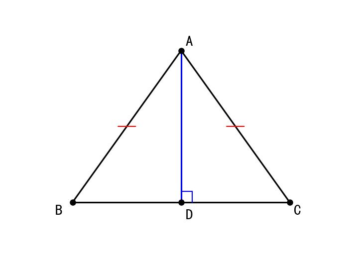

# 📅 Day 10 学习任务清单 - 2月7日（周五）【专项突破周】

**学习主题：** 等腰三角形与全等综合 + 免疫系统 + 国家安全观  
**学习时长：** 8小时  
**重点科目：** 数学（几何综合）、生物（免疫系统）

> 🎯 **今日核心目标**  
> 数学：掌握等腰三角形性质，能与全等结合解题  
> 生物：掌握人体三道免疫防线  
> 英语：完成"环境保护"主题作文  
> 历史：辛亥革命  
> 道法：总体国家安全观

---

## 🎯 今日学习目标

### 数学目标（2小时）
- ✅ 掌握等腰三角形的性质（等边对等角）
- ✅ 掌握等腰三角形的判定（等角对等边）
- ✅ 理解"三线合一"定理
- ✅ 能综合运用等腰三角形和全等判定
- ✅ 完成25道综合题，正确率65%以上

### 生物目标（1.5小时）
- ✅ 掌握人体三道免疫防线
- ✅ 区分特异性免疫与非特异性免疫
- ✅ 理解疫苗的作用原理
- ✅ 了解AIDS相关知识
- ✅ 完成25道免疫系统题

### 英语目标（1.5小时）
- ✅ 背诵30个单词（环境保护主题）
- ✅ 完成2套听力训练
- ✅ **写作专项：完成"环境保护"作文**

### 历史目标（1.5小时）
- ✅ 掌握辛亥革命的背景、过程、结果
- ✅ 理解辛亥革命的历史意义
- ✅ 记忆《中华民国临时约法》内容

### 道法目标（1小时）
- ✅ 理解总体国家安全观
- ✅ 掌握公民维护国家安全的义务
- ✅ 完成20道练习题

---

## ⏰ 详细学习时间表

| 时间 | 时长 | 科目 | 学习内容 | 完成✓ |
|------|------|------|---------|-------|
| 08:00-08:30 | 30分钟 | 英语 | 背30个单词+范文 | ☐ |
| 08:30-10:30 | **120分钟** | **数学** | **等腰三角形+全等综合** | ☐ |
| 10:30-12:00 | **90分钟** | **生物** | **免疫系统三道防线** | ☐ |
| 14:00-15:30 | 90分钟 | 英语 | 听力+完形+**作文：环境保护** | ☐ |
| 15:30-17:00 | **90分钟** | **历史** | **辛亥革命专题** | ☐ |
| 17:00-18:00 | 60分钟 | 道法 | 总体国家安全观 | ☐ |
| 19:00-20:00 | 60分钟 | 总复习 | 错题重做+知识整理 | ☐ |

---

## 📚 上午学习（08:00-12:00）

### ⏰ 08:00-08:30 | 英语早读（30分钟）

#### 任务1：背诵30个新单词

**环境保护主题词汇：**

| 序号 | 英文 | 音标 | 中文 | 例句 |
|------|------|------|------|------|
| 1 | environment | /ɪnˈvaɪrənmənt/ | 环境 | We should protect the environment. |
| 2 | pollution | /pəˈluːʃn/ | 污染 | Air pollution is a big problem. |
| 3 | protect | /prəˈtekt/ | 保护 | It's our duty to protect nature. |
| 4 | recycle | /ˌriːˈsaɪkl/ | 回收利用 | We can recycle paper and plastic. |
| 5 | waste | /weɪst/ | 浪费/废物 | Don't waste water. |
| 6 | energy | /ˈenədʒi/ | 能源 | Save energy in daily life. |
| 7 | resource | /rɪˈsɔːs/ | 资源 | Natural resources are limited. |
| 8 | planet | /ˈplænɪt/ | 星球 | We only have one planet. |
| 9 | climate | /ˈklaɪmət/ | 气候 | Climate change is serious. |
| 10 | global | /ˈɡləʊbl/ | 全球的 | Global warming affects everyone. |
| 11 | reduce | /rɪˈdjuːs/ | 减少 | Reduce the use of plastic bags. |
| 12 | reuse | /ˌriːˈjuːz/ | 重复使用 | Reuse shopping bags. |
| 13 | plastic | /ˈplæstɪk/ | 塑料 | Plastic bags harm the environment. |
| 14 | carbon | /ˈkɑːbən/ | 碳 | Reduce your carbon footprint. |
| 15 | emission | /ɪˈmɪʃn/ | 排放 | Cut down on car emissions. |
| 16 | endangered | /ɪnˈdeɪndʒəd/ | 濒危的 | Protect endangered animals. |
| 17 | species | /ˈspiːʃiːz/ | 物种 | Many species are disappearing. |
| 18 | forest | /ˈfɒrɪst/ | 森林 | Stop cutting down forests. |
| 19 | plant | /plɑːnt/ | 种植/植物 | Plant more trees. |
| 20 | sustainable | /səˈsteɪnəbl/ | 可持续的 | Sustainable development is important. |
| 21 | ecosystem | /ˈiːkəʊsɪstəm/ | 生态系统 | Protect the ecosystem. |
| 22 | conservation | /ˌkɒnsəˈveɪʃn/ | 保护 | Wildlife conservation is necessary. |
| 23 | renewable | /rɪˈnjuːəbl/ | 可再生的 | Use renewable energy. |
| 24 | solar | /ˈsəʊlə/ | 太阳能的 | Solar power is clean energy. |
| 25 | wind | /wɪnd/ | 风/风力 | Wind power is eco-friendly. |
| 26 | harm | /hɑːm/ | 伤害 | Pollution harms our health. |
| 27 | damage | /ˈdæmɪdʒ/ | 损害 | Don't damage the environment. |
| 28 | affect | /əˈfekt/ | 影响 | Pollution affects our lives. |
| 29 | action | /ˈækʃn/ | 行动 | Take action to save the earth. |
| 30 | responsibility | /rɪˌspɒnsəˈbɪləti/ | 责任 | It's everyone's responsibility. |

#### 任务2：背诵范文（环境保护）

```
How to Protect the Environment

Environmental protection is very important for us. Here are some 
suggestions about how to protect our environment.

First, it's our duty to reduce pollution. We can walk or ride bikes 
instead of taking cars.

Second, we can save energy by turning off lights when we leave. 
We should also save water in daily life.

Third, we can recycle paper, plastic and glass bottles. This helps 
reduce waste.

In my opinion, if everyone does a little, we can make a big difference. 
Let's take action to protect our planet together!
```

**必背句型：**
- It's our duty to...
- We can...by doing...
- This helps...
- If everyone does a little, we can make a big difference.
- Let's take action to...

---

### ⏰ 08:30-10:30 | 数学·等腰三角形与全等综合（120分钟）

> **知识衔接：**
> - Day4：学习了5种全等判定定理
> - Day8：学习了"8"字型、"K"字型、沙漏型模型
> - Day9：学习了角的拼凑、截长补短、找隐藏条件技巧
> - **Day10：** 等腰三角形+全等的**综合应用**，难度提升！

#### 📖 知识点一：等腰三角形的性质（复习+深化）

**定义：** 有两条边相等的三角形叫做等腰三角形。

**性质1：等边对等角**
```
在△ABC中，若 AB = AC
则 ∠B = ∠C （两底角相等）
```

**性质2：三线合一**
```
等腰三角形的顶角平分线、底边上的中线、底边上的高互相重合

即：如果 AB = AC，D是BC的中点
则：AD ⊥ BC 且 ∠BAD = ∠CAD
```

**🎯 记忆口诀：** "等腰三角形，等边对等角，三线合一记心上"

---

#### 📖 知识点二：等腰三角形的判定

**判定定理：等角对等边**
```
在△ABC中，若 ∠B = ∠C
则 AB = AC
```

**📌 性质与判定的区别：**

| 类型 | 条件 | 结论 |
|------|------|------|
| 性质 | 两边相等 → | 两角相等 |
| 判定 | 两角相等 → | 两边相等 |

---

#### 📝 等腰三角形与全等综合例题

**【例题1】** 如图，在等腰△ABC中，AB = AC，D是BC的中点，求证：AD ⊥ BC



> **图示说明**：等腰三角形ABC，D是BC中点，AD⊥BC

**证明：**
```
在 △ABD 和 △ACD 中
     ┌ AB = AC    （已知）
     │ BD = CD    （D是BC中点）
     └ AD = AD    （公共边）
∴ △ABD ≌ △ACD  （SSS）

∴ ∠ADB = ∠ADC  （全等三角形对应角相等）

∵ ∠ADB + ∠ADC = 180° （平角）
∴ ∠ADB = ∠ADC = 90°
∴ AD ⊥ BC
```

---

**【例题2】** 在△ABC中，AB = AC，∠A = 40°，求∠B和∠C

**解答：**
```
∵ AB = AC
∴ ∠B = ∠C  （等边对等角）

∵ ∠A + ∠B + ∠C = 180° （三角形内角和）
∴ 40° + ∠B + ∠C = 180°
∴ ∠B + ∠C = 140°
∴ ∠B = ∠C = 70°
```

---

**【例题3】等腰三角形+全等综合**

如图，在等腰△ABC中，AB = AC，BD ⊥ AC于D，CE ⊥ AB于E，BD和CE相交于点O，求证：BD = CE

```
       A
      /|\
     E | D
    /  O  \
   /   |   \
  B————+————C
```

**证明：**
```
∵ AB = AC
∴ ∠ABC = ∠ACB  （等边对等角）

在 △BCE 和 △CBD 中
     ┌ ∠BCE = ∠CBD （已证）
     │ BC = CB      （公共边）
     └ ∠BEC = ∠BDC = 90° （已知）
∴ △BCE ≌ △CBD  （AAS）

∴ CE = BD  （全等三角形对应边相等）
```

---

### ⏰ 10:30-12:00 | 生物·免疫系统（90分钟）

#### 📖 知识点一：人体三道免疫防线

| 防线 | 组成 | 特点 | 类型 |
|------|------|------|------|
| 第一道 | 皮肤和黏膜 | 先天具有 | 非特异性免疫 |
| 第二道 | 杀菌物质和吞噬细胞 | 先天具有 | 非特异性免疫 |
| 第三道 | 免疫器官和免疫细胞 | 后天获得 | 特异性免疫 |

---

#### 📖 知识点二：非特异性免疫与特异性免疫

**非特异性免疫（前两道防线）：**
- 先天具有
- 不针对特定病原体
- 对多种病原体都有防御作用

**特异性免疫（第三道防线）：**
- 后天获得
- 针对特定病原体
- 具有记忆性

---

#### 📖 知识点三：抗原与抗体

**抗原：** 能引起免疫反应的物质（如病原体、异物）

**抗体：** 机体受抗原刺激后产生的特殊蛋白质

```
抗原（病原体）进入人体
      ↓
刺激淋巴细胞
      ↓
产生抗体
      ↓
抗体与抗原结合
      ↓
消灭病原体
```

**🔥 关键记忆：一种抗体只能对付一种抗原！**

---

#### 📖 知识点四：疫苗的原理

**疫苗的成分：** 灭活或减毒的病原体

**疫苗的作用原理：**
```
接种疫苗（减毒的抗原）
      ↓
刺激淋巴细胞产生抗体
      ↓
产生免疫记忆细胞
      ↓
当真正的病原体入侵时
      ↓
记忆细胞迅速产生大量抗体
      ↓
消灭病原体（不发病或轻症）
```

**📌 疫苗≠抗体！疫苗是抗原，刺激机体产生抗体！**

---

#### 📖 知识点五：AIDS（艾滋病）

**病原体：** HIV（人类免疫缺陷病毒）

**传播途径：**
1. 血液传播（共用针头、输血）
2. 性传播
3. 母婴传播

**危害：** HIV攻击淋巴细胞，破坏人体免疫系统

**预防措施：**
- 不共用注射器
- 使用安全血液制品
- 不歧视AIDS患者

**📌 易错点：与AIDS患者握手、拥抱不会传染！**

---

## 📚 下午学习（14:00-18:00）

### ⏰ 14:00-15:30 | 英语（90分钟）

#### 今日作文题目：环境保护

```
假设你校正在开展"绿色环保"活动，请你写一篇倡议书，号召同学们
保护环境，内容包括：
1. 为什么要保护环境
2. 我们能做些什么（至少3条建议）
3. 呼吁大家行动起来

要求：80词左右
```

**写作框架：**

```
Dear classmates,

【开头】Environmental protection is very important. Here are some 
suggestions about how we can help.

【主体】
First, it's our duty to reduce pollution. We can walk to school 
instead of taking cars.

Second, we can save energy by turning off lights when we leave.

Third, let's recycle paper and plastic bottles. This helps reduce waste.

【结尾】If everyone does a little, we can make a big difference. 
Let's take action to protect our planet together!

Li Ming
```

---

### ⏰ 15:30-17:00 | 历史·辛亥革命专题（90分钟）

#### 辛亥革命（1911年）

**一、背景**
- 民族危机加深
- 清政府腐败无能
- 资产阶级革命思想传播
- 孙中山创建革命组织

**二、同盟会（1905年）**

| 项目 | 内容 |
|------|------|
| 时间 | 1905年 |
| 地点 | 日本东京 |
| 领导人 | 孙中山 |
| 纲领 | "驱除鞑虏，恢复中华，创立民国，平均地权" |
| 意义 | 第一个全国性资产阶级革命政党 |

**三、三民主义**

| 主义 | 内容 | 对应纲领 |
|------|------|---------|
| 民族主义 | 推翻清朝统治 | 驱除鞑虏，恢复中华 |
| 民权主义 | 建立民主共和国 | 创立民国 |
| 民生主义 | 平均地权 | 平均地权 |

**四、武昌起义（1911年10月10日）**

- **时间：** 1911年10月10日
- **地点：** 湖北武昌
- **结果：** 起义成功，各省纷纷响应

**五、中华民国的建立**

| 项目 | 内容 |
|------|------|
| 建立时间 | 1912年1月1日 |
| 首都 | 南京 |
| 临时大总统 | 孙中山 |
| 纪年方式 | 改用公历，以中华民国纪年 |

**六、《中华民国临时约法》（1912年）**

**主要内容：**
1. 中华民国主权属于全体国民
2. 国民享有人身、居住、言论、出版、集会等自由
3. 三权分立（立法、行政、司法）

**意义：** 是中国历史上第一部资产阶级性质的民主宪法

**七、辛亥革命的意义**

```
（1）推翻了清王朝的统治，结束了两千多年的封建帝制
（2）建立了中华民国
（3）使民主共和观念深入人心
（4）为中国资本主义发展创造了条件
```

**局限性：** 未能改变中国半殖民地半封建社会的性质

---

### ⏰ 17:00-18:00 | 道法·总体国家安全观（60分钟）

#### 📖 知识点一：国家安全的含义

**国家安全：** 指国家政权、主权、统一和领土完整、人民福祉、经济社会可持续发展和国家其他重大利益相对处于没有危险和不受内外威胁的状态，以及保障持续安全状态的能力。

---

#### 📖 知识点二：总体国家安全观

**核心：** 以人民安全为宗旨，以政治安全为根本

**国家安全的内容：**

| 类型 | 内容 |
|------|------|
| 政治安全 | 国家政权稳定 |
| 国土安全 | 领土完整、边防安全 |
| 军事安全 | 国防力量 |
| 经济安全 | 经济发展不受威胁 |
| 文化安全 | 民族文化不被侵蚀 |
| 社会安全 | 社会稳定和谐 |
| 科技安全 | 科技自主可控 |
| 网络安全 | 网络空间安全 |
| 生态安全 | 生态环境安全 |

---

#### 📖 知识点三：公民维护国家安全的义务

1. **遵守宪法、法律**关于国家安全的有关规定
2. **及时报告**危害国家安全活动的线索
3. **保守**所知悉的国家秘密
4. **配合**国家安全机关的工作

**📌 举报电话：12339（国家安全举报电话）**

---

#### 📖 知识点四：公民如何维护国家安全

```
1. 树立国家安全意识，增强国家安全责任感
2. 学习国家安全相关法律知识
3. 遵守国家安全法律法规
4. 发现危害国家安全的行为及时举报
5. 配合国家安全机关的工作
6. 保守国家秘密，不泄露敏感信息
```

---

## 📚 晚间复习（19:00-20:00）

### 复习重点

1. **数学：** 等腰三角形三线合一，综合证明
2. **生物：** 三道免疫防线，疫苗原理
3. **英语：** 检查环保作文
4. **历史：** 辛亥革命意义，《临时约法》
5. **道法：** 国家安全内容，公民义务

---

## ✅ 今日自我检测

### 各科检测（完成后打√）

**数学：**
- [ ] 能说出等腰三角形两个性质
- [ ] 理解"三线合一"
- [ ] 完成25道综合题

**生物：**
- [ ] 能区分三道免疫防线
- [ ] 理解疫苗≠抗体
- [ ] 了解AIDS传播途径

**英语：**
- [ ] 背会30个环保单词
- [ ] 完成环保主题作文

**历史：**
- [ ] 能说出辛亥革命意义（4点）
- [ ] 记住《临时约法》内容
- [ ] 理解三民主义

**道法：**
- [ ] 能列举国家安全内容
- [ ] 知道公民维护国家安全的义务

---

**Day 10 学习加油！专项突破周第三天，继续保持！💪**
