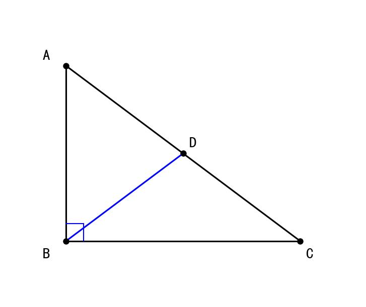

# 📅 Day 11 学习任务清单 - 2月8日（周六）【专项突破周】

**学习主题：** 直角三角形与勾股定理 + 神经调节 + 主观题模板  
**学习时长：** 8小时  
**重点科目：** 数学（直角三角形）、生物（神经调节）

> 🎯 **今日核心目标**  
> 数学：掌握直角三角形性质和勾股定理  
> 生物：掌握反射弧结构和神经调节  
> 英语：完成"健康生活"主题作文  
> 历史：新文化运动  
> 道法：主观题答题模板

---

## 🎯 今日学习目标

### 数学目标（2小时）
- ✅ 掌握直角三角形的性质
- ✅ 熟练运用勾股定理计算
- ✅ 掌握勾股定理逆定理（判定直角三角形）
- ✅ 能综合运用直角三角形与全等判定
- ✅ 完成25道综合题，正确率65%以上

### 生物目标（1.5小时）
- ✅ 掌握反射弧的五个组成部分
- ✅ 区分条件反射与非条件反射
- ✅ 理解神经系统与激素调节的关系
- ✅ 完成25道神经调节题

### 英语目标（1.5小时）
- ✅ 背诵30个单词（健康生活主题）
- ✅ 完成2套听力训练
- ✅ **写作专项：完成"健康生活"作文**

### 历史目标（1.5小时）
- ✅ 掌握新文化运动的背景、内容、意义
- ✅ 记忆代表人物和口号
- ✅ 完成15道练习题

### 道法目标（1小时）
- ✅ 掌握主观题"原因类"答题模板
- ✅ 掌握主观题"意义类"答题模板
- ✅ 完成10道主观题训练

---

## ⏰ 详细学习时间表

| 时间 | 时长 | 科目 | 学习内容 | 完成✓ |
|------|------|------|---------|-------|
| 08:00-08:30 | 30分钟 | 英语 | 背30个单词+范文 | ☐ |
| 08:30-10:30 | **120分钟** | **数学** | **直角三角形+勾股定理** | ☐ |
| 10:30-12:00 | **90分钟** | **生物** | **神经调节综合** | ☐ |
| 14:00-15:30 | 90分钟 | 英语 | 听力+完形+**作文：健康生活** | ☐ |
| 15:30-17:00 | **90分钟** | **历史** | **新文化运动专题** | ☐ |
| 17:00-18:00 | 60分钟 | 道法 | 主观题答题模板训练 | ☐ |
| 19:00-20:00 | 60分钟 | 总复习 | 错题重做+知识整理 | ☐ |

---

## 📚 上午学习（08:00-12:00）

### ⏰ 08:00-08:30 | 英语早读（30分钟）

#### 任务1：背诵30个新单词

**健康生活主题词汇：**

| 序号 | 英文 | 音标 | 中文 | 例句 |
|------|------|------|------|------|
| 1 | health | /helθ/ | 健康 | Health is the most important. |
| 2 | healthy | /ˈhelθi/ | 健康的 | Eat healthy food every day. |
| 3 | exercise | /ˈeksəsaɪz/ | 锻炼 | Exercise keeps us fit. |
| 4 | diet | /ˈdaɪət/ | 饮食 | A balanced diet is important. |
| 5 | habit | /ˈhæbɪt/ | 习惯 | Develop good habits. |
| 6 | sleep | /sliːp/ | 睡眠 | Get enough sleep every night. |
| 7 | stress | /stres/ | 压力 | Reduce stress in your life. |
| 8 | relax | /rɪˈlæks/ | 放松 | Learn to relax yourself. |
| 9 | balance | /ˈbæləns/ | 平衡 | Balance work and rest. |
| 10 | nutrition | /njuˈtrɪʃn/ | 营养 | Good nutrition helps us grow. |
| 11 | vegetable | /ˈvedʒtəbl/ | 蔬菜 | Eat more vegetables. |
| 12 | fruit | /fruːt/ | 水果 | Fruit is good for health. |
| 13 | protein | /ˈprəʊtiːn/ | 蛋白质 | Protein builds muscles. |
| 14 | vitamin | /ˈvɪtəmɪn/ | 维生素 | Vitamins keep us healthy. |
| 15 | junk food | /dʒʌŋk fuːd/ | 垃圾食品 | Avoid junk food. |
| 16 | overweight | /ˌəʊvəˈweɪt/ | 超重的 | Being overweight is unhealthy. |
| 17 | fitness | /ˈfɪtnəs/ | 健身 | Fitness is a lifestyle. |
| 18 | mental | /ˈmentl/ | 精神的 | Mental health matters too. |
| 19 | physical | /ˈfɪzɪkl/ | 身体的 | Physical exercise is necessary. |
| 20 | regular | /ˈreɡjələ/ | 有规律的 | Keep a regular schedule. |
| 21 | benefit | /ˈbenɪfɪt/ | 好处 | Exercise has many benefits. |
| 22 | fresh | /freʃ/ | 新鲜的 | Eat fresh vegetables. |
| 23 | active | /ˈæktɪv/ | 积极的 | Stay active every day. |
| 24 | lifestyle | /ˈlaɪfstaɪl/ | 生活方式 | Have a healthy lifestyle. |
| 25 | energy | /ˈenədʒi/ | 精力 | Good sleep gives us energy. |
| 26 | prevent | /prɪˈvent/ | 预防 | Exercise prevents illness. |
| 27 | illness | /ˈɪlnəs/ | 疾病 | A good diet prevents illness. |
| 28 | immune | /ɪˈmjuːn/ | 免疫的 | Exercise improves immune system. |
| 29 | positive | /ˈpɒzətɪv/ | 积极的 | Keep a positive attitude. |
| 30 | routine | /ruːˈtiːn/ | 日常 | Have a healthy daily routine. |

#### 任务2：背诵范文（健康生活）

```
How to Keep Healthy

It's important for us to keep healthy. Here are some tips.

In my opinion, we should eat healthy food. We'd better eat more 
vegetables and fruit, and avoid junk food.

First, we should exercise regularly. Running or playing sports 
for 30 minutes every day can make us stronger.

Second, we should get enough sleep. Eight hours of sleep is 
necessary for students.

Finally, we should keep a positive attitude and reduce stress.

In conclusion, if we follow these tips, we will be healthy and happy.
```

**必背句型：**
- In my opinion, we should...
- First...Second...Finally...
- ...is necessary for...
- If we follow these tips, we will...

---

### ⏰ 08:30-10:30 | 数学·直角三角形与勾股定理（120分钟）

> **知识衔接：**
> - Day4：学习了5种全等判定（含HL专用于直角三角形）
> - Day10：学习了等腰三角形+全等综合
> - **Day11：** 直角三角形+勾股定理+HL判定**综合应用**

#### 📖 知识点一：直角三角形的性质（重点！）

**性质1：两锐角互余**
```
在Rt△ABC中，∠C = 90°
则 ∠A + ∠B = 90°
```

**性质2：30°角所对直角边等于斜边的一半**
```
在Rt△ABC中，∠C = 90°，∠A = 30°
则 BC = ½AB
```

**性质3：斜边上的中线等于斜边的一半**



> **图示说明**：直角三角形ABC，∠B = 90°，D是斜边AC中点，BD = ½AC

---

#### 📖 知识点二：勾股定理

**定理内容：**
```
在直角三角形中，两条直角边的平方和等于斜边的平方

即：a² + b² = c²
（其中a、b是直角边，c是斜边）
```

**📝 例题1：** 在Rt△ABC中，∠C = 90°，AC = 3，BC = 4，求AB

```
解：根据勾股定理
    AB² = AC² + BC²
    AB² = 3² + 4²
    AB² = 9 + 16
    AB² = 25
    AB = 5
```

**🎯 常见勾股数：**
```
3, 4, 5 （最常用！）
5, 12, 13
6, 8, 10
8, 15, 17
7, 24, 25
```

---

#### 📖 知识点三：勾股定理的逆定理

**逆定理：** 如果三角形的三边满足 a² + b² = c²，则这个三角形是直角三角形。

**📝 例题2：** 判断三边为5、12、13的三角形是否为直角三角形

```
解：设最大边c = 13
    验证：5² + 12² = 25 + 144 = 169 = 13²
    所以该三角形是直角三角形
```

---

#### 📝 直角三角形与全等综合

**【例题3】** 如图，在Rt△ABC中，∠ACB = 90°，CD ⊥ AB于D，求证：△ACD ∽ △CBD

**分析：**
```
∵ ∠ACB = 90°，CD ⊥ AB
∴ △ACD、△CBD都是直角三角形

在Rt△ACD和Rt△ABC中
∠A = ∠A（公共角）
∠ADC = ∠ACB = 90°
∴ △ACD ∽ △ABC（AA）
```

---

**【例题4】HL判定综合应用**

如图，在Rt△ABC和Rt△DEF中，∠C = ∠F = 90°，AB = DE，AC = DF，求证：BC = EF

```
证明：
在Rt△ABC和Rt△DEF中
     ┌ AB = DE    （斜边相等）
     └ AC = DF    （直角边相等）
∴ Rt△ABC ≌ Rt△DEF  （HL）
∴ BC = EF  （全等三角形对应边相等）
```

---

### ⏰ 10:30-12:00 | 生物·神经调节综合（90分钟）

#### 📖 知识点一：反射弧的组成

**反射弧五个组成部分：**

```
感受器 → 传入神经 → 神经中枢 → 传出神经 → 效应器
```

| 组成部分 | 功能 | 举例 |
|---------|------|------|
| 感受器 | 接受刺激，产生兴奋 | 皮肤中的感觉神经末梢 |
| 传入神经 | 将兴奋传入神经中枢 | 感觉神经 |
| 神经中枢 | 分析综合信息 | 脑、脊髓 |
| 传出神经 | 将兴奋传出 | 运动神经 |
| 效应器 | 产生反应 | 肌肉、腺体 |

**🎯 记忆口诀：** "感传中传效"

---

#### 📖 知识点二：条件反射与非条件反射

| 类型 | 特点 | 神经中枢 | 举例 |
|------|------|---------|------|
| 非条件反射 | 先天具有，不学就会 | 脑干、脊髓 | 眨眼、膝跳反射 |
| 条件反射 | 后天学习获得 | 大脑皮层 | 望梅止渴、谈虎色变 |

**📌 判断技巧：**
- 生下来就会的 → 非条件反射
- 需要学习才会的 → 条件反射

---

#### 📖 知识点三：神经系统的组成

```
神经系统
├── 中枢神经系统
│   ├── 脑（大脑、小脑、脑干）
│   └── 脊髓
└── 周围神经系统
    ├── 脑神经
    └── 脊神经
```

**各部分功能：**

| 部分 | 功能 |
|------|------|
| 大脑皮层 | 高级中枢（思维、语言、条件反射） |
| 小脑 | 协调运动、维持身体平衡 |
| 脑干 | 生命活动的基本中枢（呼吸、心跳） |
| 脊髓 | 反射中枢、传导功能 |

---

#### 📖 知识点四：激素调节

**人体主要激素：**

| 激素 | 分泌器官 | 功能 | 异常症状 |
|------|---------|------|---------|
| 生长激素 | 垂体 | 促进生长 | 巨人症/侏儒症 |
| 甲状腺激素 | 甲状腺 | 促进新陈代谢 | 甲亢/甲减 |
| 胰岛素 | 胰岛 | 降低血糖 | 糖尿病 |

**神经调节与激素调节的比较：**

| 项目 | 神经调节 | 激素调节 |
|------|---------|---------|
| 反应速度 | 快 | 慢 |
| 作用时间 | 短 | 长 |
| 作用范围 | 准确、局限 | 广泛 |

**📌 两者关系：** 相互配合、相互影响

---

## 📚 下午学习（14:00-18:00）

### ⏰ 14:00-15:30 | 英语（90分钟）

#### 今日作文题目：健康生活

```
你的英国笔友Mike来信询问你是如何保持健康的。请给他写一封回信，
内容包括：
1. 你的健康生活方式（饮食、运动、睡眠）
2. 给他的建议

要求：80词左右
```

---

### ⏰ 15:30-17:00 | 历史·新文化运动专题（90分钟）

#### 新文化运动（1915年开始）

**一、背景**
- 袁世凯复辟帝制
- 尊孔复古逆流
- 先进知识分子寻求新的出路

**二、开始标志**
- **时间：** 1915年
- **标志：** 陈独秀创办《青年杂志》（后改名《新青年》）

**三、代表人物**
```
陈独秀、李大钊、胡适、鲁迅
```

**四、主要阵地**
- 刊物：《新青年》
- 地点：北京大学

**五、口号（旗帜）**
```
"民主"与"科学"（德先生与赛先生）
```

**六、主要内容**

| 提倡 | 反对 |
|------|------|
| 民主 | 专制 |
| 科学 | 迷信盲从 |
| 新道德 | 旧道德 |
| 新文学 | 旧文学 |

**七、重要成就**
- 鲁迅《狂人日记》——中国第一篇白话小说
- 胡适提倡白话文

**八、意义**

```
1. 是中国历史上一次空前的思想大解放运动
2. 启发人们追求民主和科学，探索救国救民的真理
3. 为马克思主义在中国的传播创造了条件
4. 促进了民众的觉醒
```

**局限性：**
- 存在绝对否定传统文化的倾向
- 没有与工农运动相结合

---

### ⏰ 17:00-18:00 | 道法·主观题答题模板（60分钟）

#### 📖 模板一：原因类答题模板

**题型特征：** "为什么...""原因是什么..."

**答题结构：**
```
【主观原因/内因】
从__自身来说，__________________

【客观原因/外因】
从外部环境来说，________________

【直接原因】
直接导致这一结果的是____________
```

**示例：青少年违法犯罪的原因**
```
（1）主观原因：法律意识淡薄，不能明辨是非，抵制诱惑能力差。

（2）家庭原因：家庭教育缺失，父母管教不当。

（3）学校原因：法治教育不够，校园环境存在问题。

（4）社会原因：不良社会风气影响，网络不良信息诱导。
```

---

#### 📖 模板二：意义类答题模板

**题型特征：** "有什么意义/作用/影响..."

**答题结构：**
```
对个人：有利于___________________

对社会：有利于___________________

对国家：有利于___________________
```

**示例：依法治国的意义**
```
（1）对公民：保障公民的合法权益，维护公民的人身自由和财产安全。

（2）对社会：维护社会公平正义，促进社会和谐稳定。

（3）对国家：实现国家长治久安，推进国家治理体系和治理能力现代化。
```

---

#### 📖 模板三：做法类答题模板

**题型特征：** "应该怎么做..."

**答题结构：**
```
国家/政府层面：_________________

社会/学校层面：_________________

个人层面：_____________________
```

**示例：如何保护未成年人**
```
（1）国家：完善法律法规，加大执法力度，为未成年人创造良好的成长环境。

（2）社会/学校：加强法治教育，创建安全文明的校园环境。

（3）家庭：父母要履行监护职责，关心未成年人的身心健康。

（4）自身：提高法律意识，学会自我保护，远离违法犯罪。
```

---

## 📚 晚间复习（19:00-20:00）

### 复习重点

1. **数学：** 勾股定理及常见勾股数
2. **生物：** 反射弧五个组成部分
3. **英语：** 检查健康生活作文
4. **历史：** 新文化运动口号和意义
5. **道法：** 三种主观题答题模板

---

## ✅ 今日自我检测

### 各科检测（完成后打√）

**数学：**
- [ ] 能背出常见勾股数（3-4-5等）
- [ ] 能用勾股定理计算边长
- [ ] 会用逆定理判定直角三角形

**生物：**
- [ ] 能默写反射弧五个部分
- [ ] 能区分条件/非条件反射
- [ ] 知道主要激素的功能

**英语：**
- [ ] 背会30个健康生活单词
- [ ] 完成健康生活主题作文

**历史：**
- [ ] 知道新文化运动四位代表人物
- [ ] 能说出"两面旗帜"
- [ ] 理解新文化运动的意义

**道法：**
- [ ] 掌握原因类答题模板
- [ ] 掌握意义类答题模板
- [ ] 掌握做法类答题模板

---

**Day 11 学习加油！周六继续努力，向70分目标冲刺！💪**
