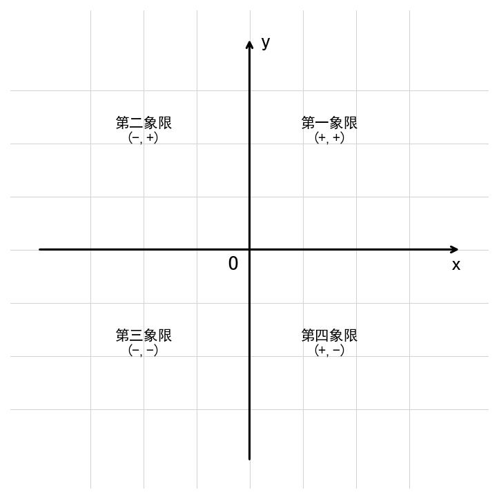

# 📅 Day 13 学习任务清单 - 2月10日（周一）【专项突破周】

**学习主题：** 平面直角坐标系 + 生物实验题 + 时事政治  
**学习时长：** 8小时  
**重点科目：** 数学（坐标系）、生物（实验题）

> 🎯 **今日核心目标**  
> 数学：掌握坐标系基础概念和点的坐标运算  
> 生物：掌握对照实验设计和变量控制  
> 英语：完成"我的偶像/榜样"主题作文  
> 历史：北伐战争  
> 道法：时事政治与学科结合

---

## 🎯 今日学习目标

### 数学目标（2小时）
- ✅ 掌握平面直角坐标系的概念
- ✅ 理解四个象限的特点
- ✅ 掌握点的对称规律
- ✅ 能计算两点之间的距离
- ✅ 完成30道坐标系题，正确率70%以上

### 生物目标（1.5小时）
- ✅ 掌握对照实验的设计原则
- ✅ 理解变量和对照组的概念
- ✅ 能独立设计简单的对照实验
- ✅ 完成20道实验题

### 英语目标（1.5小时）
- ✅ 背诵30个单词（人物描述主题）
- ✅ 完成2套听力训练
- ✅ **写作专项：完成"我的偶像/榜样"作文**

### 历史目标（1.5小时）
- ✅ 掌握北伐战争的背景、过程、结果
- ✅ 了解国共第一次合作
- ✅ 完成15道练习题

### 道法目标（1小时）
- ✅ 了解近期时事热点
- ✅ 学会用学科知识分析时事
- ✅ 完成15道练习题

---

## ⏰ 详细学习时间表

| 时间 | 时长 | 科目 | 学习内容 | 完成✓ |
|------|------|------|---------|-------|
| 08:00-08:30 | 30分钟 | 英语 | 背30个单词+范文 | ☐ |
| 08:30-10:30 | **120分钟** | **数学** | **平面直角坐标系** | ☐ |
| 10:30-12:00 | **90分钟** | **生物** | **实验题专项训练** | ☐ |
| 14:00-15:30 | 90分钟 | 英语 | 听力+完形+**作文：我的偶像** | ☐ |
| 15:30-17:00 | **90分钟** | **历史** | **北伐战争专题** | ☐ |
| 17:00-18:00 | 60分钟 | 道法 | 时事政治+学科分析 | ☐ |
| 19:00-20:00 | 60分钟 | 总复习 | 错题重做+知识整理 | ☐ |

---

## 📚 上午学习（08:00-12:00）

### ⏰ 08:00-08:30 | 英语早读（30分钟）

#### 任务1：背诵30个新单词

**人物描述主题词汇：**

| 序号 | 英文 | 音标 | 中文 | 例句 |
|------|------|------|------|------|
| 1 | admire | /ədˈmaɪə/ | 钦佩 | I admire him very much. |
| 2 | hero | /ˈhɪərəʊ/ | 英雄 | He is my hero. |
| 3 | role model | /rəʊl ˈmɒdl/ | 榜样 | She is my role model. |
| 4 | inspire | /ɪnˈspaɪə/ | 激励 | Her story inspired me. |
| 5 | influence | /ˈɪnfluəns/ | 影响 | He has great influence on me. |
| 6 | success | /səkˈses/ | 成功 | His success inspires me. |
| 7 | effort | /ˈefət/ | 努力 | Success needs effort. |
| 8 | achieve | /əˈtʃiːv/ | 实现 | He achieved his dream. |
| 9 | hardworking | /ˌhɑːdˈwɜːkɪŋ/ | 勤奋的 | She is hardworking. |
| 10 | talented | /ˈtæləntɪd/ | 有才华的 | He is very talented. |
| 11 | brave | /breɪv/ | 勇敢的 | Be brave like him. |
| 12 | honest | /ˈɒnɪst/ | 诚实的 | He is always honest. |
| 13 | confident | /ˈkɒnfɪdənt/ | 自信的 | Be confident in yourself. |
| 14 | patient | /ˈpeɪʃnt/ | 耐心的 | Teachers need to be patient. |
| 15 | creative | /kriˈeɪtɪv/ | 有创造力的 | Scientists are creative. |
| 16 | determined | /dɪˈtɜːmɪnd/ | 坚定的 | He is determined to succeed. |
| 17 | overcome | /ˌəʊvəˈkʌm/ | 克服 | Overcome difficulties. |
| 18 | challenge | /ˈtʃælɪndʒ/ | 挑战 | Face challenges bravely. |
| 19 | struggle | /ˈstrʌɡl/ | 奋斗 | Struggle for dreams. |
| 20 | persevere | /ˌpɜːsɪˈvɪə/ | 坚持 | Persevere until you succeed. |
| 21 | quality | /ˈkwɒləti/ | 品质 | Good qualities matter. |
| 22 | personality | /ˌpɜːsəˈnæləti/ | 个性 | I like his personality. |
| 23 | character | /ˈkærəktə/ | 性格 | He has a good character. |
| 24 | respect | /rɪˈspekt/ | 尊重 | I respect him a lot. |
| 25 | famous | /ˈfeɪməs/ | 著名的 | He became famous. |
| 26 | contribution | /ˌkɒntrɪˈbjuːʃn/ | 贡献 | His contribution is great. |
| 27 | spirit | /ˈspɪrɪt/ | 精神 | Learn from his spirit. |
| 28 | attitude | /ˈætɪtjuːd/ | 态度 | Attitude determines success. |
| 29 | encourage | /ɪnˈkʌrɪdʒ/ | 鼓励 | He encouraged me to try. |
| 30 | example | /ɪɡˈzɑːmpl/ | 榜样/例子 | Set a good example. |

#### 任务2：背诵范文（我的偶像）

```
My Role Model

My role model is Yuan Longping, the "Father of Hybrid Rice". 
I admire him very much for the following reasons.

First, he was hardworking. He spent most of his life working in 
the fields, trying to help more people have enough food.

Second, he was determined. Although he faced many difficulties, 
he never gave up his dream.

What's more, he made great contributions to the world. His hybrid 
rice has helped feed billions of people.

I have learned a lot from him. I will work hard like him and try 
to make contributions to our country in the future.
```

**必背句型：**
- I admire...for the following reasons.
- He/She was...
- Although..., he/she never gave up.
- He/She made great contributions to...
- I have learned...from him/her.

---

### ⏰ 08:30-10:30 | 数学·平面直角坐标系（120分钟）

#### 📖 知识点一：平面直角坐标系的概念

**定义：** 在平面内，两条互相垂直且有公共原点的数轴组成平面直角坐标系。



> **图示说明**：平面直角坐标系，标注四个象限及其符号特征

**基本要素：**
- **原点O：** 两条数轴的交点
- **x轴（横轴）：** 水平的数轴，向右为正
- **y轴（纵轴）：** 竖直的数轴，向上为正

---

#### 📖 知识点二：点的坐标

**表示方法：** 点P的坐标记作P(x, y)

- x：点到y轴的距离（横坐标）
- y：点到x轴的距离（纵坐标）

**📝 例题1：** 写出下列点的坐标
- A点在x轴正方向3个单位 → A(3, 0)
- B点在y轴负方向2个单位 → B(0, -2)
- C点向右3向上4 → C(3, 4)

---

#### 📖 知识点三：四个象限的特点

| 象限 | x的符号 | y的符号 | 坐标符号 |
|------|--------|--------|---------|
| 第一象限 | + | + | (+, +) |
| 第二象限 | - | + | (-, +) |
| 第三象限 | - | - | (-, -) |
| 第四象限 | + | - | (+, -) |

**🎯 记忆口诀：** "一正二负x，三四正负y"
或："一正正，二负正，三负负，四正负"

**📌 注意：** 坐标轴上的点不属于任何象限！

---

#### 📖 知识点四：特殊位置的点

| 位置 | 坐标特点 |
|------|---------|
| x轴上 | y = 0，即(a, 0) |
| y轴上 | x = 0，即(0, b) |
| 原点 | x = y = 0，即(0, 0) |
| 第一三象限角平分线上 | x = y |
| 第二四象限角平分线上 | x = -y |

---

#### 📖 知识点五：点的对称

**关于x轴对称：** x不变，y变号
```
点(a, b) 关于x轴对称的点是 (a, -b)
```

**关于y轴对称：** x变号，y不变
```
点(a, b) 关于y轴对称的点是 (-a, b)
```

**关于原点对称：** x、y都变号
```
点(a, b) 关于原点对称的点是 (-a, -b)
```

**🎯 记忆口诀：** 
"x轴对称y变号，y轴对称x变号，原点对称都变号"

---

#### 📝 坐标系例题

**【例题1】** 点P(-3, 5)在第几象限？

```
解：x = -3 < 0，y = 5 > 0
    符号为(-, +)
    所以点P在第二象限
```

**【例题2】** 点A(2, -3)关于x轴对称的点是？

```
解：关于x轴对称，y变号
    A'(2, 3)
```

**【例题3】** 若点P(a-1, a+3)在y轴上，求a和点P坐标

```
解：点在y轴上，则x = 0
    a - 1 = 0
    a = 1
    点P坐标：P(0, 4)
```

---

#### 📖 知识点六：两点间距离

**公式：** 设A(x₁, y₁)，B(x₂, y₂)

```
AB = √[(x₂-x₁)² + (y₂-y₁)²]
```

**特殊情况：**
- 平行于x轴：AB = |x₂ - x₁|
- 平行于y轴：AB = |y₂ - y₁|

**📝 例题：** 求A(1, 2)到B(4, 6)的距离

```
解：AB = √[(4-1)² + (6-2)²]
       = √[9 + 16]
       = √25
       = 5
```

---

### ⏰ 10:30-12:00 | 生物·实验题专项训练（90分钟）

#### 📖 知识点一：科学探究的一般步骤

```
1. 提出问题
2. 作出假设
3. 制定计划
4. 实施计划
5. 得出结论
6. 表达交流
```

---

#### 📖 知识点二：对照实验的设计原则

**核心原则：控制变量法**

**关键术语：**

| 术语 | 定义 | 举例 |
|------|------|------|
| 变量 | 实验中可以变化的因素 | 光照、温度、水分 |
| 实验变量（自变量） | 有意改变的变量 | 探究光对种子萌发的影响→光照 |
| 无关变量 | 保持不变的其他因素 | 温度、水分、种子数量 |
| 对照组 | 不处理或标准处理的组 | 正常光照条件 |
| 实验组 | 进行实验处理的组 | 无光照条件 |

**🔥 设计原则：**
1. 只改变一个变量（单一变量原则）
2. 其他条件保持相同
3. 设置对照组

---

#### 📝 实验设计示例

**【例题】** 探究光照对植物光合作用的影响

**实验设计：**
```
【提出问题】光照对植物光合作用有影响吗？

【作出假设】光照能促进植物进行光合作用

【实验设计】
材料：两株相同的植物、黑色塑料袋

实验组：用黑色塑料袋遮住一株植物（无光照）
对照组：另一株植物正常光照

控制变量：温度、水分、植物种类和大小相同

【预期结果】
对照组（有光照）：正常生长，能进行光合作用
实验组（无光照）：生长不良，不能进行光合作用

【结论】光照是植物进行光合作用的必要条件
```

---

#### 📖 知识点三：常见实验注意事项

**1. 样本数量**
- 每组不能只有1个，应有多个（如每组10粒种子）
- 原因：排除偶然性，使结果更可靠

**2. 重复实验**
- 同一实验应重复多次
- 原因：减少实验误差

**3. 单一变量**
- 只能有一个变量不同
- 原因：确定实验结果由该变量引起

---

#### 📝 实验题常见问题类型

**类型一：找出变量**
"该实验的变量是什么？"

**类型二：设置对照组**
"请设置对照实验"

**类型三：分析实验结果**
"根据结果得出什么结论？"

**类型四：完善实验设计**
"该实验设计有什么不足？如何改进？"

---

## 📚 下午学习（14:00-18:00）

### ⏰ 14:00-15:30 | 英语（90分钟）

#### 今日作文题目：我的偶像/榜样

```
请以"My Role Model"为题，介绍一位你敬佩的人（可以是名人、
老师、父母等），内容包括：
1. 他/她是谁
2. 你为什么敬佩他/她（至少2个原因）
3. 你从他/她身上学到了什么

要求：80词左右
```

---

### ⏰ 15:30-17:00 | 历史·北伐战争专题（90分钟）

#### 北伐战争（1926-1928年）

**一、背景**
- 国民革命运动兴起
- 国共第一次合作（1924年）
- 黄埔军校建立

**二、国共第一次合作**

| 项目 | 内容 |
|------|------|
| 标志 | 1924年国民党一大召开 |
| 合作方式 | 党内合作（共产党员以个人身份加入国民党） |
| 意义 | 国民革命运动开始 |

**三、黄埔军校（1924年）**

| 项目 | 内容 |
|------|------|
| 地点 | 广州黄埔 |
| 校长 | 蒋介石 |
| 政治部主任 | 周恩来 |
| 作用 | 培养了大批军事政治人才 |

**四、北伐战争**

**目标：** 推翻北洋军阀，统一全国

**对象：** 吴佩孚、孙传芳、张作霖

**主要战役：**
- 汀泗桥、贺胜桥战役（打吴佩孚）
- 叶挺独立团表现英勇

**结果：**
- 基本推翻了北洋军阀的统治
- 但蒋介石、汪精卫相继叛变革命
- 国民革命失败

**五、国共合作破裂**

| 事件 | 时间 | 发动者 |
|------|------|--------|
| 四一二政变 | 1927年4月 | 蒋介石（上海） |
| 七一五政变 | 1927年7月 | 汪精卫（武汉） |

**六、北伐战争的教训**

```
共产党认识到：必须掌握革命武装，进行武装斗争
```

---

### ⏰ 17:00-18:00 | 道法·时事政治（60分钟）

#### 📖 时事政治学习方法

**1. 关注热点话题**
- 国内重大政策
- 国际重要事件
- 社会热点问题

**2. 用学科知识分析**
- 找出相关知识点
- 运用答题模板
- 多角度分析

---

#### 📝 时事分析示例

**热点1：科技创新（航天、芯片等）**

**可联系的知识点：**
- 创新是引领发展的第一动力
- 科教兴国战略
- 增强综合国力

**答题示例：**
```
问：我国航天事业取得重大成就说明了什么？

答：（1）说明我国综合国力不断增强，科技水平显著提高。
    （2）体现了我国坚持科教兴国战略和创新驱动发展战略。
    （3）增强了民族自信心和自豪感。
    （4）为实现中华民族伟大复兴提供了强大动力。
```

---

**热点2：生态环境保护**

**可联系的知识点：**
- 绿水青山就是金山银山
- 可持续发展
- 建设美丽中国

---

**热点3：法治建设**

**可联系的知识点：**
- 依法治国基本方略
- 宪法是根本法
- 公民权利和义务

---

## 📚 晚间复习（19:00-20:00）

### 复习重点

1. **数学：** 象限判断，点的对称
2. **生物：** 对照实验设计原则
3. **英语：** 检查偶像作文
4. **历史：** 北伐战争目标和对象
5. **道法：** 时事分析方法

---

## ✅ 今日自我检测

### 各科检测（完成后打√）

**数学：**
- [ ] 能说出四个象限坐标特点
- [ ] 掌握点的对称规律
- [ ] 会计算两点距离
- [ ] 完成30道坐标系题

**生物：**
- [ ] 能说出对照实验设计原则
- [ ] 理解单一变量原则
- [ ] 能设计简单对照实验

**英语：**
- [ ] 背会30个人物描述单词
- [ ] 完成偶像作文

**历史：**
- [ ] 知道北伐对象三人
- [ ] 了解国共第一次合作

**道法：**
- [ ] 能用学科知识分析时事
- [ ] 完成15道练习题

---

**Day 13 学习加油！专项突破周倒数第二天！💪**
