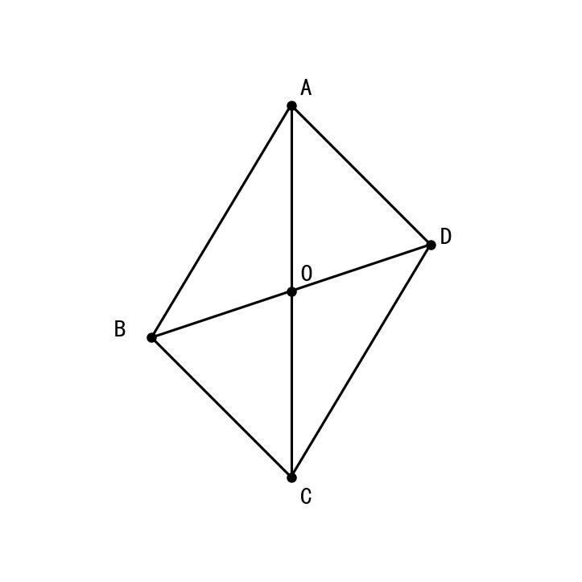
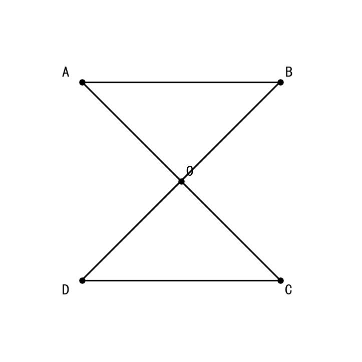
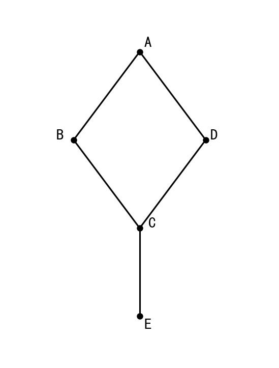

# 📅 Day 8 学习任务清单 - 2月5日（周三）【专项突破周】

**学习主题：** 全等证明经典模型（一） + 遗传图解 + 宪法基础  
**学习时长：** 8小时  
**重点科目：** 数学（几何证明深化）、生物（遗传深化）

> 🎯 **今日核心目标**  
> 数学：掌握全等证明的经典模型，能熟练运用"8"字型、"K"字型模型  
> 生物：掌握遗传图解的规范画法  
> 英语：完成"学校规则建议信"作文  
> 历史：甲午中日战争  
> 道法：法治观念-宪法至上

---

## 🎯 今日学习目标

### 数学目标（2小时）【重点深化！】

> **第一周复习：** Day4已学习5种判定定理（SSS/SAS/ASA/AAS/HL）和证明格式  
> **本周任务：** 从"会判定"→"会证明"→"会分析"，掌握经典模型和解题技巧

- ✅ 复习5种判定定理（5分钟快速回顾）
- ✅ 掌握**"8"字型模型**（对顶角+两组边）
- ✅ 掌握**"K"字型模型**（平行线+同位角/内错角）
- ✅ 掌握**"沙漏型"模型**（公共角+两组边）
- ✅ 完成15道中等难度证明题，正确率65%以上

### 生物目标（1.5小时）
- ✅ 掌握遗传图解的规范画法
- ✅ 理解亲本、子代、配子的书写规范
- ✅ 能独立完成单因子杂交遗传图解
- ✅ 完成20道遗传图解练习题

### 英语目标（1.5小时）
- ✅ 背诵30个单词（学校规则主题）
- ✅ 完成2套听力训练
- ✅ **写作专项：完成"学校规则建议信"**

### 历史目标（1.5小时）
- ✅ 掌握甲午中日战争背景、经过、结果
- ✅ 背诵《马关条约》内容及影响
- ✅ 完成15道练习题

### 道法目标（1小时）
- ✅ 理解宪法是国家根本法
- ✅ 掌握公民的基本权利和义务
- ✅ 完成10道练习题

---

## ⏰ 详细学习时间表

| 时间 | 时长 | 科目 | 学习内容 | 完成✓ |
|------|------|------|---------|-------|
| 08:00-08:30 | 30分钟 | 英语 | 背30个单词+范文 | ☐ |
| 08:30-10:30 | **120分钟** | **数学** | **全等证明经典模型** | ☐ |
| 10:30-12:00 | **90分钟** | **生物** | **遗传图解规范画法** | ☐ |
| 14:00-15:30 | 90分钟 | 英语 | 听力+阅读+**作文：学校规则建议信** | ☐ |
| 15:30-17:00 | **90分钟** | **历史** | **甲午中日战争专题** | ☐ |
| 17:00-18:00 | 60分钟 | 道法 | 宪法至上+公民权利义务 | ☐ |
| 19:00-20:00 | 60分钟 | 总复习 | 错题重做+知识整理 | ☐ |

**总学习时长：8小时**

---

## 📚 上午学习（08:00-12:00）

### ⏰ 08:00-08:30 | 英语早读（30分钟）

#### 任务1：背诵30个新单词

**学校规则主题词汇：**

| 序号 | 英文 | 音标 | 中文 | 例句 |
|------|------|------|------|------|
| 1 | rule | /ruːl/ | 规则 | We must follow the school rules. |
| 2 | allow | /əˈlaʊ/ | 允许 | Students are not allowed to run in the hallway. |
| 3 | forbid | /fəˈbɪd/ | 禁止 | Mobile phones are forbidden in class. |
| 4 | punish | /ˈpʌnɪʃ/ | 惩罚 | He was punished for being late. |
| 5 | reward | /rɪˈwɔːd/ | 奖励 | Good students will get rewards. |
| 6 | uniform | /ˈjuːnɪfɔːm/ | 校服 | We should wear uniforms at school. |
| 7 | behave | /bɪˈheɪv/ | 表现 | Please behave well in public. |
| 8 | polite | /pəˈlaɪt/ | 礼貌的 | Be polite to your teachers. |
| 9 | respect | /rɪˈspekt/ | 尊重 | We should respect our classmates. |
| 10 | obey | /əˈbeɪ/ | 遵守 | All students must obey the rules. |
| 11 | suggestion | /səˈdʒestʃən/ | 建议 | I have some suggestions for you. |
| 12 | advice | /ədˈvaɪs/ | 建议 | Here is my advice. |
| 13 | require | /rɪˈkwaɪə/ | 要求 | The school requires us to be on time. |
| 14 | prevent | /prɪˈvent/ | 阻止 | Rules prevent accidents. |
| 15 | necessary | /ˈnesəsəri/ | 必要的 | It's necessary to follow rules. |
| 16 | reasonable | /ˈriːzənəbl/ | 合理的 | The rules are reasonable. |
| 17 | strict | /strɪkt/ | 严格的 | Our school is strict about uniforms. |
| 18 | improve | /ɪmˈpruːv/ | 改善 | Rules help improve the environment. |
| 19 | benefit | /ˈbenɪfɪt/ | 好处 | Rules benefit everyone. |
| 20 | safety | /ˈseɪfti/ | 安全 | Safety is the most important. |
| 21 | concentrate | /ˈkɒnsntreɪt/ | 集中注意力 | Rules help us concentrate on study. |
| 22 | disturb | /dɪˈstɜːb/ | 打扰 | Don't disturb others in class. |
| 23 | responsible | /rɪˈspɒnsəbl/ | 负责的 | We should be responsible for our behavior. |
| 24 | discipline | /ˈdɪsəplɪn/ | 纪律 | Good discipline is important. |
| 25 | punctual | /ˈpʌŋktʃuəl/ | 守时的 | Students should be punctual. |
| 26 | organize | /ˈɔːɡənaɪz/ | 组织 | Rules help organize school life. |
| 27 | harmful | /ˈhɑːmfl/ | 有害的 | Some behaviors are harmful. |
| 28 | appropriate | /əˈprəʊpriət/ | 适当的 | Wear appropriate clothes. |
| 29 | effective | /ɪˈfektɪv/ | 有效的 | The rules are effective. |
| 30 | cooperation | /kəʊˌɒpəˈreɪʃn/ | 合作 | Rules encourage cooperation. |

#### 任务2：背诵范文（学校规则建议信）

**范文主题：给校长的建议信——关于学校规则的改进建议**

```
Dear Principal,

I am writing to give you some suggestions about our school rules.

First of all, I think we should be allowed to use mobile phones during 
lunch break. Many students need to contact their parents, and using 
phones for a short time won't affect our study.

Secondly, I suggest that the school uniform rules should be more flexible. 
We should be allowed to wear our own clothes on Fridays. This will make 
students happier.

Finally, I hope the library can stay open longer. If we can use the 
library until 7 pm, we will have more time to study and read.

In conclusion, I believe these changes will benefit all students. 
I hope you will consider my suggestions.

Yours sincerely,
Li Ming
```

**必背句型：**
- I am writing to give you some suggestions about...
- I think we should be allowed to...
- I suggest that...should...
- I hope...can...
- In conclusion, I believe...

---

### ⏰ 08:30-10:30 | 数学·全等证明经典模型（120分钟）

> ⚠️ **重要说明：**  
> 第一周Day4已学习5种判定定理，本周**不再重复讲定理**，而是深化应用！

#### 📖 第一步：5分钟快速复习

**5种判定定理（默写检测）：**

```
SSS：___________________________
SAS：___________________________
ASA：___________________________
AAS：___________________________
HL：____________________________
```

**证明格式（默写）：**
```
在△___和△___中
∵ ________（  ）
  ________（  ）
  ________（  ）
∴ △___≌△___（    ）
```

---

#### 📖 第二步：经典模型一 —— "8"字型模型（30分钟）

**模型特征：** 两个三角形共顶点，形成"8"字形状

```
        A
       /|\
      / | \
     /  |  \
    B———O———D
     \  |  /
      \ | /
       \|/
        C
```

**核心特点：**
1. O是公共顶点
2. ∠AOB和∠COD是**对顶角**（相等）
3. 常用SAS或ASA判定

**🔥 "8"字型解题套路：**
```
第1步：找对顶角 → ∠AOB = ∠COD（对顶角相等）
第2步：找两组边 → OA = OC，OB = OD
第3步：写证明 → △AOB ≌ △COD（SAS）
```

---

**【经典例题1】** 如图，OA = OC，OB = OD，求证：AB = CD



> **图示说明**："8"字型模型，O在中心，A、C在上下，B、D在左右

**证明：**
```
在△AOB和△COD中
∵ OA = OC      （已知）
  ∠AOB = ∠COD  （对顶角相等）
  OB = OD      （已知）
∴ △AOB ≌ △COD （SAS）
∴ AB = CD     （全等三角形对应边相等）
```

**📌 技巧总结：** 看到"8"字形，先找对顶角！

---

**【变式练习1】** 如图，OA = OC，OB = OD，∠A = ∠C，求证：AB∥CD

**分析：**
```
要证AB∥CD → 需证内错角相等 → ∠OAB = ∠OCD
→ 需先证△AOB ≌ △COD
```

**证明：**
```
在△AOB和△COD中
∵ ∠A = ∠C      （已知）
  OA = OC      （已知）
  ∠AOB = ∠COD  （对顶角相等）
∴ △AOB ≌ △COD （ASA）
∴ ∠ABO = ∠CDO （全等三角形对应角相等）
∴ AB ∥ CD     （内错角相等，两直线平行）
```

---

#### 📖 第三步：经典模型二 —— "K"字型模型（30分钟）

**模型特征：** 两条平行线被两条直线所截，形成"K"字形状



> **图示说明**："K"字型模型，AB∥CD，交于O点

**核心特点：**
1. AB∥CD（平行线）
2. ∠OAB = ∠OCD（内错角相等）
3. ∠OBA = ∠ODC（内错角相等）

**🔥 "K"字型解题套路：**
```
第1步：利用平行 → 找内错角/同位角
第2步：找公共边或等量关系
第3步：用ASA或AAS判定
```

---

**【经典例题2】** 如图，AB∥CD，AO = CO，求证：BO = DO


> **图示说明**："K"字型，AB∥CD，AO = CO

**证明：**
```
∵ AB ∥ CD（已知）
∴ ∠OAB = ∠OCD （两直线平行，内错角相等）
  ∠OBA = ∠ODC （两直线平行，内错角相等）

在△AOB和△COD中
∵ ∠OAB = ∠OCD  （已证）
  AO = CO       （已知）
  ∠AOB = ∠COD  （对顶角相等）
∴ △AOB ≌ △COD （ASA）
∴ BO = DO      （全等三角形对应边相等）
```

---

#### 📖 第四步：经典模型三 —— "沙漏型"模型（30分钟）

**模型特征：** 两个三角形共用一个角



> **图示说明**："沙漏型"模型，两个三角形共用顶角A

**核心特点：**
1. 共用∠A（公共角）
2. 两组边成比例或相等

**🔥 "沙漏型"解题套路：**
```
第1步：找公共角
第2步：找两组对应边
第3步：用SAS判定
```

---

**【经典例题3】** 如图，AB = AD，AC = AE，求证：BC = DE


> **图示说明**：沙漏型，AB = AD，AC = AE

**证明：**
```
在△ABC和△ADE中
∵ AB = AD      （已知）
  ∠BAC = ∠DAE  （公共角/同角）
  AC = AE      （已知）
∴ △ABC ≌ △ADE （SAS）
∴ BC = DE     （全等三角形对应边相等）
```

**📌 注意：** 公共角的写法要看清楚是同一个角还是需要证明！

---

#### 📖 第五步：综合练习（25分钟）

**【练习1·"8"字型】** 
如图，∠1 = ∠2，OA = OC，求证：OB = OD


> **图示说明**："8"字型，∠1 = ∠AOB，∠2 = ∠COD

---

**【练习2·"K"字型】** 
如图，AB∥DE，AB = DE，C是BD的中点，求证：AC = EC


> **图示说明**："K"字型变式，AB∥DE，C是BD中点

---

**【练习3·综合】** 
如图，在□ABCD中，E、F分别在BC、AD上，BE = DF，求证：AE = CF

```
    A———F———D
    |       |
    |       |
    B———E———C
```

**提示：** 平行四边形对边相等，AB = CD，AD = BC

---

#### 📖 今日数学总结

**三大经典模型：**

| 模型 | 特征 | 关键条件 | 常用判定 |
|------|------|---------|---------|
| "8"字型 | 共顶点 | 对顶角相等 | SAS/ASA |
| "K"字型 | 平行线 | 内错角相等 | ASA/AAS |
| "沙漏型" | 共角 | 公共角相等 | SAS |

**🎯 记忆口诀：**
```
"8"字对顶要牢记
"K"字平行找内错
沙漏共角很重要
三种模型记心上
```

---

### ⏰ 10:30-12:00 | 生物·遗传图解规范画法（90分钟）

> **重要提醒：** 遗传图解是中考必考内容，规范书写可得满分！

#### 📖 知识点一：遗传图解的基本格式

**标准遗传图解结构：**

```
亲本（P）：    ♀ 表现型（基因型）  ×  ♂ 表现型（基因型）
                    ↓                      ↓
配子：           配子类型              配子类型
                        ↘        ↙
子代（F₁）：           基因型
                        ↓
                      表现型
```

#### 📖 知识点二：书写规范要求

**🔥 必背格式规范：**

| 项目 | 规范要求 | 示例 |
|------|---------|------|
| 亲本表示 | P:或亲本: | P: 高茎豌豆 × 矮茎豌豆 |
| 性别标注 | ♀表示雌性，♂表示雄性 | ♀ Dd × ♂ Dd |
| 基因型 | 大写字母表示显性，小写表示隐性 | DD、Dd、dd |
| 配子 | 圆圈圈起来 | ⓓ ⓓ |
| 子代 | F₁:或子一代: | F₁: Dd |
| 比例 | 用":"分隔 | 3:1 |

---

#### 📝 遗传图解例题精讲

**【例题1】单因子杂交**

**题目：** 豌豆高茎（D）对矮茎（d）为显性，纯合高茎与矮茎杂交，请写出遗传图解。

**规范解答：**

```
亲本（P）：    ♀ 高茎        ×        ♂ 矮茎
基因型：         DD                      dd
                  ↓                        ↓
配子：           Ⓓ                       ⓓ
                     ↘              ↙
子一代（F₁）：        Dd
表现型：            高茎
```

---

**【例题2】F₁自交**

**题目：** 让F₁代（Dd）自交，请写出遗传图解并计算子代比例。

**规范解答：**

```
亲本（P）：    ♀ 高茎        ×        ♂ 高茎
基因型：         Dd                      Dd
                  ↓                        ↓
配子：        Ⓓ  ⓓ                   Ⓓ  ⓓ
                    ↘    ↙    ↘    ↙
子二代（F₂）：   DD    Dd    Dd    dd
基因型比例：      1  :  2  :  1
表现型：        高茎   高茎   高茎   矮茎
表现型比例：           3     :     1
```

**📌 关键结论：**
- 基因型比例 = DD : Dd : dd = 1 : 2 : 1
- 表现型比例 = 高茎 : 矮茎 = 3 : 1

---

#### 📖 知识点三：常见遗传图解类型

| 类型 | 亲本组合 | 子代结果 |
|------|---------|---------|
| 纯合×纯合（同型） | DD × DD | 全为DD |
| 纯合×纯合（异型） | DD × dd | 全为Dd |
| 杂合×杂合 | Dd × Dd | DD:Dd:dd = 1:2:1 |
| 杂合×纯合显性 | Dd × DD | DD:Dd = 1:1 |
| 杂合×纯合隐性 | Dd × dd | Dd:dd = 1:1 |

**🎯 记忆口诀：**
- "杂交杂交三比一"（Dd × Dd → 3:1）
- "测交测交一比一"（Dd × dd → 1:1）

---

## 📚 下午学习（14:00-18:00）

### ⏰ 14:00-15:30 | 英语（90分钟）

#### 任务1：听力训练（30分钟）
- 完成2套听力真题
- 记录听不懂的词汇

#### 任务2：阅读+完形（30分钟）
- 完成1篇阅读理解
- 完成1篇完形填空

#### 任务3：写作专项（30分钟）

**今日作文题目：学校规则建议信**

```
假设你是李明，你的学校最近制定了一些新规则。请你给校长写一封建议信，
内容包括：
1. 你对学校某条规则的看法
2. 你的建议及理由
3. 希望校长采纳你的建议

要求：80词左右，语句通顺，书写工整
```

---

### ⏰ 15:30-17:00 | 历史·甲午中日战争专题（90分钟）

#### 甲午中日战争（1894-1895年）

**一、背景**
- 日本明治维新后国力增强，制定侵略中国的大陆政策
- 朝鲜东学党起义，清朝应邀出兵

**二、经过**

| 战役 | 时间 | 结果 | 重要人物 |
|------|------|------|---------|
| 丰岛海战 | 1894.7 | 清军失利 | 战争爆发 |
| 平壤战役 | 1894.9 | 清军战败 | 叶志超逃跑 |
| 黄海海战 | 1894.9 | 北洋舰队主力尚存 | **邓世昌殉国** |
| 威海卫战役 | 1895.2 | 北洋舰队全军覆没 | **丁汝昌殉国** |

**三、《马关条约》（1895年4月）**

| 内容 | 影响 |
|------|------|
| 割辽东半岛、台湾、澎湖列岛给日本 | 领土大量丧失 |
| 赔款2亿两白银 | 加重人民负担 |
| 开放沙市、重庆、苏州、杭州为商埠 | 侵略深入内地 |
| 允许日本在通商口岸开设工厂 | 阻碍民族工业发展 |

**四、影响**
- 标志着洋务运动的破产
- 中国半殖民地化程度**大大加深**
- 刺激了列强瓜分中国的野心
- 引发了维新变法运动

**🎯 记忆口诀：**
"甲午战败马关签，台湾割让最心寒，两亿白银赔日本，开办工厂又四城"

---

### ⏰ 17:00-18:00 | 道法·法治观念-宪法至上（60分钟）

#### 📖 知识点一：宪法是国家的根本法

**宪法的地位：**

| 方面 | 内容 |
|------|------|
| 内容上 | 规定国家生活中最根本、最重要的问题 |
| 法律效力上 | 具有最高的法律效力 |
| 制定和修改程序上 | 比其他法律更加严格 |

**🔥 关键结论：**
- 宪法是国家的根本法
- 宪法是治国安邦的总章程
- 宪法是一切组织和个人的根本活动准则

---

#### 📖 知识点二：公民的基本权利

| 权利类型 | 具体内容 |
|---------|---------|
| 政治权利 | 选举权和被选举权、政治自由 |
| 人身自由权 | 人身自由不受侵犯、人格尊严不受侵犯 |
| 社会经济权利 | 财产权、劳动权、受教育权 |
| 文化教育权利 | 受教育权、科学研究自由 |

#### 📖 知识点三：公民的基本义务

| 义务 | 具体要求 |
|------|---------|
| 遵守宪法和法律 | 维护国家统一和民族团结 |
| 维护国家安全、荣誉和利益 | 保守国家秘密 |
| 依法服兵役 | 符合条件的公民有服兵役的义务 |
| 依法纳税 | 公民有依法纳税的义务 |

---

## 📚 晚间复习（19:00-20:00）

### 复习重点

#### 1. 数学：三大经典模型
- 默写"8"字型解题套路
- 默写"K"字型解题套路
- 重做今天的3道综合题

#### 2. 生物：遗传图解
- 默写遗传图解的规范格式
- 练习3道遗传图解题

#### 3. 英语作文
- 检查今天写的作文
- 背诵3个重点句型

#### 4. 历史
- 背诵《马关条约》内容
- 记忆甲午战争重要人物

#### 5. 道法
- 宪法是国家根本法的三个理由
- 公民基本权利和义务

---

## ✅ 今日自我检测

### 各科检测（完成后打√）

**数学：**
- [ ] 能默写"8"字型解题套路
- [ ] 能默写"K"字型解题套路
- [ ] 会识别"沙漏型"模型
- [ ] 完成15道中等证明题

**生物：**
- [ ] 能画出规范的遗传图解
- [ ] 知道Dd × Dd的子代比例
- [ ] 完成20道遗传题

**英语：**
- [ ] 背会30个单词
- [ ] 完成1篇作文
- [ ] 背诵3个写作句型

**历史：**
- [ ] 能说出甲午战争的4个重要战役
- [ ] 能背诵《马关条约》4条内容
- [ ] 完成15道练习题

**道法：**
- [ ] 能说出宪法是根本法的3个原因
- [ ] 知道公民4类基本权利
- [ ] 完成10道练习题

---

### 学习反思

| 科目 | 完成情况 | 掌握程度 | 明日改进 |
|------|---------|---------|---------|
| 数学 | __小时 | __% | |
| 生物 | __小时 | __% | |
| 英语 | __小时 | __% | |
| 历史 | __小时 | __% | |
| 道法 | __小时 | __% | |

---

**📌 Day 8 学习提醒：**
1. 数学从"会判定"升级到"会用模型"
2. 重点掌握三大经典模型的解题套路
3. 遗传图解是生物必考题，认真练习
4. 历史《马关条约》是高频考点，必须背熟

**Day 8 学习加油！专项突破周，每一天都在进步！💪**
