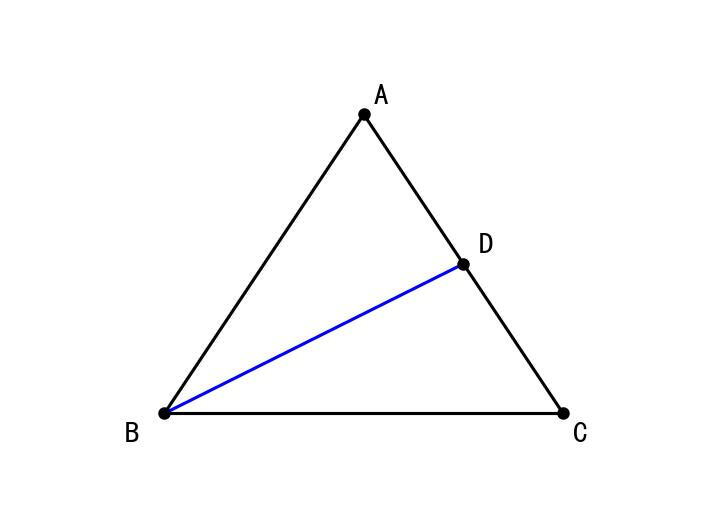
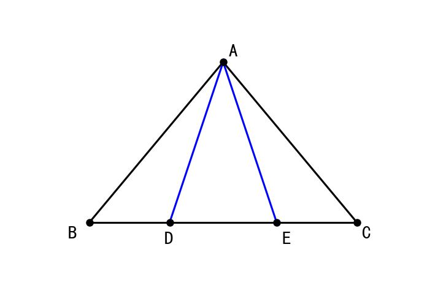
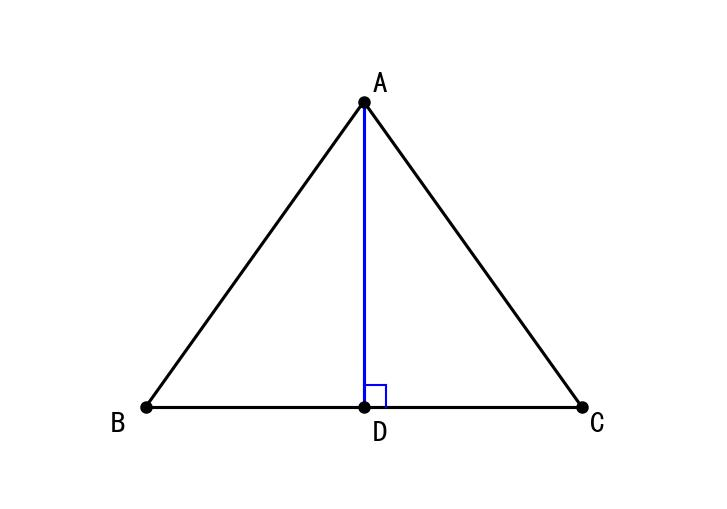
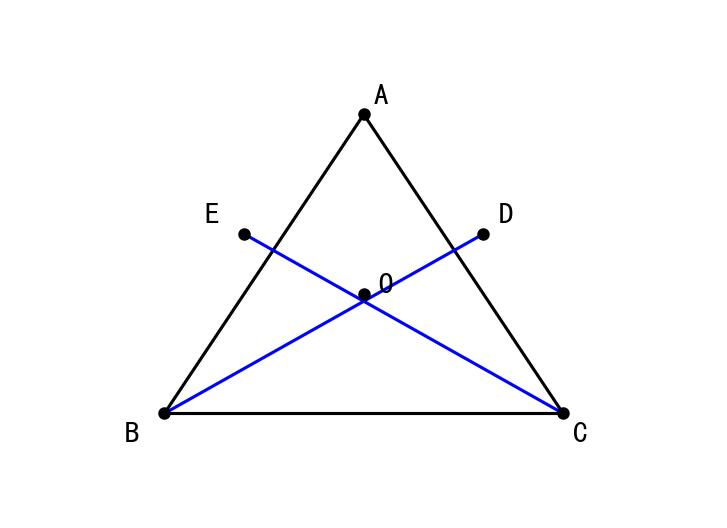
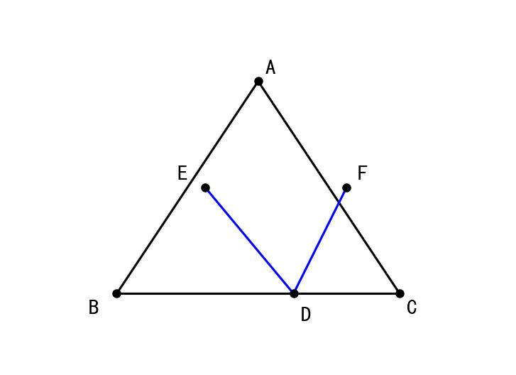
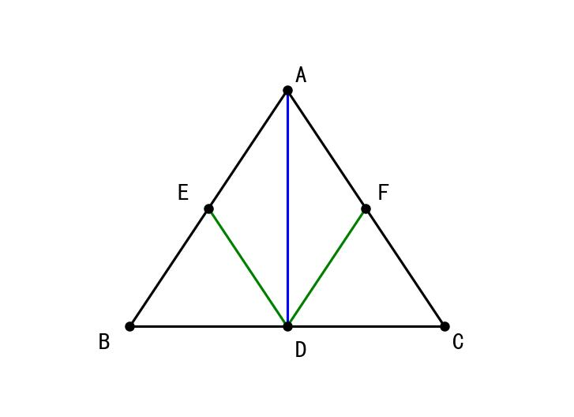

# 📝 Day 10 专项练习题集 - 2月7日（等腰三角形与全等综合）

> **练习要求：**
> 1. 数学部分时长：60分钟
> 2. 独立完成，完成后对照文末答案

---

## 📐 第一部分：数学·等腰三角形与全等综合（35题）

### 一、选择题（12题）

1. 等腰三角形的性质是（  ）
   A. 等边对等角
   B. 等角对等边
   C. 三线合一
   D. A和C都对

2. 在等腰△ABC中，AB = AC，∠A = 40°，则∠B =（  ）
   A. 40°　　B. 70°　　C. 80°　　D. 140°

3. 在等腰△ABC中，AB = AC = 5cm，BC = 6cm，则BC边上的高AD =（  ）cm
   A. 3　　B. 4　　C. 5　　D. 6

4. 等腰三角形的顶角平分线、底边上的中线、底边上的高（  ）
   A. 不一定重合　　B. 一定重合　　C. 有时重合　　D. 都不重合

5. 在△ABC中，AB = AC，D是BC的中点，则AD是（  ）
   A. 只是BC的垂直平分线
   B. 只是∠A的平分线
   C. 是BC的垂直平分线，也是∠A的平分线
   D. 都不是

6. 如果一个三角形有两个角相等，那么这个三角形是（  ）
   A. 等边三角形　　B. 等腰三角形　　C. 直角三角形　　D. 无法确定

7. 在等腰△ABC中，AB = AC，∠B = 50°，则∠A =（  ）
   A. 50°　　B. 65°　　C. 80°　　D. 100°

8. 如图，在等腰△ABC中，AB = AC，BD⊥AC于D，则∠DBC =（  ）



   A. ∠A　　B. ∠ABC - ∠A　　C. 90° - ∠A　　D. ∠ABC/2

9. 在等腰△ABC中，AB = AC，若∠A = 120°，则∠B =（  ）
   A. 30°　　B. 60°　　C. 120°　　D. 150°

10. 如图，在△ABC中，AB = AC，点D、E在BC上，BD = CE，则（  ）



    A. AD = AE　　B. AD > AE　　C. AD < AE　　D. 无法比较

11. 等边三角形的每个角等于（  ）
    A. 30°　　B. 45°　　C. 60°　　D. 90°

12. 在△ABC中，若AB = AC，且有一个角等于60°，则△ABC是（  ）
    A. 等腰三角形　　B. 等边三角形　　C. 直角三角形　　D. A或B

### 二、填空题（12题）

13. 等腰三角形的定义是有______条边相等的三角形。

14. 等腰三角形的性质（1）：等边对______。

15. 等腰三角形的性质（2）：______合一（顶角平分线、底边中线、底边上的高）。

16. 等腰三角形的判定：在一个三角形中，如果有______相等，那么这两个角所对的边也相等。

17. 在等腰△ABC中，AB = AC = 10cm，∠A = 36°，则∠B = ______°。

18. 在等腰△ABC中，AB = AC，∠A = 100°，则∠C = ______°。

19. 在等腰△ABC中，AB = AC，D是BC的中点，则AD______BC（填"⊥"或"∥"）。

20. 在等腰△ABC中，AB = AC，∠BAC的平分线AD与BC交于点D，则BD______ CD。

21. 等边三角形是特殊的______三角形。

22. 在△ABC中，∠B = ∠C = 50°，则AB ______ AC（填"="、">"或"<"）。

23. 如图，△ABC中，AB = AC，D是AC上一点，BD = BC = AD，则∠A = ______°。


24. 在等腰△ABC中，AB = AC，周长为20cm，BC = 6cm，则AB = ______cm。

### 三、解答题（11题）

25. 如图，在△ABC中，AB = AC，D是BC的中点，求证：AD⊥BC



26. 如图，在△ABC中，AB = AC，BD⊥AC于D，CE⊥AB于E，BD与CE相交于点O，求证：OB = OC



27. 如图，在△ABC中，AB = AC，点D、E分别在AB、AC上，且BD = CE，连接DE，求证：△BDE是等腰三角形

28. 如图，在△ABC中，AB = AC，D是BC上一点，DE∥AC交AB于E，DF∥AB交AC于F，求证：DE + DF = AB



29. 如图，在等腰△ABC中，AB = AC，M是BC的中点，D、E分别在AB、AC上，且DM = EM，求证：BD = CE

30. 在△ABC中，AB = AC，∠A = 36°，BD是∠ABC的平分线，求证：BD = BC

31. 如图，点D在△ABC内部，且DA = DB = DC，求证：∠ACB = 90°当且仅当D是AB的中点

32. 如图，在△ABC中，AB = AC，D是BC的中点，DE⊥AB于E，DF⊥AC于F，求证：DE = DF



33. 如图，在△ABC中，AB = AC，∠BAC = 90°，D是BC的中点，DE⊥AB于E，求证：△BDE是等腰直角三角形

34. 如图，在△ABC中，AB = AC，BD、CE是高，BD与CE相交于H，求证：BH = CH

35. 综合题：在△ABC中，AB = AC = 10cm，BC = 12cm，求：
    (1) BC边上的高AD的长度
    (2) △ABC的面积

---

## 📝 参考答案

### 一、选择题答案

| 题号 | 答案 | 解析 |
|------|------|------|
| 1 | D | 等边对等角和三线合一都是等腰三角形的性质 |
| 2 | B | ∠B = ∠C = (180° - 40°)/2 = 70° |
| 3 | B | BD = 3，AB² = AD² + BD²，25 = AD² + 9，AD = 4 |
| 4 | B | 等腰三角形的三线合一 |
| 5 | C | D是中点→AD是中线也是高也是顶角平分线 |
| 6 | B | 等角对等边→等腰三角形 |
| 7 | C | ∠A = 180° - 50° - 50° = 80° |
| 8 | B | ∠DBC = ∠ABC - ∠ABD = ∠ABC - (90° - ∠A) |
| 9 | A | ∠B = ∠C = (180° - 120°)/2 = 30° |
| 10 | A | BD = CE，由对称性AD = AE |
| 11 | C | 等边三角形每个角60° |
| 12 | D | 可能是等腰（顶角60°）或等边 |

### 二、填空题答案

| 题号 | 答案 |
|------|------|
| 13 | 两 |
| 14 | 等角 |
| 15 | 三线 |
| 16 | 两个角 |
| 17 | 72 |
| 18 | 40 |
| 19 | ⊥ |
| 20 | = |
| 21 | 等腰 |
| 22 | = |
| 23 | 36 |
| 24 | 7 |

### 三、解答题答案

**25题答案：**
```
证明：在△ABD和△ACD中
     ┌ AB = AC    （已知）
     │ BD = CD    （D是中点）
     └ AD = AD    （公共边）
∴ △ABD ≌ △ACD  （SSS）
∴ ∠ADB = ∠ADC

∵ ∠ADB + ∠ADC = 180°
∴ ∠ADB = ∠ADC = 90°
∴ AD ⊥ BC
```

**35题答案：**
```
(1) D是BC中点，BD = CD = 6cm
在Rt△ABD中，AD² = AB² - BD² = 100 - 36 = 64
∴ AD = 8cm

(2) S = ½ × BC × AD = ½ × 12 × 8 = 48cm²
```

---

**完成时间：____分钟**

**正确题数：____/35**

**正确率：____%**
