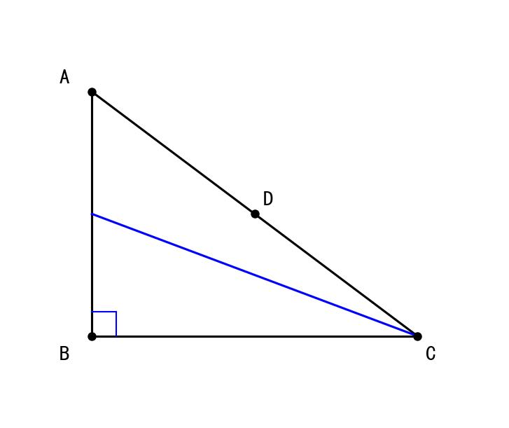
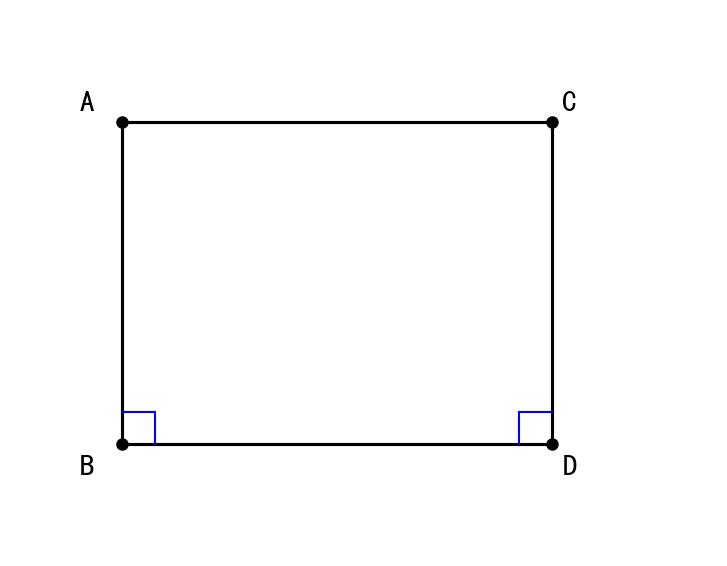
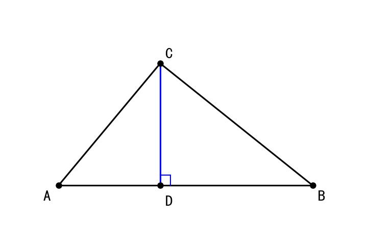
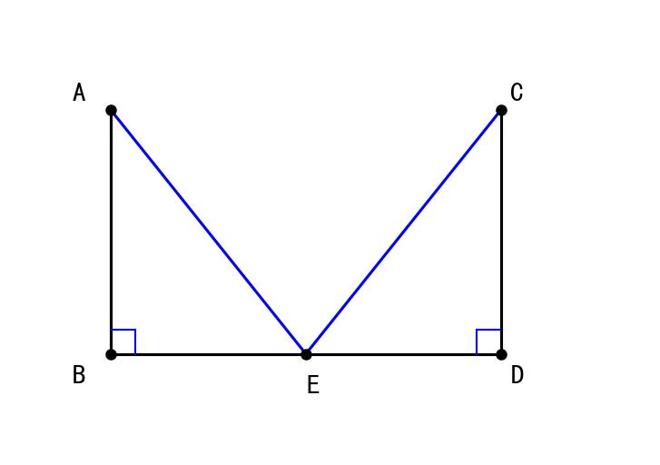
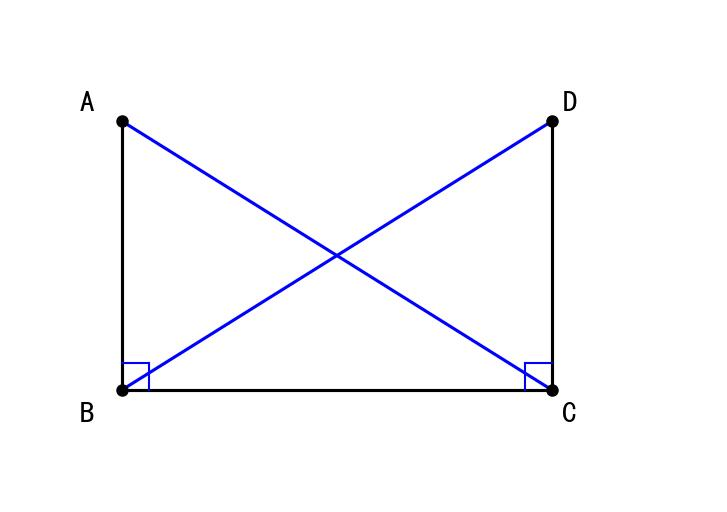

# 📝 Day 11 专项练习题集 - 2月8日（直角三角形与全等综合）

> **练习要求：**
> 1. 数学部分时长：60分钟
> 2. 独立完成，完成后对照文末答案

---

## 📐 第一部分：数学·直角三角形与全等综合（35题）

### 一、选择题（12题）

1. 直角三角形的两个锐角之和等于（  ）
   A. 90°　　B. 180°　　C. 60°　　D. 120°

2. 在Rt△ABC中，∠C = 90°，∠A = 30°，AB = 10cm，则BC =（  ）cm
   A. 5　　B. 5√3　　C. 10　　D. 10√3

3. 在Rt△ABC中，∠C = 90°，AC = 3，BC = 4，则AB =（  ）
   A. 5　　B. 6　　C. 7　　D. √7

4. 直角三角形斜边上的中线等于（  ）
   A. 一条直角边　　B. 斜边　　C. 斜边的一半　　D. 无法确定

5. 下列各组数中，能作为直角三角形三边的是（  ）
   A. 1, 2, 3　　B. 2, 3, 4　　C. 3, 4, 5　　D. 4, 5, 6

6. 在Rt△ABC中，∠C = 90°，若∠A = 2∠B，则∠A =（  ）
   A. 30°　　B. 45°　　C. 60°　　D. 90°

7. 在Rt△ABC和Rt△DEF中，∠C = ∠F = 90°，下列条件能判定△ABC≌△DEF的是（  ）
   A. AB = DE　　B. AC = DF　　C. AB = DE, AC = DF　　D. ∠A = ∠D

8. 在Rt△ABC中，∠ACB = 90°，CD是斜边AB上的高，下列结论错误的是（  ）
   A. CD² = AD·DB　　B. AC² = AD·AB　　C. BC² = BD·AB　　D. CD = AB

9. 如图，在Rt△ABC中，∠C = 90°，D是AB中点，则CD与AB的关系是（  ）



   A. CD = AB　　B. CD = ½AB　　C. CD = 2AB　　D. 无关系

10. 在△ABC中，a² + b² = c²，则∠C =（  ）
    A. 锐角　　B. 直角　　C. 钝角　　D. 无法确定

11. 如图，AB⊥BD，CD⊥BD，AB = CD = 3，BD = 4，则AC =（  ）



    A. 4　　B. 5　　C. 6　　D. 7

12. 在Rt△ABC中，∠C = 90°，AC = BC = 1，则AB =（  ）
    A. 1　　B. √2　　C. 2　　D. √3

### 二、填空题（12题）

13. 直角三角形中，90°的角叫做______，90°角所对的边叫做______。

14. 勾股定理：直角三角形两直角边的平方和等于______的平方。

15. 在Rt△ABC中，∠C = 90°，则∠A + ∠B = ______°。

16. 在Rt△ABC中，∠C = 90°，AC = 5，BC = 12，则AB = ______。

17. 在Rt△ABC中，∠C = 90°，∠A = 30°，AC = 6，则AB = ______。

18. 在Rt△ABC中，∠C = 90°，AB = 10，D是AB中点，则CD = ______。

19. 判定直角三角形全等的特有方法是______。

20. 在Rt△ABC和Rt△DEF中，∠C = ∠F = 90°，AB = DE，BC = EF，则△ABC≌△DEF的判定依据是______。

21. 常见的勾股数有：3, 4, 5；5, 12, ______；8, 15, ______。

22. 在△ABC中，AB = 13，AC = 5，BC = 12，则△ABC是______三角形。

23. 等腰直角三角形的两个锐角都等于______°。

24. 在Rt△ABC中，∠C = 90°，若AB = 2BC，则∠A = ______°。

### 三、解答题（11题）

25. 在Rt△ABC中，∠C = 90°，AC = 6cm，BC = 8cm，求AB的长度。

26. 如图，在Rt△ABC中，∠ACB = 90°，CD⊥AB于D，AC = 6，BC = 8，求CD的长度。



27. 如图，∠ACB = ∠ADB = 90°，AC = AD，求证：BC = BD


28. 如图，AB⊥BD，CD⊥BD，AB = CD，E是BD的中点，求证：AE = CE



29. 在Rt△ABC中，∠C = 90°，∠A = 30°，AB = 20cm，求AC和BC的长度。

30. 如图，在△ABC中，∠ACB = 90°，CD⊥AB于D，若AD = 4，BD = 9，求CD的长度。

31. 如图，AB⊥BC，DC⊥BC，AC = BD，求证：AB = DC



32. 如图，在Rt△ABC中，∠C = 90°，M是AB的中点，DM⊥AB交BC的延长线于D，求证：DA = DB

33. 在Rt△ABC中，∠C = 90°，AC = 3cm，BC = 4cm，求：
    (1) 斜边AB的长度
    (2) 斜边上的高CD的长度

34. 如图，在△ABC中，∠ACB = 90°，AC = BC，D是AC上一点，AE⊥BD于E，求证：BD = 2AE

35. 如图，在△ABC中，∠C = 90°，∠A = 30°，BD平分∠ABC交AC于D，若BC = 6cm，求BD的长度。

---

## 📝 参考答案

### 一、选择题答案

| 题号 | 答案 | 解析 |
|------|------|------|
| 1 | A | 三角形内角和180°，直角90°，所以两锐角和90° |
| 2 | A | 30°角对的直角边 = 斜边的一半 = 5 |
| 3 | A | 勾股定理：AB = √(9+16) = 5 |
| 4 | C | 斜边上的中线 = 斜边/2 |
| 5 | C | 3² + 4² = 5² = 25 ✓ |
| 6 | C | ∠A + ∠B = 90°，2∠B + ∠B = 90°，∠B = 30°，∠A = 60° |
| 7 | C | HL判定：斜边+直角边 |
| 8 | D | CD ≠ AB，其他三个是射影定理 |
| 9 | B | 斜边中线 = 斜边/2 |
| 10 | B | 勾股定理逆定理 |
| 11 | B | AC² = AB² + BD² + CD² - 2·BD·0 = 9 + 16 = 25，AC = 5 |
| 12 | B | AB = √(1+1) = √2 |

### 二、填空题答案

| 题号 | 答案 |
|------|------|
| 13 | 直角；斜边 |
| 14 | 斜边 |
| 15 | 90 |
| 16 | 13 |
| 17 | 4√3（或约6.93） |
| 18 | 5 |
| 19 | HL |
| 20 | HL |
| 21 | 13；17 |
| 22 | 直角 |
| 23 | 45 |
| 24 | 60 |

### 三、解答题答案

**25题答案：**
```
解：根据勾股定理
AB² = AC² + BC²
AB² = 6² + 8² = 36 + 64 = 100
AB = 10cm
```

**26题答案：**
```
解：先求AB
AB² = AC² + BC² = 36 + 64 = 100
AB = 10

用面积法：
S = ½·AC·BC = ½·AB·CD
½·6·8 = ½·10·CD
24 = 5·CD
CD = 4.8cm
```

**27题答案：**
```
证明：∵ ∠ACB = ∠ADB = 90°
∴ Rt△ACB 和 Rt△ADB

在 Rt△ACB 和 Rt△ADB 中
     ┌ AB = AB    （公共斜边）
     └ AC = AD    （已知直角边）
∴ Rt△ACB ≌ Rt△ADB  （HL）
∴ BC = BD
```

**33题答案：**
```
(1) AB² = AC² + BC² = 9 + 16 = 25
    AB = 5cm

(2) 用面积法：
    S = ½·AC·BC = ½·AB·CD
    ½·3·4 = ½·5·CD
    6 = 2.5·CD
    CD = 2.4cm
```

---

**完成时间：____分钟**

**正确题数：____/35**

**正确率：____%**
