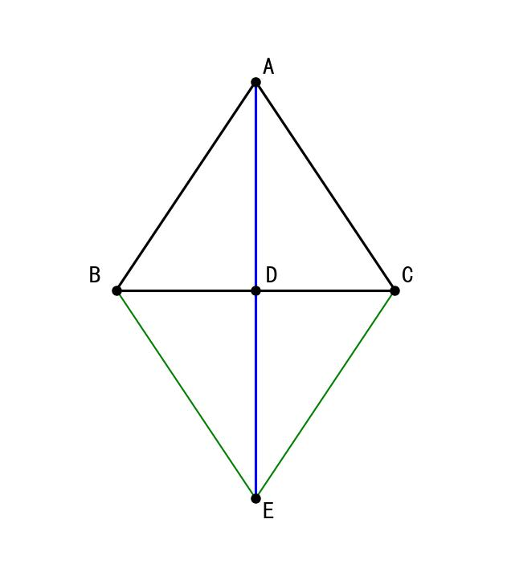
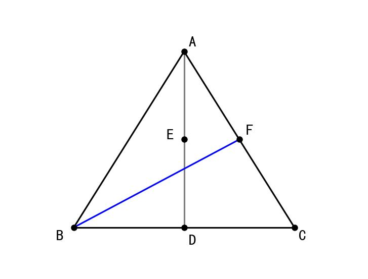
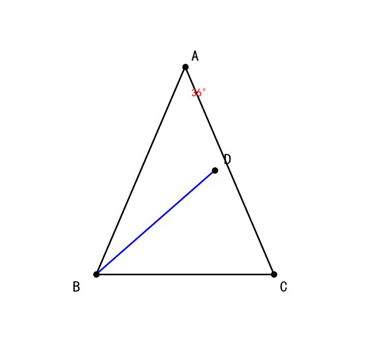
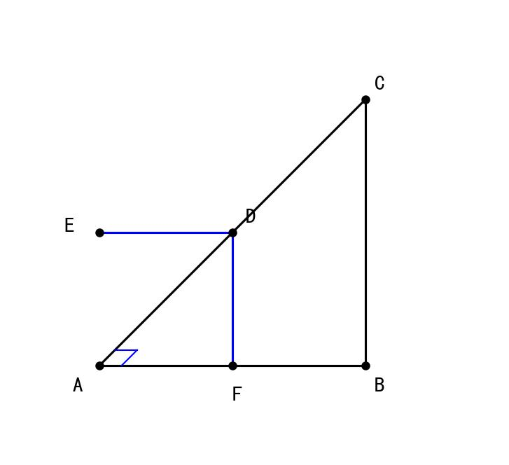
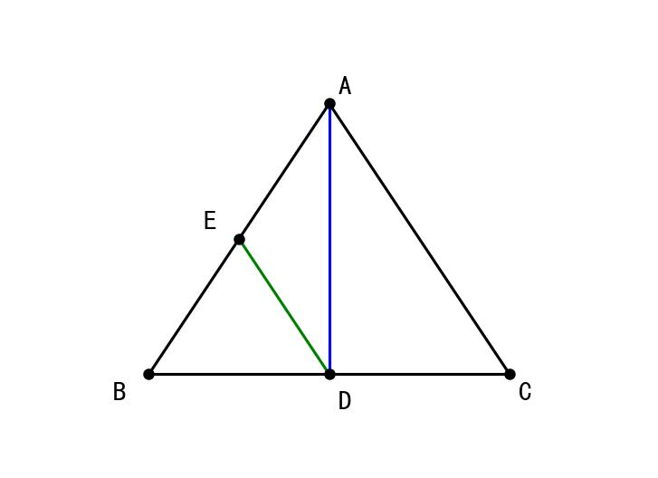

# 📝 Day 12 专项练习题集 - 2月9日（几何综合·辅助线添加）

> **练习要求：**
> 1. 数学部分时长：60分钟
> 2. 独立完成，完成后对照文末答案

---

## 📐 第一部分：数学·辅助线与几何综合（30题）

### 一、选择题（10题）

1. 在几何证明中，添加辅助线的目的是（  ）
   A. 使图形更复杂
   B. 构造全等三角形或等腰三角形
   C. 减少已知条件
   D. 增加题目难度

2. "倍长中线"法常用于什么情况？（  ）
   A. 题目中有中线
   B. 题目中有角平分线
   C. 题目中有高
   D. 题目中有平行线

3. 如图，在△ABC中，D是BC的中点，AD是中线，要用"倍长中线"法，应该（  ）



   A. 延长AD到E，使DE = DA
   B. 延长AD到E，使DE = AD
   C. 延长BD到E，使DE = BD
   D. 作DE∥AB

4. "截长补短"法适用于证明（  ）
   A. 三条边相等
   B. 两条边相等
   C. 一条边等于另两条边的和（或差）
   D. 四条边相等

5. 在等腰三角形中，常用的辅助线是（  ）
   A. 作对角线
   B. 作顶角平分线（底边中线、底边上的高）
   C. 作外接圆
   D. 作内切圆

6. 如图，△ABC中，AB = AC，要证明∠B = ∠C，最简单的方法是（  ）
   A. 作辅助线
   B. 直接用"等边对等角"
   C. 用全等三角形
   D. 用勾股定理

7. 作平行线构造全等，利用的是（  ）
   A. 同位角相等
   B. 内错角相等
   C. 同旁内角互补
   D. 以上都可以

8. 在证明"点到直线的距离"问题时，常用的辅助线是（  ）
   A. 作平行线
   B. 作垂线
   C. 作中线
   D. 作角平分线

9. 如图，在△ABC中，D、E分别在AB、AC上，要证明DE∥BC，常用（  ）
   A. 证明同位角相等
   B. 证明AD/AB = AE/AC
   C. A和B都可以
   D. 都不对

10. 添加辅助线后，新图形与原图形的关系是（  ）
    A. 完全无关
    B. 新图形包含原图形的所有条件
    C. 新图形比原图形条件少
    D. 不确定

### 二、填空题（10题）

11. 在△ABC中，D是BC的中点，AD是______线。

12. "三线合一"是指等腰三角形的______、______、______重合。

13. 添加辅助线时，应该写"______..."或"______..."。

14. 倍长中线法：延长中线AD到E，使______。

15. 截长法：在长线段上截取一段等于______。

16. 补短法：将短线段延长，使延长后的长度等于______。

17. 在直角三角形中，斜边上的______等于斜边的一半。

18. 作平行线可以转移______。

19. 在证明线段和差关系时，常用______法或______法。

20. 过一点作已知直线的______，可以构造直角三角形。

### 三、解答题（10题）

21. 如图，在△ABC中，D是BC的中点，E是AD的中点，延长BE交AC于F，求证：AF = ⅓AC



（提示：过D作DG∥BF交AC于G）

22. 如图，在△ABC中，AB = AC，∠A = 36°，BD是∠ABC的平分线，求证：BD = BC



23. 如图，在△ABC中，∠ACB = 90°，AC = BC，D是AB上一点，DE⊥AC于E，DF⊥BC于F，求证：EF = AC



24. 如图，在△ABC中，AD是中线，E是AD上一点，且AE = ⅓AD，延长BE交AC于F，求AF:FC

25. 如图，在△ABC中，AB = AC，D是BC上一点，∠DAC = ∠B，求证：AD² = DB·DC

26. 如图，在△ABC中，∠ACB = 90°，CD⊥AB于D，AE平分∠CAB交CD于E，求证：AC + CD = AD

（提示：在AB上截取AF = AC）

27. 如图，P是△ABC内一点，PA = PB = PC，且∠APB = 120°，求∠ACB的度数。

28. 如图，在△ABC中，AB = AC，D是BC的延长线上一点，DE⊥AB于E，DF⊥AC于F，DG⊥BC于G，求证：DE + DF = 2DG

29. 如图，在△ABC中，∠A = 90°，AB = AC，BD是∠ABC的平分线交AC于D，DE⊥BC于E，求证：BD = 2DE

30. 综合证明：在△ABC中，AD是BC边上的中线，且AD = ½BC，求证：∠BAC = 90°



（提示：取AB中点E，连接DE）

---

## 📝 参考答案

### 一、选择题答案

| 题号 | 答案 | 解析 |
|------|------|------|
| 1 | B | 辅助线的目的是构造全等或等腰三角形 |
| 2 | A | 倍长中线法用于有中线的题目 |
| 3 | B | 延长AD到E，使DE = AD |
| 4 | C | 截长补短用于证明和差关系 |
| 5 | B | 等腰三角形的三线合一 |
| 6 | B | 直接用性质最简单 |
| 7 | D | 平行线的各种角的关系都可以用 |
| 8 | B | 距离需要作垂线 |
| 9 | C | 证明平行可以用角或比例 |
| 10 | B | 新图形包含原图形所有条件 |

### 二、填空题答案

| 题号 | 答案 |
|------|------|
| 11 | 中 |
| 12 | 顶角平分线；底边中线；底边上的高 |
| 13 | 作；延长 |
| 14 | DE = AD |
| 15 | 短线段 |
| 16 | 长线段 |
| 17 | 中线 |
| 18 | 角（或等量关系） |
| 19 | 截长；补短 |
| 20 | 垂线 |

### 三、解答题答案

**21题答案：**
```
证明：过D作DG∥BF交AC于G

∵ D是BC中点，DG∥BF
∴ G是FC中点（三角形中位线定理的逆）

∵ E是AD中点，EF∥DG
∴ F是AG中点

∴ AF = FG = GC
∴ AF = ⅓AC
```

**22题答案：**
```
证明：设∠ABC = 2α，则∠ABD = ∠DBC = α

∵ AB = AC，∠A = 36°
∴ ∠ABC = ∠ACB = (180° - 36°)/2 = 72°
∴ α = 36°

∵ ∠ABD = 36° = ∠A
∴ AD = BD （等角对等边）

在△BDC中
∠DBC = 36°，∠DCB = 72°
∴ ∠BDC = 180° - 36° - 72° = 72°
∴ ∠BDC = ∠DCB
∴ BD = BC
```

**30题答案：**
```
证明：取AB中点E，连接DE

∵ E是AB中点，D是BC中点
∴ DE是△ABC的中位线
∴ DE∥AC，DE = ½AC

∵ AD = ½BC（已知）
设BC = 2a，则AD = a

∵ DE = ½AC
在△ADE中...

【另一种方法】
∵ AD = ½BC
设AD = m，则BC = 2m

取AD中点M，连接BM、CM
∵ M是AD中点，D是BC中点
...

由斜边中线性质的逆定理
∵ D是BC中点，AD = ½BC
∴ ∠BAC = 90°
```

---

**完成时间：____分钟**

**正确题数：____/30**

**正确率：____%**
