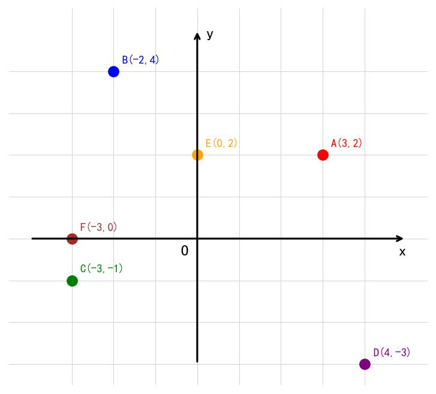

# 📝 Day 13 专项练习题集 - 2月10日（平面直角坐标系）

> **练习要求：**
> 1. 数学部分时长：60分钟
> 2. 独立完成，完成后对照文末答案

---

## 📐 第一部分：数学·平面直角坐标系专项（40题）

### 一、选择题（15题）

1. 平面直角坐标系由（  ）组成
   A. 一条数轴
   B. 两条平行的数轴
   C. 两条互相垂直且有公共原点的数轴
   D. 任意两条直线

2. 点(3, -2)在（  ）
   A. 第一象限　　B. 第二象限　　C. 第三象限　　D. 第四象限

3. 点(-4, 5)在（  ）
   A. 第一象限　　B. 第二象限　　C. 第三象限　　D. 第四象限

4. 下列各点中，在x轴上的是（  ）
   A. (0, 3)　　B. (3, 0)　　C. (3, 3)　　D. (-3, -3)

5. 下列各点中，在y轴上的是（  ）
   A. (2, 0)　　B. (0, -2)　　C. (2, 2)　　D. (-2, -2)

6. 原点的坐标是（  ）
   A. (1, 1)　　B. (0, 1)　　C. (1, 0)　　D. (0, 0)

7. 点(2, 3)到x轴的距离是（  ）
   A. 2　　B. 3　　C. 5　　D. √13

8. 点(-3, 4)到y轴的距离是（  ）
   A. 3　　B. 4　　C. 5　　D. -3

9. 点(2, -5)关于x轴对称的点是（  ）
   A. (-2, -5)　　B. (2, 5)　　C. (-2, 5)　　D. (-5, 2)

10. 点(-3, 4)关于y轴对称的点是（  ）
    A. (3, 4)　　B. (-3, -4)　　C. (3, -4)　　D. (4, -3)

11. 点(a, b)关于原点对称的点是（  ）
    A. (-a, b)　　B. (a, -b)　　C. (-a, -b)　　D. (b, a)

12. 若点P(m, -3)在第三象限，则m的取值范围是（  ）
    A. m > 0　　B. m < 0　　C. m = 0　　D. m ≠ 0

13. 若点P(2, n)在第四象限，则n的取值范围是（  ）
    A. n > 0　　B. n < 0　　C. n = 0　　D. n ≠ 0

14. 若点P(a-1, a+1)在y轴上，则a =（  ）
    A. 0　　B. 1　　C. -1　　D. 2

15. 若点P(a+2, 3-a)在x轴上，则a =（  ）
    A. -2　　B. 2　　C. 3　　D. -3

### 二、填空题（15题）

16. 平面直角坐标系的横轴也叫______轴，纵轴也叫______轴。

17. 点(5, -3)的横坐标是______，纵坐标是______。

18. 第一象限内点的坐标符号是______。

19. 第三象限内点的坐标符号是______。

20. x轴上的点，纵坐标都等于______。

21. y轴上的点，横坐标都等于______。

22. 点(4, 0)在______轴上。

23. 点(0, -5)在______轴上。

24. 点(-2, 3)到x轴的距离是______。

25. 点(5, -4)到y轴的距离是______。

26. 点(3, 4)关于x轴对称的点是______。

27. 点(-2, 5)关于y轴对称的点是______。

28. 点(1, -3)关于原点对称的点是______。

29. 若点(a, b)满足ab > 0，则点(a, b)在第______象限或第______象限。

30. 若点(a, b)满足ab < 0，则点(a, b)在第______象限或第______象限。

### 三、解答题（10题）

31. 在直角坐标系中，画出下列各点，并说明它们分别在哪个象限或哪条轴上：
    A(3, 2), B(-2, 4), C(-3, -1), D(4, -3), E(0, 2), F(-3, 0)



32. 判断下列各点所在的象限或坐标轴：
    (1) (5, 3)　(2) (-2, 7)　(3) (-4, -6)　(4) (3, -8)　(5) (0, -5)　(6) (4, 0)

33. 已知点P(m+3, m-1)在第一象限，求m的取值范围。

34. 已知点P(2a-1, a+3)在第二象限，求a的取值范围。

35. 已知点A(3, 2)，求：
    (1) A关于x轴对称的点A₁的坐标
    (2) A关于y轴对称的点A₂的坐标
    (3) A关于原点对称的点A₃的坐标

36. 已知点P(a-1, 2-a)在x轴上，求a的值和点P的坐标。

37. 已知点P(2m-4, m+1)在y轴上，求m的值和点P的坐标。

38. 已知点A(2, 5)和点B(2, -3)，求AB的长度。

39. 已知点A(-1, 3)和点B(4, 3)，求AB的长度。

40. 已知点A(0, 0)和点B(3, 4)，求AB的长度。

---

## 📝 参考答案

### 一、选择题答案

| 题号 | 答案 | 解析 |
|------|------|------|
| 1 | C | 定义：两条互相垂直且有公共原点的数轴 |
| 2 | D | 横坐标正，纵坐标负 → 第四象限 |
| 3 | B | 横坐标负，纵坐标正 → 第二象限 |
| 4 | B | x轴上的点纵坐标为0 |
| 5 | B | y轴上的点横坐标为0 |
| 6 | D | 原点坐标(0, 0) |
| 7 | B | 到x轴距离 = |纵坐标| = 3 |
| 8 | A | 到y轴距离 = |横坐标| = 3 |
| 9 | B | 关于x轴对称，纵坐标变号 |
| 10 | A | 关于y轴对称，横坐标变号 |
| 11 | C | 关于原点对称，横纵坐标都变号 |
| 12 | B | 第三象限：横坐标负，纵坐标负 |
| 13 | B | 第四象限：横坐标正，纵坐标负 |
| 14 | B | 在y轴上，横坐标为0，a-1=0，a=1 |
| 15 | C | 在x轴上，纵坐标为0，3-a=0，a=3 |

### 二、填空题答案

| 题号 | 答案 |
|------|------|
| 16 | x；y |
| 17 | 5；-3 |
| 18 | (+, +) |
| 19 | (-, -) |
| 20 | 0 |
| 21 | 0 |
| 22 | x |
| 23 | y |
| 24 | 3 |
| 25 | 5 |
| 26 | (3, -4) |
| 27 | (2, 5) |
| 28 | (-1, 3) |
| 29 | 一；三 |
| 30 | 二；四 |

### 三、解答题答案

**31题答案：**
- A(3, 2)：第一象限
- B(-2, 4)：第二象限
- C(-3, -1)：第三象限
- D(4, -3)：第四象限
- E(0, 2)：y轴上
- F(-3, 0)：x轴上

**33题答案：**
```
∵ 点P(m+3, m-1)在第一象限
∴ m+3 > 0 且 m-1 > 0
  m > -3 且 m > 1
∴ m > 1
```

**34题答案：**
```
∵ 点P(2a-1, a+3)在第二象限
∴ 2a-1 < 0 且 a+3 > 0
  a < ½ 且 a > -3
∴ -3 < a < ½
```

**35题答案：**
```
(1) A₁(3, -2) （纵坐标变号）
(2) A₂(-3, 2) （横坐标变号）
(3) A₃(-3, -2) （横纵坐标都变号）
```

**36题答案：**
```
∵ 点P在x轴上
∴ 纵坐标为0，即 2-a = 0
∴ a = 2
∴ P(2-1, 0) = P(1, 0)
```

**37题答案：**
```
∵ 点P在y轴上
∴ 横坐标为0，即 2m-4 = 0
∴ m = 2
∴ P(0, 2+1) = P(0, 3)
```

**38题答案：**
```
∵ A(2, 5)和B(2, -3)横坐标相同
∴ AB = |5-(-3)| = |5+3| = 8
```

**39题答案：**
```
∵ A(-1, 3)和B(4, 3)纵坐标相同
∴ AB = |4-(-1)| = |4+1| = 5
```

**40题答案：**
```
AB = √[(3-0)² + (4-0)²]
   = √(9 + 16)
   = √25
   = 5
```

---

**完成时间：____分钟**

**正确题数：____/40**

**正确率：____%**
