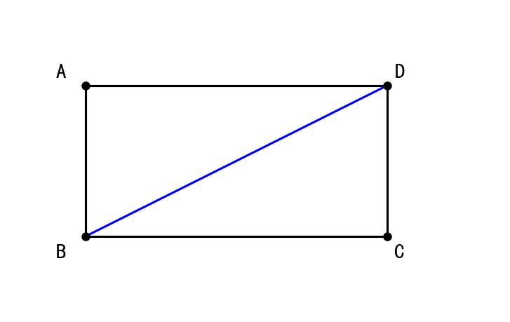
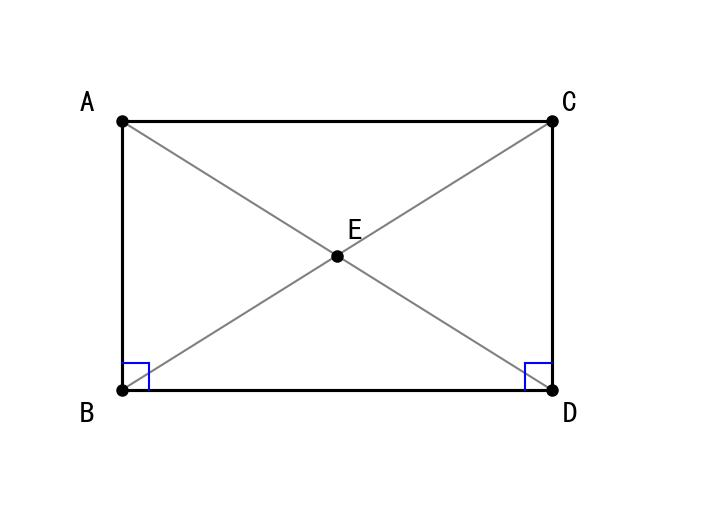
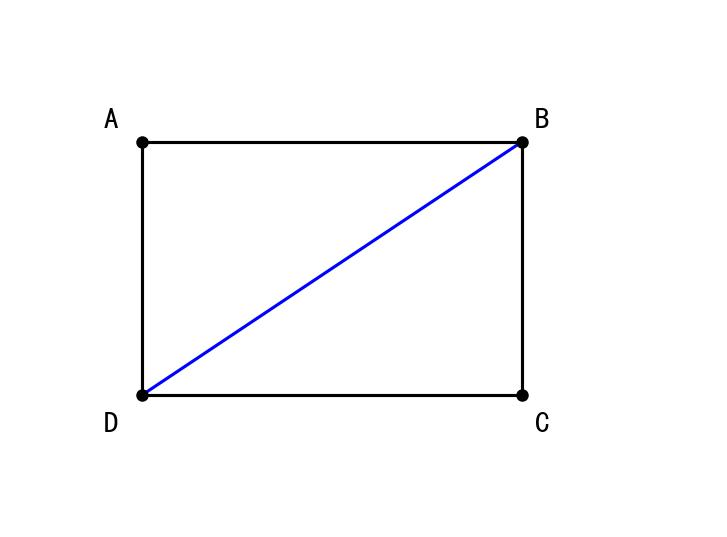
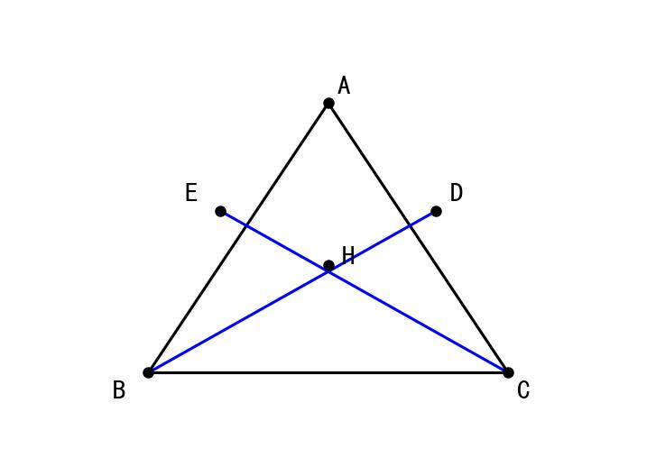

# 📝 Day 14 专项练习题集 - 2月11日（第二周综合测试）

> **练习要求：**
> 1. 本练习作为第二周综合复习
> 2. 时长：90分钟
> 3. 独立完成，完成后对照文末答案

---

## 📐 第二周数学综合练习（50题）

### 一、选择题（20题）

**【全等三角形判定】**

1. 下列不能判定两个三角形全等的条件是（  ）
   A. SSS　　B. SAS　　C. SSA　　D. ASA

2. △ABC≌△DEF，且∠A = 50°，∠B = 70°，则∠F =（  ）
   A. 50°　　B. 60°　　C. 70°　　D. 120°

3. 如图，AB = DC，∠ABD = ∠CDB，则△ABD≌△CDB的判定依据是（  ）



   A. SSS　　B. SAS　　C. ASA　　D. AAS

4. 如图，AB⊥BD，CD⊥BD，AB = CD，则Rt△ABE≌Rt△DCE的判定依据是（  ）



   A. SSS　　B. SAS　　C. HL　　D. ASA

5. HL判定只能用于（  ）
   A. 等腰三角形　　B. 直角三角形　　C. 等边三角形　　D. 任意三角形

**【等腰三角形】**

6. 等腰三角形的性质不包括（  ）
   A. 等边对等角　　B. 等角对等边　　C. 三线合一　　D. B是判定

7. 在等腰△ABC中，AB = AC，∠A = 50°，则∠B =（  ）
   A. 50°　　B. 65°　　C. 70°　　D. 130°

8. 在等腰△ABC中，AB = AC = 10cm，BC = 12cm，则BC边上的高是（  ）cm
   A. 6　　B. 8　　C. 10　　D. 12

**【直角三角形】**

9. 在Rt△ABC中，∠C = 90°，AC = 6，BC = 8，则AB =（  ）
   A. 10　　B. 14　　C. √14　　D. 100

10. 在Rt△ABC中，∠C = 90°，∠A = 30°，AB = 20，则BC =（  ）
    A. 10　　B. 10√3　　C. 20　　D. 20√3

11. 在Rt△ABC中，∠C = 90°，D是AB中点，则CD =（  ）
    A. AB　　B. ½AB　　C. 2AB　　D. ¼AB

12. 下列各组数能构成直角三角形的是（  ）
    A. 1, 2, 3　　B. 2, 3, 4　　C. 5, 12, 13　　D. 6, 7, 8

**【平面直角坐标系】**

13. 点(-3, 4)在（  ）
    A. 第一象限　　B. 第二象限　　C. 第三象限　　D. 第四象限

14. 点(a, 0)一定在（  ）
    A. 第一象限　　B. x轴上　　C. y轴上　　D. 原点

15. 点(2, -3)到x轴的距离是（  ）
    A. 2　　B. 3　　C. -3　　D. 5

16. 点(5, -2)关于x轴对称的点是（  ）
    A. (-5, -2)　　B. (5, 2)　　C. (-5, 2)　　D. (2, -5)

17. 点(-1, 3)关于原点对称的点是（  ）
    A. (1, 3)　　B. (-1, -3)　　C. (1, -3)　　D. (3, -1)

18. 若点P(m-1, m+2)在第三象限，则m的取值范围是（  ）
    A. m > 1　　B. m < -2　　C. -2 < m < 1　　D. m > -2

**【函数初步】**

19. 下列关系式中，y是x的函数的是（  ）
    A. y² = x　　B. y = 1/x　　C. |y| = x　　D. x² + y² = 1

20. 函数y = 1/(x-2)中，自变量x的取值范围是（  ）
    A. x ≠ 0　　B. x ≠ 2　　C. x > 2　　D. x < 2

### 二、填空题（15题）

21. 全等三角形的5种判定方法是______、______、______、______、______。

22. 等腰三角形的两个性质是______和______。

23. 直角三角形两锐角之和等于______°。

24. 勾股定理：在直角三角形中，两直角边的平方和等于______的平方。

25. 斜边上的中线等于______的一半。

26. 点(0, 5)在______轴上。

27. 第四象限内点的坐标符号是______。

28. 点(a, b)关于y轴对称的点是______。

29. 点(3, 4)到原点的距离是______。

30. 若点(a-2, 3a+6)在x轴上，则a = ______。

31. 在△ABC中，AB = AC = 5，BC = 6，则△ABC的面积是______。

32. 在Rt△ABC中，∠C = 90°，若AB = 13，AC = 5，则BC = ______。

33. △ABC≌△DEF，若AB = 3cm，BC = 4cm，CA = 5cm，则△DEF的周长是______cm。

34. 函数y = √(x-1)中，自变量x的取值范围是______。

35. 若两点A(2, y₁)和B(2, y₂)，则AB的长度是______。

### 三、解答题（15题）

36. 如图，AB = CD，AD = CB，求证：△ABD≌△CDB



37. 如图，∠1 = ∠2，∠A = ∠D，AC = DF，求证：BC = EF


38. 如图，AB⊥BD，CD⊥BD，AB = CD，求证：AC = BD


39. 在等腰△ABC中，AB = AC，D是BC中点，求证：AD⊥BC

40. 在Rt△ABC中，∠C = 90°，AC = 8cm，BC = 6cm，求AB的长度和斜边上的高CD。

41. 如图，∠ACB = ∠ADB = 90°，AC = AD，求证：BC = BD


42. 已知点A(-2, 3)，B(4, 3)，C(4, -1)，求：
    (1) AB的长度
    (2) BC的长度
    (3) △ABC的面积

43. 已知点P(2m-1, m+3)在第一象限，求m的取值范围。

44. 求点(3, 4)关于x轴、y轴和原点对称的点的坐标。

45. 已知函数y = 2/(x+1) + √(x-2)，求自变量x的取值范围。

46. 如图，在△ABC中，AB = AC，BD、CE是高，交于点H，求证：BH = CH



47. 如图，在△ABC中，D是BC上的中点，E是AD上一点，且BE的延长线交AC于F，若AE = EF，求证：AC = 2BF


48. 在△ABC中，∠ACB = 90°，CD⊥AB于D，AC = 3，BC = 4，求AB和CD。

49. 如图，AB∥CD，AB = CD，E是BD的中点，求证：E也是AC的中点


50. 综合题：在直角坐标系中，A(0, 3)，B(4, 0)，C(-2, 0)
    (1) 求AB、BC、AC的长度
    (2) 判断△ABC是什么三角形

---

## 📝 参考答案

### 一、选择题答案

| 题号 | 答案 | 题号 | 答案 |
|------|------|------|------|
| 1 | C | 11 | B |
| 2 | B | 12 | C |
| 3 | B | 13 | B |
| 4 | C | 14 | B |
| 5 | B | 15 | B |
| 6 | D | 16 | B |
| 7 | B | 17 | C |
| 8 | B | 18 | B |
| 9 | A | 19 | B |
| 10 | A | 20 | B |

### 二、填空题答案

| 题号 | 答案 |
|------|------|
| 21 | SSS、SAS、ASA、AAS、HL |
| 22 | 等边对等角；三线合一 |
| 23 | 90 |
| 24 | 斜边 |
| 25 | 斜边 |
| 26 | y |
| 27 | (+, -) |
| 28 | (-a, b) |
| 29 | 5 |
| 30 | -2 |
| 31 | 12 |
| 32 | 12 |
| 33 | 12 |
| 34 | x ≥ 1 |
| 35 | |y₁ - y₂| |

### 三、解答题答案

**40题答案：**
```
AB² = AC² + BC² = 64 + 36 = 100
AB = 10cm

用面积法：
S = ½·AC·BC = ½·AB·CD
½·8·6 = ½·10·CD
24 = 5·CD
CD = 4.8cm
```

**42题答案：**
```
(1) A和B纵坐标相同
AB = |4-(-2)| = 6

(2) B和C横坐标相同
BC = |3-(-1)| = 4

(3) S = ½·AB·BC = ½·6·4 = 12
```

**48题答案：**
```
AB = √(AC² + BC²) = √(9+16) = 5

面积法：
½·AC·BC = ½·AB·CD
½·3·4 = ½·5·CD
6 = 2.5·CD
CD = 2.4
```

**50题答案：**
```
(1) AB = √[(4-0)² + (0-3)²] = √(16+9) = 5
    BC = |4-(-2)| = 6
    AC = √[(-2-0)² + (0-3)²] = √(4+9) = √13

(2) AB² + AC² = 25 + 13 = 38 ≠ 36 = BC²
    不是直角三角形

    AB = AC? 5 ≠ √13
    不是等腰三角形

    △ABC是不等边三角形（斜三角形）
```

---

**完成时间：____分钟**

**正确题数：____/50**

**正确率：____%**

---

## 📊 第二周学习效果自评

| 知识点 | 掌握程度 | 需要加强 |
|--------|---------|---------|
| SSS、SAS判定 | ☐优 ☐良 ☐中 ☐差 | |
| ASA、AAS、HL判定 | ☐优 ☐良 ☐中 ☐差 | |
| 等腰三角形性质 | ☐优 ☐良 ☐中 ☐差 | |
| 直角三角形性质 | ☐优 ☐良 ☐中 ☐差 | |
| 勾股定理 | ☐优 ☐良 ☐中 ☐差 | |
| 辅助线添加 | ☐优 ☐良 ☐中 ☐差 | |
| 平面直角坐标系 | ☐优 ☐良 ☐中 ☐差 | |
| 函数初步 | ☐优 ☐良 ☐中 ☐差 | |
