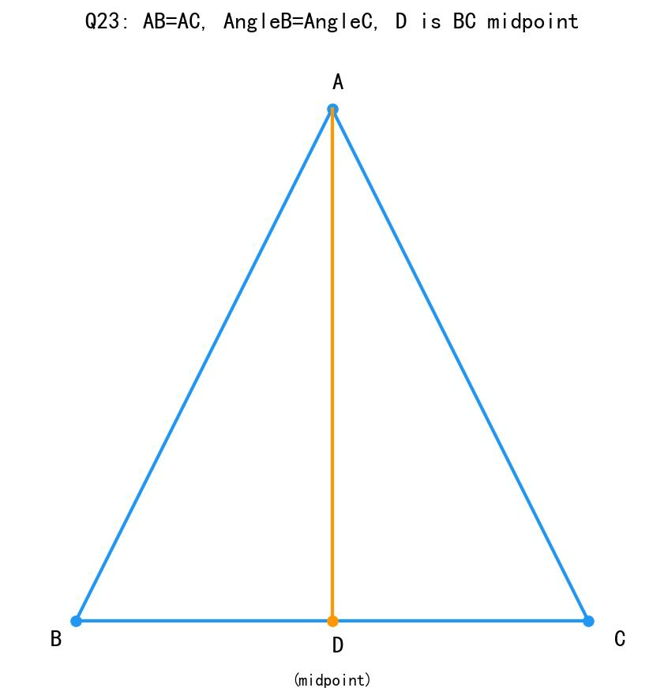
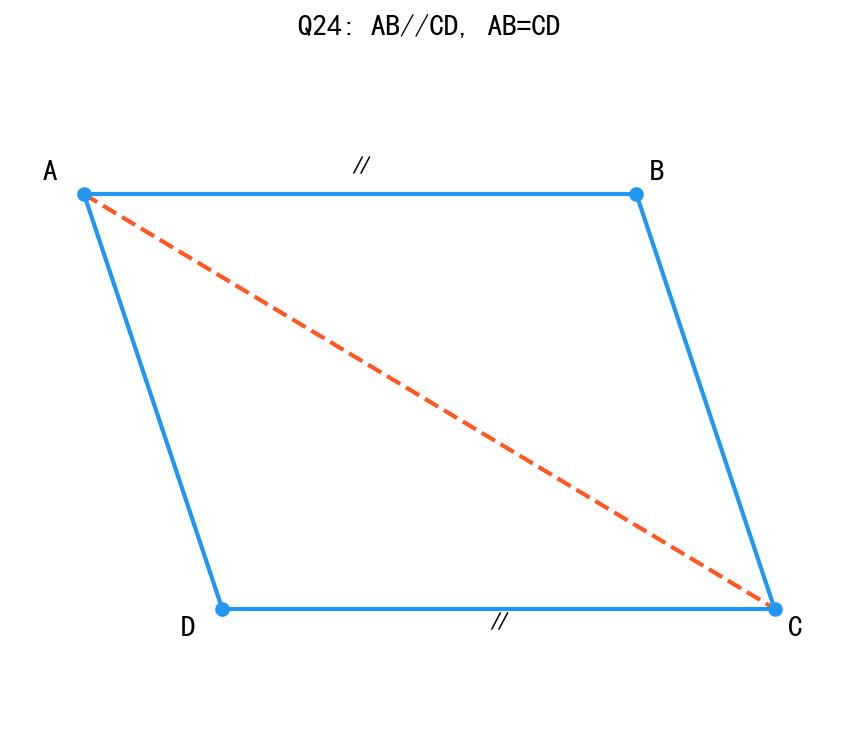
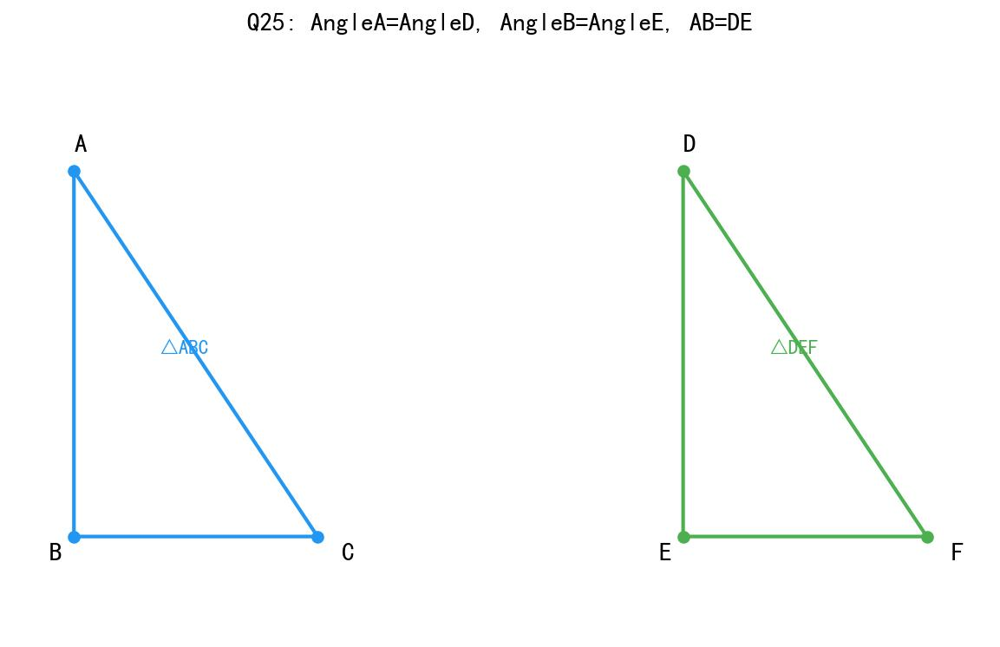
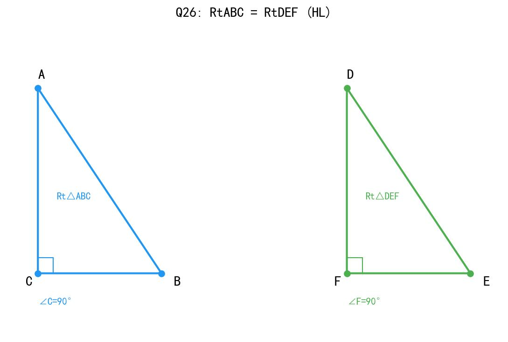
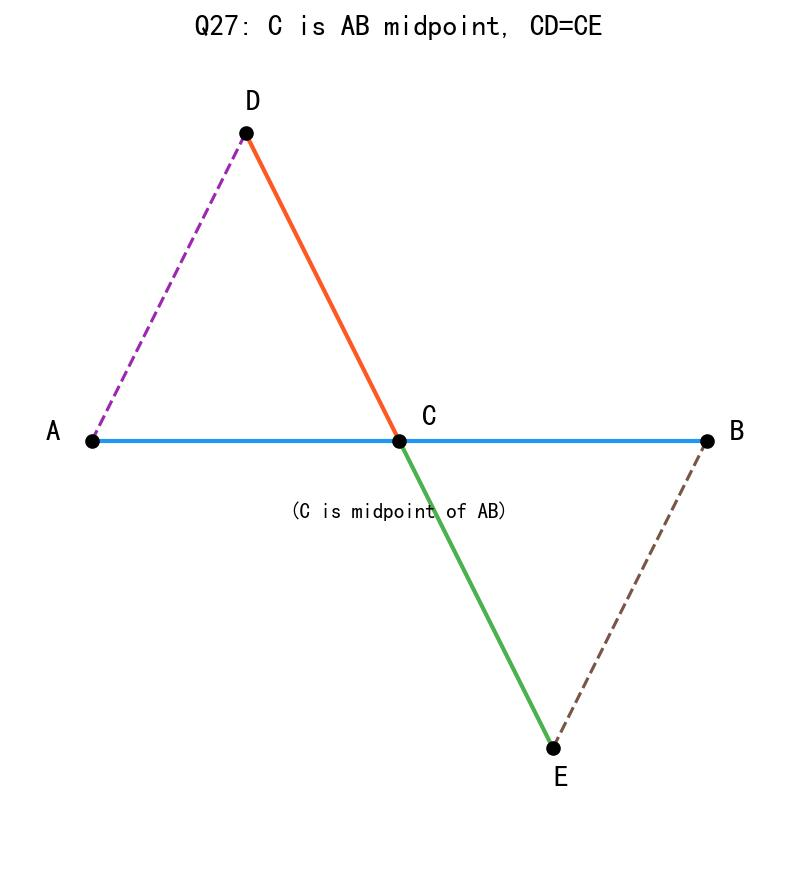
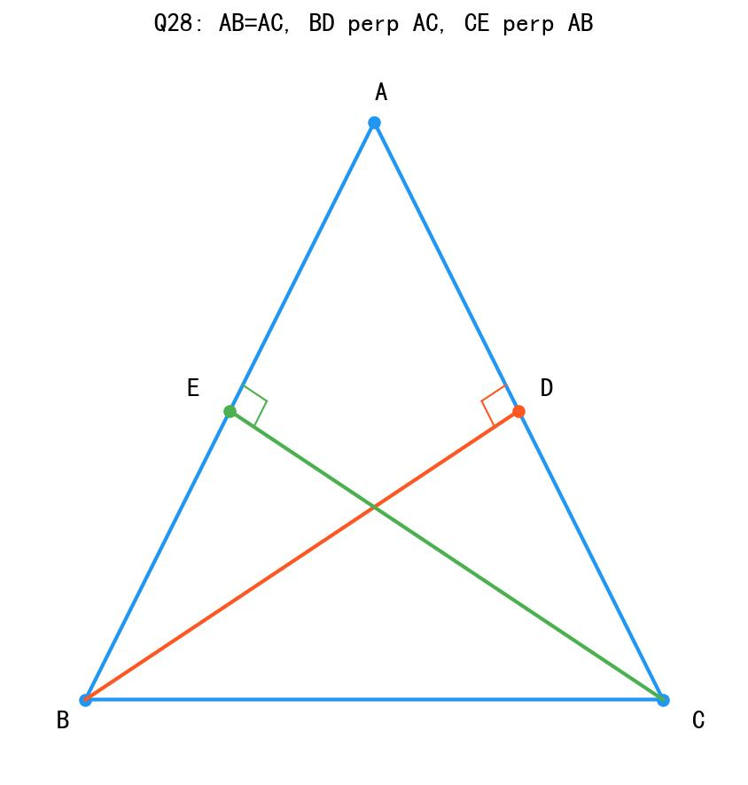
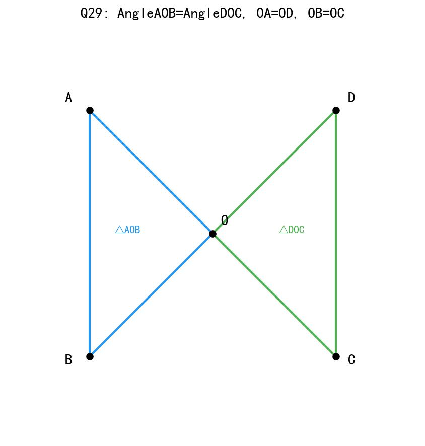
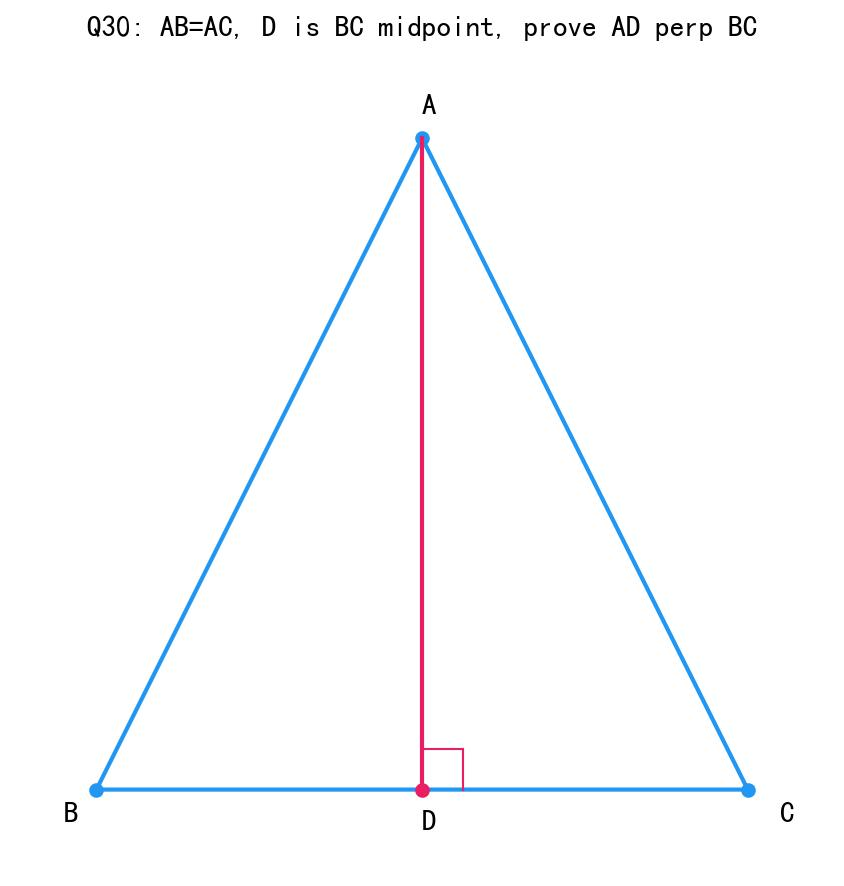

# 📝 Day 4 专项练习题集 - 2月1日（全科目完整版）

> **练习要求：**
> 1. 时长：数学 90分钟 | 生物 60分钟 | 历史 45分钟 | 道法 30分钟
> 2. 独立完成，结果请书写在练习本上，完成后对照文末答案。

---

## 📐 第一部分：数学·全等三角形判定专项（30题）

### 一、判断能否全等及判定方法（10题）

1. 已知△ABC和△DEF中，AB=DE, BC=EF, AC=DF，能判定全等吗？用什么定理？

2. 已知△ABC和△DEF中，AB=DE, ∠A=∠D, AC=DF，能判定全等吗？用什么定理？

3. 已知△ABC和△DEF中，∠A=∠D, AB=DE, ∠B=∠E，能判定全等吗？用什么定理？

4. 已知△ABC和△DEF中，∠A=∠D, ∠B=∠E, BC=EF，能判定全等吗？用什么定理？

5. 已知Rt△ABC和Rt△DEF中，∠C=∠F=90°, AB=DE, AC=DF，能判定全等吗？用什么定理？

6. 已知△ABC和△DEF中，∠A=∠D, ∠B=∠E, ∠C=∠F，能判定全等吗？为什么？

7. 已知△ABC和△DEF中，AB=DE, ∠B=∠E, BC=EF，能判定全等吗？用什么定理？

8. 已知Rt△ABC和Rt△DEF中，∠C=∠F=90°, AB=DE, BC=EF，能判定全等吗？用什么定理？

9. 已知△ABC和△DEF中，∠A=∠D, BC=EF, AC=DF，能判定全等吗？为什么？

10. 已知△ABC和△DEF中，AB=DE, AC=DF, ∠B=∠E，能判定全等吗？为什么？

### 二、选择补充条件（10题）

11. 要证明△ABC≌△DEF，已知AB=DE, AC=DF，还需要什么条件？
    A. ∠A=∠D  B. ∠B=∠E  C. BC=EF  D. 以上都可以

12. 要证明△ABC≌△DEF，已知∠A=∠D, ∠B=∠E，还需要什么条件？
    A. AB=DE  B. BC=EF  C. AC=DF  D. 以上都可以

13. 在Rt△ABC和Rt△DEF中，∠C=∠F=90°，若AB=DE，再加什么条件可证明全等？
    A. AC=DF  B. BC=EF  C. ∠A=∠D  D. 以上都可以

14. 要证明△ABC≌△DEF，已知AB=DE, BC=EF，还需要什么条件可用SAS判定？
    A. ∠A=∠D  B. ∠B=∠E  C. AC=DF  D. ∠C=∠F

15. 要证明△ABC≌△DEF，已知∠A=∠D, AB=DE，还需要什么条件可用ASA判定？
    A. ∠B=∠E  B. ∠C=∠F  C. BC=EF  D. AC=DF

16. 已知△ABC和△DEF中，AB=DE, ∠A=∠D，要使△ABC≌△DEF，可以添加的条件是（ ）
    A. BC=EF  B. ∠B=∠E  C. AC=DF  D. ∠C=∠F

17. 下列条件中，不能判定两个三角形全等的是（ ）
    A. 三条边对应相等  B. 两边和它们的夹角对应相等  
    C. 两角和它们的夹边对应相等  D. 三个角对应相等

18. 已知△ABC和△DEF中，∠A=∠D, ∠C=∠F，要使△ABC≌△DEF，还需要的条件是（ ）
    A. AB=DE  B. BC=EF  C. AC=DF  D. 以上都可以

19. 在Rt△ABC和Rt△DEF中，∠C=∠F=90°，下列条件中不能判定全等的是（ ）
    A. AB=DE, AC=DF  B. AB=DE, BC=EF  
    C. AC=DF, BC=EF  D. ∠A=∠D, BC=EF

20. 已知△ABC和△DEF中，AB=DE, BC=EF, ∠A=∠D，这两个三角形（ ）
    A. 一定全等  B. 一定不全等  C. 不一定全等  D. 无法判断

### 三、证明题（10题）

21. 已知：如图，AB=AC，BD=CD。
    求证：△ABD≌△ACD


> **图示说明**：A在顶部，B、C在底边，D是BC中点，AD是中线

---

22. 已知：如图，∠1=∠2，∠3=∠4，AB=AC。
    求证：△ABD≌△ACD


> **图示说明**：∠1和∠2是顶角A被AD分成的两个角，∠3和∠4是底角被D分成的两个角

---

23. 已知：如图，AB=AC，∠B=∠C。
    求证：△ABD≌△ACD（D是BC中点）



> **图示说明**：等腰三角形ABC，D是底边BC的中点

---

24. 已知：如图，AB∥CD，AB=CD。
    求证：△ABC≌△CDA



> **图示说明**：平行四边形ABCD，AB∥CD，对角线AC将其分成△ABC和△CDA

---

25. 已知：如图，∠A=∠D，∠B=∠E，AB=DE。
    求证：△ABC≌△DEF



> **图示说明**：左边是△ABC（蓝色），右边是△DEF（绿色），两个三角形全等

---

26. 已知：在Rt△ABC和Rt△DEF中，∠C=∠F=90°，AB=DE，BC=EF。
    求证：Rt△ABC≌Rt△DEF



> **图示说明**：两个直角三角形，C和F处为直角（90°）

---

27. 已知：如图，点C是AB的中点，CD=CE。
    求证：△ACD≌△BCE



> **图示说明**：AB为水平线段，C是中点，CD向上延伸，CE向下延伸，形成对顶角

---

28. 已知：如图，AB=AC，BD⊥AC，CE⊥AB，垂足分别为D、E。
    求证：△ABD≌△ACE



> **图示说明**：等腰三角形ABC，BD垂直于AC（D在AC上），CE垂直于AB（E在AB上）

---

29. 已知：如图，∠AOB=∠DOC，OA=OD，OB=OC。
    求证：△AOB≌△DOC



> **图示说明**：O在中间，A、B在左侧，D、C在右侧，△AOB和△DOC共顶点O

---

30. 已知：如图，在△ABC中，AB=AC，D是BC的中点。
    求证：△ABD≌△ACD，并说明AD⊥BC。



> **图示说明**：等腰三角形ABC，D是BC中点，AD是中线且垂直于BC

---

## 🧬 第二部分：生物·神经系统与反射专项（30题）

### 一、神经系统组成（10题）

31. 神经系统由________和________两部分组成。

32. 中枢神经系统包括________和________。

33. 周围神经系统包括________和________。

34. 大脑的主要功能有：①________；②________；③________；④________。

35. 小脑的主要功能是________和________。

36. 脑干的主要功能是调节________、________、________等生命活动。

37. 脊髓的功能有：①________；②________。

38. 人体有________对脑神经和________对脊神经。

39. 如果小脑受损，人会出现________的症状。

40. 脑干受损会导致________，甚至危及生命。

### 二、反射与反射弧（10题）

41. 反射的定义是：____________________________________。

42. 反射弧由________、________、________、________、________五个环节组成。

43. 反射弧的第一个环节是________，其功能是________。

44. 反射弧的第三个环节是________，其位置在________或________。

45. 效应器是指________和________，它们的功能是________。

46. 完成反射活动的结构基础是________，如果反射弧不完整，反射________（能/不能）发生。

47. 膝跳反射的神经中枢在________，所以膝跳反射是________反射。

48. 缩手反射的神经中枢在________，这种反射的意义是________。

49. 传入神经的功能是____________________。

50. 传出神经的功能是____________________。

### 三、反射类型与综合题（10题）

51. 反射分为________反射和________反射两类。

52. 简单反射的特点是：①________；②神经中枢在________或________；③________（需要/不需要）学习。

53. 复杂反射的特点是：①________；②神经中枢在________；③需要________获得。

54. 下列属于简单反射的是（ ）（多选）
    A. 膝跳反射  B. 缩手反射  C. 望梅止渴  D. 婴儿吸吮反射

55. 下列属于复杂反射的是（ ）（多选）
    A. 谈虎色变  B. 眨眼反射  C. 看到红灯停车  D. 听到铃声流口水

56. 巴甫洛夫的狗听到铃声就分泌唾液，这是________反射，神经中枢在________。

57. "望梅止渴"说明人能形成________反射，这种反射的神经中枢在________。

58. 婴儿一出生就会吸吮乳汁，这是________反射；而小孩看到糖果就流口水，这是________反射。

59. 画出完整的反射弧示意图，并标注各部分名称。

60. 简答：为什么说反射是人体适应环境的重要方式？（至少答出三点）

---

## 📜 第三部分：历史·义和团与八国联军侵华专项（30题）

### 一、时间轴与核心事件（10题）

61. 义和团运动兴起于________年。

62. 义和团运动的口号是"________"。

63. 八国联军侵华战争发生在________年。

64. 侵略中国的八个国家是：________、________、________、________、________、________、________、________。

65. 八国联军攻占北京的时间是________年。

66. 《辛丑条约》签订于________年。

67. 《辛丑条约》规定中国赔款________两白银。

68. 《辛丑条约》是中国近代史上赔款________（最多/最少）的条约。

69. 《辛丑条约》签订后，中国________沦为半殖民地半封建社会。

70. 义和团运动的性质是________________运动。

### 二、核心知识填空（10题）

71. 义和团运动兴起的背景是____________________。

72. 义和团运动的主力是________和________。

73. 义和团运动失败的原因有：①________；②________。

74. 八国联军侵华的借口是____________________。

75. 八国联军在北京犯下的罪行有：①________；②________；③________。

76. 《辛丑条约》的主要内容有：
    ①赔款：________
    ②军事：________
    ③政治：________
    ④反帝：________

77. 《辛丑条约》中"改总理衙门为外务部"说明________。

78. 《辛丑条约》中"严禁人民反帝"说明________。

79. 《辛丑条约》是中国近代史上________（性质）的不平等条约。

80. 《辛丑条约》签订的影响是____________________。

### 三、辨析与简答（10题）

81. 简述《辛丑条约》的主要内容。（至少答出4条）

82. 为什么说《辛丑条约》使中国完全沦为半殖民地半封建社会？

83. 义和团运动的历史意义是什么？

84. 义和团运动为什么会失败？（答出至少2个原因）

85. 比较《马关条约》和《辛丑条约》，说说哪个条约的危害更大？为什么？

86. 八国联军侵华给中国带来了什么灾难？

87. "扶清灭洋"的口号反映了什么？这个口号有什么局限性？

88. 列举八国联军中的三个国家。

89. 《辛丑条约》中赔款4.5亿两白银有什么深意？

90. 从义和团运动到八国联军侵华，给我们什么启示？

---

## ⚖️ 第四部分：道德与法治·社会规则深化专项（30题）

### 一、选择题（15题）

91. 下列关于社会规则的说法，正确的是（ ）
    A. 社会规则束缚了人的自由  B. 社会规则是维护社会秩序的必要条件
    C. 有了社会规则就不需要自律  D. 社会规则可有可无

92. 社会规则包括（ ）
    ①法律 ②道德 ③纪律 ④习俗 ⑤宗教规范
    A. ①②③  B. ①②③④  C. ①②③④⑤  D. ①②

93. 下列属于法律特征的是（ ）
    A. 由国家制定或认可  B. 靠舆论维持  C. 自愿遵守  D. 没有强制力

94. 法律与道德的共同作用是（ ）
    A. 限制人的自由  B. 规范人的行为，维护社会秩序
    C. 惩罚坏人  D. 奖励好人

95. 下列行为中，既违反道德又违反法律的是（ ）
    A. 说谎  B. 偷窃  C. 不守信用  D. 浪费粮食

96. 我国的根本大法是（ ）
    A. 刑法  B. 民法  C. 宪法  D. 行政法

97. 下列关于守法的说法，错误的是（ ）
    A. 守法是公民的基本义务  B. 只有犯罪分子才需要学法守法
    C. 法律面前人人平等  D. 守法要从小事做起

98. 法律最主要的特征是（ ）
    A. 由国家制定或认可，代表国家意志
    B. 对全体社会成员具有普遍约束力
    C. 靠国家强制力保证实施
    D. 以上都是

99. 违反法律要承担（ ）
    A. 民事责任  B. 行政责任  C. 刑事责任  D. 以上都可能

100. 下列关于法律和道德关系的说法，正确的是（ ）
     A. 法律和道德完全相同  B. 法律和道德没有关系
     C. 法律和道德相互补充、相互促进  D. 只需要法律不需要道德

101. 社会生活离不开规则，这是因为（ ）
     ①规则维护社会秩序 ②规则保障人们的权利 ③规则促进社会和谐 ④规则限制所有自由
     A. ①②③  B. ①②④  C. ②③④  D. ①③④

102. 作为中学生，我们应该（ ）
     A. 只遵守法律  B. 只遵守道德  C. 既遵守法律又遵守道德  D. 不需要遵守规则

103. 法律对全体社会成员具有普遍约束力，这意味着（ ）
     A. 只约束未成年人  B. 只约束成年人  C. 对所有人都有约束力  D. 只约束违法者

104. 下列关于违法和犯罪的说法，正确的是（ ）
     A. 违法就是犯罪  B. 犯罪一定违法  C. 违法不一定受处罚  D. 犯罪不一定违法

105. 我们要做守法公民，应该（ ）
     ①学法、知法 ②守法、用法 ③敢于同违法行为作斗争 ④只管好自己
     A. ①②③  B. ①②④  C. ②③④  D. ①③④

### 二、判断题（10题）

106. 法律是维护社会秩序最有力的武器。（ ）

107. 道德靠国家强制力保证实施。（ ）

108. 违反道德一定违反法律。（ ）

109. 法律体现了基本的道德要求。（ ）

110. 只要不违法，做什么都是道德的。（ ）

111. 未成年人不需要承担法律责任。（ ）

112. 法律是由国家制定或认可的。（ ）

113. 每个公民都有遵守法律的义务。（ ）

114. 社会规则保障了我们的自由。（ ）

115. 法律和道德都是社会规则，但实施方式不同。（ ）

### 三、材料分析与简答题（5题）

116. **材料题**：小明在网上看到一条关于某明星的负面消息，他没有核实真假就转发到朋友圈，结果这条消息是谣言。后来该明星以侵犯名誉权为由将传播谣言的人告上法庭。

**问题：**
（1）小明的行为违反了什么？可能承担什么责任？
（2）这件事给我们什么启示？

117. 运用所学知识，说明为什么法律是维护社会秩序的重要手段？（至少答出三点）

118. 简述法律和道德在实施方式上的区别。

119. 作为中学生，我们应该如何培养法律意识？（至少答出四点）

120. 结合实际，谈谈你对"法律面前人人平等"的理解。

---

# ✅ Day 4 练习题详细答案与解题技巧

## 📐 数学部分答案（含解题步骤）

### 一、判断能否全等及判定方法答案（1-10题）

**1. 能，SSS**
- 解析：三条边分别相等（AB=DE, BC=EF, AC=DF）
- 判定：SSS（边边边）

**2. 能，SAS**
- 解析：两边和它们的夹角相等（AB=DE, ∠A=∠D, AC=DF）
- 注意：∠A是AB和AC的夹角

**3. 能，ASA**
- 解析：两角和它们的夹边相等（∠A=∠D, AB=DE, ∠B=∠E）
- 注意：AB是∠A和∠B的夹边

**4. 能，AAS**
- 解析：两角和其中一角的对边相等（∠A=∠D, ∠B=∠E, BC=EF）
- 说明：BC是∠A的对边

**5. 能，HL**
- 解析：直角三角形中，斜边和一条直角边相等（AB=DE斜边, AC=DF直角边）
- 判定：HL（斜边直角边），仅适用于直角三角形

**6. 不能**
- 解析：三个角对应相等不能判定全等（AAA不能判定全等）
- 原因：角度相等只能说明形状相同，大小可能不同

**7. 能，SAS**
- 解析：两边和它们的夹角相等（AB=DE, ∠B=∠E, BC=EF）
- 判定：SAS

**8. 能，HL**
- 解析：直角三角形中，斜边和一条直角边相等（AB=DE斜边, BC=EF直角边）
- 判定：HL

**9. 不能**
- 解析：虽然有两边和一角相等，但∠A不是这两边的夹角
- 易错：两边和其中一边的对角不能判定全等（SSA不成立）

**10. 不能**
- 解析：AB=DE, AC=DF, ∠B=∠E，∠B不是AB和AC的夹角
- 说明：这是"边边角"（SSA），不能判定全等

---

### 二、选择补充条件答案（11-20题）

**11. D（以上都可以）**
- 解析：已知两边AB=DE, AC=DF
- A选项：加上夹角∠A=∠D → SAS
- C选项：加上第三边BC=EF → SSS
- D正确（但注意B选项∠B=∠E不是夹角，需要验证）

**12. D（以上都可以）**
- 解析：已知两角∠A=∠D, ∠B=∠E
- A、B、C选项：加上任一边 → ASA或AAS
- 都可以判定全等

**13. D（以上都可以）**
- 解析：已知斜边AB=DE
- A选项：加直角边AC=DF → HL
- B选项：加直角边BC=EF → HL
- C选项：加角∠A=∠D，结合∠C=∠F=90° → AAS

**14. B（∠B=∠E）**
- 解析：要用SAS，需要两边的夹角
- AB=DE, BC=EF的夹角是∠B和∠E

**15. A（∠B=∠E）**
- 解析：要用ASA，需要两角的夹边
- ∠A=∠D, AB=DE（夹边），再加∠B=∠E → ASA

**16. C（AC=DF）**
- 解析：AB=DE, ∠A=∠D，加AC=DF → SAS
- 注意：A选项BC=EF不是夹角对应的边

**17. D（三个角对应相等）**
- 解析：AAA不能判定全等，只能判定相似
- 原因：角度相等只能确定形状，不能确定大小

**18. D（以上都可以）**
- 解析：已知两角∠A=∠D, ∠C=∠F
- 加任一边都可以用ASA或AAS判定

**19. D（∠A=∠D, BC=EF）**
- 解析：在直角三角形中
- A、B选项可用HL；C选项可用SAS（直角是夹角）
- D选项：∠A=∠D, ∠C=∠F=90°, BC=EF可用AAS

**20. C（不一定全等）**
- 解析：AB=DE, BC=EF, ∠A=∠D
- ∠A不是AB和BC的夹角，SSA不能判定全等

---

### 三、证明题答案（21-30题）

**21. 证明**
```
证明：在△ABD和△ACD中
∵ AB = AC（已知）
  BD = CD（已知）
  AD = AD（公共边）
∴ △ABD ≌ △ACD（SSS）
```

**22. 证明**
```
证明：在△ABD和△ACD中
∵ ∠1 = ∠2（已知）
  AB = AC（已知）
  ∠3 = ∠4（已知）
∴ △ABD ≌ △ACD（ASA）
```
- 说明：∠1和∠3夹边是AB，∠2和∠4夹边是AC

**23. 证明**
```
证明：在△ABD和△ACD中
∵ AB = AC（已知）
  ∠B = ∠C（已知）
  BD = CD（D是BC中点）
∴ △ABD ≌ △ACD（SAS）
```
- 说明：BD=CD是夹在AB、AD和AC、AD之间

**24. 证明**
```
证明：在△ABC和△CDA中
∵ AB ∥ CD（已知）
∴ ∠BAC = ∠DCA（内错角相等）
∵ AB = CD（已知）
  AC = CA（公共边）
∴ △ABC ≌ △CDA（SAS）
```

**25. 证明**
```
证明：在△ABC和△DEF中
∵ ∠A = ∠D（已知）
  ∠B = ∠E（已知）
  AB = DE（已知）
∴ △ABC ≌ △DEF（ASA）
```

**26. 证明**
```
证明：在Rt△ABC和Rt△DEF中
∵ ∠C = ∠F = 90°（已知）
  AB = DE（已知，斜边）
  BC = EF（已知，直角边）
∴ Rt△ABC ≌ Rt△DEF（HL）
```

**27. 证明**
```
证明：在△ACD和△BCE中
∵ 点C是AB的中点（已知）
∴ AC = BC
∵ CD = CE（已知）
  ∠ACD = ∠BCE（对顶角相等）
∴ △ACD ≌ △BCE（SAS）
```

**28. 证明**
```
证明：在△ABD和△ACE中
∵ BD ⊥ AC，CE ⊥ AB（已知）
∴ ∠ADB = ∠AEC = 90°
∵ AB = AC（已知）
  ∠A = ∠A（公共角）
∴ △ABD ≌ △ACE（AAS）
```

**29. 证明**
```
证明：在△AOB和△DOC中
∵ ∠AOB = ∠DOC（已知）
  OA = OD（已知）
  OB = OC（已知）
∴ △AOB ≌ △DOC（SAS）
```

**30. 证明**
```
证明：在△ABD和△ACD中
∵ AB = AC（已知）
  BD = CD（D是BC的中点）
  AD = AD（公共边）
∴ △ABD ≌ △ACD（SSS）
∴ ∠ADB = ∠ADC（全等三角形对应角相等）
∵ ∠ADB + ∠ADC = 180°（平角）
∴ ∠ADB = ∠ADC = 90°
∴ AD ⊥ BC
```

---

## 🧬 生物部分答案（含详细解析）

### 一、神经系统组成答案（31-40题）

**31. 中枢神经系统；周围神经系统**
- 记忆：一中枢、一周围

**32. 脑；脊髓**
- 脑包括：大脑、小脑、脑干
- 脊髓：位于椎管内

**33. 脑神经；脊神经**
- 脑神经：12对
- 脊神经：31对

**34. ①感觉（视觉、听觉、触觉等）；②运动；③语言；④思维**
- 大脑是最高级的神经中枢
- 控制人的高级神经活动

**35. 协调运动；维持身体平衡**
- 例子：骑自行车、跳舞、体操
- 小脑受损：动作不协调，站立不稳

**36. 呼吸；心跳；血压**
- 脑干是生命中枢
- 脑干受损会危及生命

**37. ①反射功能；②传导功能**
- 反射：如膝跳反射
- 传导：传递大脑和身体各部分之间的信息

**38. 12；31**
- 脑神经：12对（连接脑和头面部）
- 脊神经：31对（连接脊髓和躯干、四肢）

**39. 动作不协调、站立不稳、走路摇晃**
- 小脑功能：协调运动、维持平衡
- 受损表现：运动失调

**40. 呼吸、心跳停止**
- 脑干是生命中枢
- 控制基本生命活动

---

### 二、反射与反射弧答案（41-50题）

**41. 人体通过神经系统，对外界或内部的各种刺激所发生的有规律的反应**
- 关键词：神经系统、刺激、有规律
- 特点：需要完整的反射弧

**42. 感受器；传入神经；神经中枢；传出神经；效应器**
- 顺序不能错
- 记忆：感→传入→中枢→传出→效

**43. 感受器；接受刺激，产生神经冲动**
- 位置：皮肤、眼、耳、鼻、舌等
- 功能：把刺激转变成神经冲动

**44. 神经中枢；脑；脊髓**
- 功能：接收、分析信息，产生指令
- 位置：中枢神经系统

**45. 运动神经末梢和它所支配的肌肉；腺体；做出反应（肌肉收缩或腺体分泌）**
- 效应器包含神经末梢
- 最终产生反应

**46. 反射弧；不能**
- 反射弧是反射的结构基础
- 任何一个环节损坏，反射都不能发生

**47. 脊髓；简单（非条件）**
- 膝跳反射：生来就有
- 不需要大脑参与

**48. 脊髓；保护身体免受伤害**
- 反应快速，不需要大脑思考
- 避免烫伤等伤害

**49. 将感受器产生的神经冲动传到神经中枢**
- 方向：从感受器→神经中枢
- 也叫"传入路径"

**50. 将神经中枢产生的神经冲动传到效应器**
- 方向：从神经中枢→效应器
- 也叫"传出路径"

---

### 三、反射类型与综合题答案（51-60题）

**51. 简单（非条件）；复杂（条件）**
- 简单反射：生来就有
- 复杂反射：后天获得

**52. ①生来就有；②脊髓；脑干；③不需要**
- 例子：膝跳反射、缩手反射
- 神经中枢位置较低

**53. ①后天学习获得；②大脑皮层；③后天学习**
- 例子：望梅止渴、谈虎色变
- 需要大脑皮层参与

**54. A B D**
- A：膝跳反射（生来就有）
- B：缩手反射（生来就有）
- C：望梅止渴（后天学习）✗
- D：婴儿吸吮反射（生来就有）

**55. A C D**
- A：谈虎色变（后天学习，"谈"表示听说）
- B：眨眼反射（生来就有）✗
- C：看到红灯停车（后天学习，交通规则）
- D：听到铃声流口水（巴甫洛夫实验，后天建立）

**56. 复杂（条件）；大脑皮层**
- 巴甫洛夫的经典实验
- 通过训练建立的反射

**57. 复杂（条件）；大脑皮层**
- "望梅止渴"：听到或想到梅子就流口水
- 是后天建立的联系

**58. 简单（非条件）；复杂（条件）**
- 吸吮反射：婴儿天生就会
- 看到糖果流口水：通过经验建立

**59. 反射弧示意图**
```
    刺激
     ↓
┌─────────┐
│ 感受器   │ ← 接受刺激
└─────────┘
     ↓
   传入神经 ← 传递神经冲动
     ↓
┌─────────┐
│神经中枢  │ ← 产生指令（脑或脊髓）
└─────────┘
     ↓
   传出神经 ← 传递指令
     ↓
┌─────────┐
│ 效应器   │ ← 产生反应（肌肉、腺体）
└─────────┘
     ↓
    反应
```

**60. 反射是人体适应环境的重要方式**

答：
**第一，反射能够快速应对环境变化。**如缩手反射能让我们快速躲避危险，保护身体免受伤害。

**第二，反射有助于维持生命活动。**如呼吸、心跳、消化等都受反射调节，保证生命活动正常进行。

**第三，复杂反射让人能够学习和积累经验。**通过后天学习建立的条件反射，使人能够更好地适应复杂的社会环境。

**第四，反射具有预见性。**如看到红灯就停车，能够预防危险，体现了反射的适应意义。

---

## 📜 历史部分答案（含详细解析）

### 一、时间轴与核心事件答案（61-70题）

**61. 1900年**
- 背景：帝国主义侵略加剧
- 地点：从山东、河北开始

**62. 扶清灭洋**
- "扶清"：扶助清政府
- "灭洋"：消灭外国侵略者
- 局限性：对清政府抱有幻想

**63. 1900年**
- 时间：1900-1901年
- 借口：镇压义和团、保护使馆

**64. 英国、法国、美国、俄国、德国、日本、意大利、奥匈帝国**
- 记忆口诀：英法美俄德日意奥
- 共八个国家

**65. 1900年**
- 时间：1900年8月
- 罪行：烧杀抢掠，犯下滔天罪行

**66. 1901年**
- 时间：1901年9月
- 地点：北京

**67. 4.5亿**
- 数额：4.5亿两白银
- 含义：当时中国人口约4.5亿，每人赔1两，意在侮辱

**68. 最多**
- 对比：
  - 《南京条约》：2100万银元
  - 《马关条约》：2亿两白银
  - 《辛丑条约》：4.5亿两白银（最多）

**69. 完全**
- 标志：中国完全沦为半殖民地半封建社会
- 意义：这是近代中国社会性质变化的最终结果

**70. 反帝爱国**
- 性质：反帝爱国运动
- 地位：中国人民英勇反抗的表现

---

### 二、核心知识填空答案（71-80题）

**71. 帝国主义侵略加剧，民族危机空前严重**
- 甲午战后，列强掀起瓜分中国的狂潮
- 人民生活困苦

**72. 农民；手工业者**
- 主力：贫苦农民和手工业者
- 口号反映了农民阶级的局限性

**73. ①农民阶级的局限性，对清政府抱有幻想；②中外反动势力联合镇压**
- 主观原因：阶级局限性
- 客观原因：敌人力量强大

**74. 镇压义和团运动，保护使馆**
- 实质：扩大对华侵略
- 性质：侵略战争

**75. ①攻占北京，烧杀抢掠；②屠杀中国人民；③抢劫文物财宝**
- 罪行累累，罄竹难书
- 充分暴露了帝国主义的侵略本性

**76. 
①赔款4.5亿两白银
②拆毁大沽炮台，允许列强在北京至山海关铁路沿线驻兵
③划定北京东交民巷为使馆界，不许中国人居住
④严禁人民参加反帝活动**
- 其他：改总理衙门为外务部

**77. 清政府完全成为帝国主义统治中国的工具**
- 外务部地位高于其他部门
- 便于列强控制清政府

**78. 清政府成为帝国主义侵略中国的工具**
- 清政府帮助列强镇压中国人民
- 彻底成为"洋人的朝廷"

**79. 空前严重**
- 性质：空前严重的不平等条约
- 地位：近代史上最严重的不平等条约之一

**80. 中国完全沦为半殖民地半封建社会**
- 标志：社会性质彻底改变
- 影响：中华民族灾难深重

---

### 三、辨析与简答答案（81-90题）

**81. 《辛丑条约》主要内容**

答：
- ①赔款：赔款4.5亿两白银，分39年还清，本息共计9.8亿两
- ②军事：拆毁大沽炮台，允许列强在北京至山海关铁路沿线驻兵
- ③政治：划定北京东交民巷为使馆界，不许中国人居住；改总理衙门为外务部，位居六部之上
- ④反帝：严禁中国人民参加反帝活动

**82. 为什么说《辛丑条约》使中国完全沦为半殖民地半封建社会**

答：
**第一，巨额赔款加重了中国人民的负担。**4.5亿两白银是空前的，清政府为了筹款不得不加重对人民的剥削。

**第二，军事控制加强。**允许列强在京津地区驻兵，中国的心脏地带被控制，主权进一步丧失。

**第三，清政府完全成为帝国主义统治中国的工具。**改总理衙门为外务部，严禁人民反帝，说明清政府已成为"洋人的朝廷"。

**第四，中国已经失去了独立自主的地位。**政治、经济、军事全面被控制，完全沦为半殖民地半封建社会。

**83. 义和团运动的历史意义**

答：
- ①性质：是一次反帝爱国运动，显示了中国人民的英勇斗争精神
- ②作用：沉重打击了帝国主义瓜分中国的野心
- ③影响：粉碎了帝国主义瓜分中国的迷梦，推迟了中国完全殖民地化
- ④精神：体现了中华民族不屈不挠的反抗精神

**84. 义和团运动失败原因**

答：
- ①主观原因：农民阶级的局限性，对清政府抱有幻想，没有科学的理论指导
- ②客观原因：中外反动势力联合镇压，敌人力量过于强大
- ③策略失误：提出"扶清灭洋"口号，对清政府的反动本质认识不清
- ④根本原因：在半殖民地半封建社会，农民阶级无法领导革命取得胜利

**85. 比较《马关条约》和《辛丑条约》**

答：
**《辛丑条约》危害更大，理由如下：**

**①赔款数额：**
- 《马关条约》：2亿两白银
- 《辛丑条约》：4.5亿两白银（加倍增加）

**②影响程度：**
- 《马关条约》：大大加深半殖民地化
- 《辛丑条约》：完全沦为半殖民地半封建社会

**③军事控制：**
- 《马关条约》：开放通商口岸
- 《辛丑条约》：允许在京津地区驻兵（控制心脏地带）

**④政治控制：**
- 《马关条约》：经济侵略为主
- 《辛丑条约》：清政府完全成为帝国主义统治中国的工具

**86. 八国联军侵华给中国带来的灾难**

答：
- ①军事灾难：攻占北京等地，中国主权严重丧失
- ②人员伤亡：屠杀大量中国人民，血债累累
- ③文化破坏：抢劫文物财宝，破坏文化遗产
- ④经济掠夺：抢劫财物，加上后来的巨额赔款，经济损失巨大
- ⑤社会影响：签订《辛丑条约》，中国完全沦为半殖民地半封建社会

**87. "扶清灭洋"的口号**

答：
**反映了什么：**
- ①反映了中国人民反抗帝国主义侵略的强烈愿望（"灭洋"）
- ②反映了农民对清政府还抱有幻想（"扶清"）
- ③体现了农民阶级的爱国精神

**局限性：**
- ①对清政府的反动本质认识不清，抱有幻想
- ②没有认识到清政府已成为帝国主义侵略中国的工具
- ③这种局限性导致了运动最终失败

**88. 英国、法国、美国（或俄国、德国、日本、意大利、奥匈帝国，任选三个）**

**89. 深意：侮辱中国**
- 当时中国人口约4.5亿
- 赔款4.5亿两，意味着每个中国人赔1两
- 充分体现了帝国主义的侵略野心和对中国的侮辱

**90. 启示**

答：
- ①落后就要挨打，只有国家强大才能抵御外来侵略
- ②必须坚持中国共产党的领导，走社会主义道路
- ③要警惕帝国主义，维护国家主权和领土完整
- ④要不断发展经济、科技、国防，增强综合国力
- ⑤人民群众是历史的创造者，要依靠人民的力量

---

## ⚖️ 道德与法治部分答案（含详细解析）

### 一、选择题答案（91-105题）

**91. B（社会规则是维护社会秩序的必要条件）**
- 解析：社会规则维护秩序，保障自由
- 易错：A错，规则保障而非束缚自由

**92. C（①②③④⑤）**
- 解析：法律、道德、纪律、习俗、宗教规范都是社会规则
- 理解：社会规则是广义概念

**93. A（由国家制定或认可）**
- 解析：这是法律区别于其他规则的重要特征
- 对比：道德靠舆论形成

**94. B（规范人的行为，维护社会秩序）**
- 解析：法律和道德的共同作用
- 关系：相互补充、相互促进

**95. B（偷窃）**
- 解析：偷窃既违反道德（不诚实）又违法（侵犯财产权）
- 对比：A、C、D只违反道德

**96. C（宪法）**
- 解析：宪法是国家根本大法
- 地位：具有最高法律效力

**97. B（只有犯罪分子才需要学法守法）**
- 正解：所有公民都需要学法守法
- 原则：法律面前人人平等

**98. D（以上都是）**
- 解析：法律的三大特征都很重要
- ①国家意志 ②普遍约束力 ③强制实施

**99. D（以上都可能）**
- 解析：根据违法程度不同，承担不同责任
- 分类：民事、行政、刑事责任

**100. C（法律和道德相互补充、相互促进）**
- 解析：法律和道德既有区别又有联系
- 关系：相辅相成，共同维护社会秩序

**101. A（①②③）**
- 解析：④错误，规则限制的是损害他人的"自由"
- 作用：维护秩序、保障权利、促进和谐

**102. C（既遵守法律又遵守道德）**
- 解析：法律是底线，道德是更高要求
- 要求：两者都要遵守

**103. C（对所有人都有约束力）**
- 解析：法律面前人人平等，无特权
- 包括：国家领导人、公职人员、普通公民

**104. B（犯罪一定违法）**
- 解析：犯罪是严重违法行为
- 关系：犯罪⊂违法

**105. A（①②③）**
- 解析：④错误，不能只管自己
- 要求：学法、知法、守法、用法、护法

---

### 二、判断题答案（106-115题）

**106. ✅（法律是维护社会秩序最有力的武器）**
- 解析：法律靠国家强制力保证实施
- 地位：最重要的社会规则

**107. ❌（道德靠国家强制力保证实施）**
- 正解：道德靠舆论、教育和良心维持
- 区别：法律才靠国家强制力

**108. ❌（违反道德一定违反法律）**
- 正解：违反道德不一定违反法律
- 但是：违反法律一定违反道德

**109. ✅（法律体现了基本的道德要求）**
- 解析：法律是最低限度的道德
- 关系：法律和道德相互联系

**110. ❌（只要不违法，做什么都是道德的）**
- 正解：不违法不等于符合道德
- 要求：既要守法，也要守德

**111. ❌（未成年人不需要承担法律责任）**
- 正解：未成年人达到一定年龄也要承担法律责任
- 说明：已满16周岁犯罪要负刑事责任

**112. ✅（法律是由国家制定或认可的）**
- 解析：这是法律的特征之一
- 来源：立法机关或国家认可

**113. ✅（每个公民都有遵守法律的义务）**
- 解析：守法是公民基本义务
- 原则：法律面前人人平等

**114. ✅（社会规则保障了我们的自由）**
- 解析：规则限制损害他人的行为，保障每个人的自由
- 理解：没有规则就没有自由

**115. ✅（法律和道德都是社会规则，但实施方式不同）**
- 解析：法律靠强制力，道德靠舆论
- 关系：都规范行为，方式不同

---

### 三、材料分析与简答题答案（116-120题）

**116. 材料题答案**

（1）小明的行为违反了什么？可能承担什么责任？

答：
- **违反了什么：**
  - ①违反了道德（不负责任的行为）
  - ②违反了法律（可能侵犯他人名誉权）
  - ③违反了网络道德和法律

- **可能承担的责任：**
  - ①民事责任：如果造成损失，需要赔礼道歉、赔偿损失
  - ②行政责任：如果情节较重，可能受到行政处罚
  - ③道德谴责：受到社会舆论的批评

（2）这件事给我们什么启示？

答：
- ①网络不是法外之地，网络行为也要受法律约束
- ②要提高辨别信息真伪的能力，不随意传播未经核实的信息
- ③要遵守网络道德和法律法规，做负责任的网民
- ④尊重他人的名誉权和隐私权，不传播虚假信息
- ⑤网络传播速度快、范围广，要对自己的言行负责

---

**117. 为什么法律是维护社会秩序的重要手段**

答：
**第一，法律具有强制性。**法律靠国家强制力（军队、警察、法庭、监狱）保证实施，对违法者有强大的威慑力。

**第二，法律具有普遍约束力。**法律对全体社会成员都有约束力，任何人都必须遵守，保证了社会秩序的统一性。

**第三，法律明确规定了行为规范。**法律明确告诉人们什么可以做、什么不可以做，为社会生活提供了明确的规则。

**第四，法律保护公民权利。**法律保护公民的合法权益不受侵犯，维护了社会的公平正义。

**第五，法律惩罚违法行为。**违法者要承担法律责任，这对其他人起到警示作用，预防违法行为发生。

---

**118. 法律和道德在实施方式上的区别**

答：
**法律的实施方式：**
- ①由国家强制力保证实施
- ②通过军队、警察、法庭、监狱等国家机器强制执行
- ③违反法律要承担法律责任（民事、行政、刑事）
- ④具有强制性、权威性

**道德的实施方式：**
- ①靠社会舆论、传统习俗和人们的内心信念来维持
- ②通过教育、劝说、表扬、批评等方式
- ③违反道德主要受到道德谴责和良心不安
- ④主要依靠自律，没有强制性

**总结：**法律靠国家强制力，道德靠舆论和自觉。法律是"他律"为主，道德是"自律"为主。

---

**119. 中学生如何培养法律意识**

答：
**第一，认真学习法律知识。**通过道德与法治课、法制讲座等途径，学习宪法、刑法、民法等基本法律知识。

**第二，树立法律至上的观念。**认识到法律的权威性和重要性，树立法律面前人人平等的观念。

**第三，自觉遵守法律法规。**在日常生活中，严格要求自己，不做违法的事，从小事做起守法。

**第四，学会运用法律武器。**当自己的合法权益受到侵害时，要学会用法律手段保护自己。

**第五，积极宣传法律知识。**向家人、同学宣传法律知识，营造学法守法的良好氛围。

**第六，敢于同违法行为作斗争。**发现违法行为要及时制止或报告，在确保自身安全的前提下，维护法律尊严。

---

**120. 对"法律面前人人平等"的理解**

答：
**基本含义：**
法律面前人人平等，是指任何公民，不分民族、种族、性别、职业、家庭出身、宗教信仰、教育程度、财产状况、居住期限，都平等地享有宪法和法律规定的权利，也都平等地履行宪法和法律规定的义务。

**具体体现：**
- ①任何人的合法权益都受法律保护：无论是国家领导人还是普通公民，合法权益都平等受到法律保护。

- ②任何人违法都要受到法律追究：无论职务高低、财富多少，违法都要承担法律责任，没有人享有超越法律的特权。

- ③在适用法律上一律平等：司法机关在处理案件时，对任何人都适用同样的法律，不偏袒任何人。

**实际意义：**
- 法律面前人人平等是法治社会的基本原则，是维护社会公平正义的重要保障。作为中学生，我们要认识到法律的公正性和权威性，自觉遵守法律，同时当自己的权利受到侵害时，要相信法律，运用法律手段维护自己的合法权益。

---

## 💡 整体答题技巧总结（Day 4专用）

### 数学答题技巧强化

**全等三角形判定记忆：**
1. **SSS**：三边对应相等
2. **SAS**：两边及夹角对应相等（注意是夹角！）
3. **ASA**：两角及夹边对应相等（注意是夹边！）
4. **AAS**：两角及其中一角对边对应相等
5. **HL**：直角三角形中斜边和一直角边对应相等

**证明格式规范：**
```
证明：在△ABC和△DEF中
∵ [条件1]（理由）
  [条件2]（理由）
  [条件3]（理由）
∴ △ABC ≌ △DEF（判定方法）
∴ [结论]（全等三角形性质）
```

**易错点：**
- SSA（边边角）不能判定全等
- AAA（三个角）不能判定全等
- SAS和ASA必须是"夹角"和"夹边"
- HL只适用于直角三角形

### 生物答题技巧强化

**神经系统组成记忆：**
```
神经系统
├─中枢神经系统
│  ├─脑（大脑、小脑、脑干）
│  └─脊髓
└─周围神经系统
   ├─脑神经（12对）
   └─脊神经（31对）
```

**功能记忆口诀：**
- 大脑：感觉运动语言思维
- 小脑：协调运动维持平衡
- 脑干：呼吸心跳生命中枢
- 脊髓：反射传导两不误

**反射弧五环节：**
感受器→传入神经→神经中枢→传出神经→效应器

**区分反射类型：**
- 简单反射：生来就有，神经中枢在脊髓或脑干
- 复杂反射：后天学习，神经中枢在大脑皮层

### 历史答题技巧强化

**时间轴记忆：**
- 1900年：义和团运动、八国联军侵华
- 1901年：《辛丑条约》

**《辛丑条约》记忆（重点）：**
1. 赔款：4.5亿两（最多，每人1两）
2. 军事：拆炮台、驻兵（京津地区）
3. 政治：划使馆界、改外务部
4. 反帝：严禁人民反帝

**影响：完全沦为半殖民地半封建社会**

**简答题答题结构：**
1. 内容类：分点列举（①②③④）
2. 影响类：政治+经济+社会+思想
3. 原因类：主观+客观+根本
4. 启示类：联系现实，正反对比

### 道德与法治答题技巧强化

**核心知识点：**
1. 法律三大特征：国家制定、强制实施、普遍约束力
2. 法律与道德：区别（制定主体、实施方式）+联系（都是规范）
3. 违法后果：民事、行政、刑事责任

**选择题技巧：**
1. 关键词：国家、强制力、普遍、平等
2. 排除法：排除绝对化（"一定"、"都"）
3. 注意：法律≠道德，但相互联系

**简答题结构：**
1. 观点明确（第一、第二、第三）
2. 解释充分（每点展开）
3. 联系实际（举例说明）
4. 语言规范（使用法律术语）

---

## ✅ 答案校对建议（Day 4完整版）

**数学部分：**
- 判定方法必须准确（SSS、SAS、ASA、AAS、HL）
- 注意"夹角"和"夹边"的区别
- 证明格式要规范（∵、∴、对应顶点）
- SSA和AAA不能判定全等

**生物部分：**
- 神经系统组成要完整（中枢+周围）
- 反射弧五环节顺序不能错
- 区分简单反射和复杂反射（神经中枢位置不同）
- 画图要规范，标注要清楚

**历史部分：**
- 时间要准确（1900、1901）
- 《辛丑条约》内容要全面（4点）
- 影响要准确：完全沦为半殖民地半封建社会
- 简答题分点作答，要点齐全

**道德与法治部分：**
- 法律三大特征要准确
- 法律与道德的区别和联系要分清
- 简答题必须分点，语言规范
- 注意：违反道德不一定违法，但违法一定违反道德

---

**文件更新时间：** 2026年1月29日  
**答案版本：** V1.0（Day 4完整版含全科目详细解析）  
**文件路径：** `DailyTasks/习题集/Day4_第4天学习任务_练习题集.md`

**已完成：** Day 1、Day 2、Day 3、Day 4 练习题集（共480道题）

**下一步：** Day 5 练习题集（全等三角形证明深化+激素调节）

---

*加油！Day 4 的练习题已经准备好了，全等三角形和神经系统是重点突破内容，认真完成每一道题！💪*

