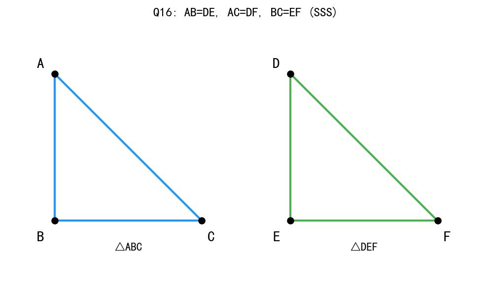
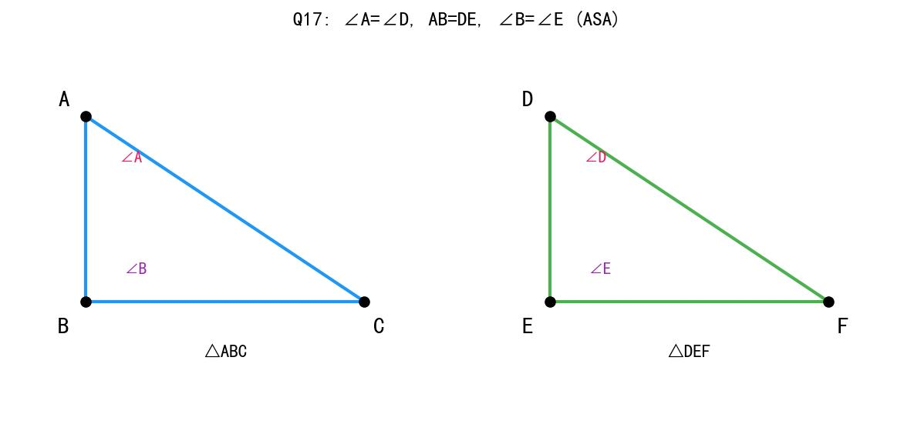
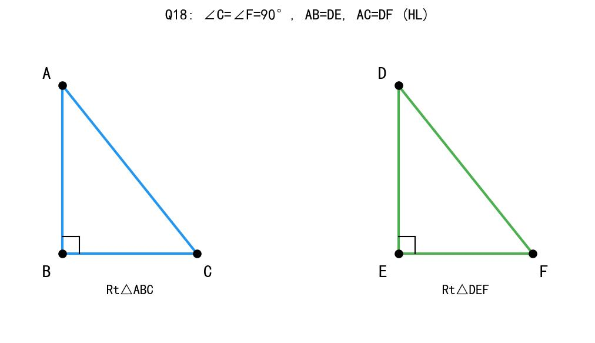
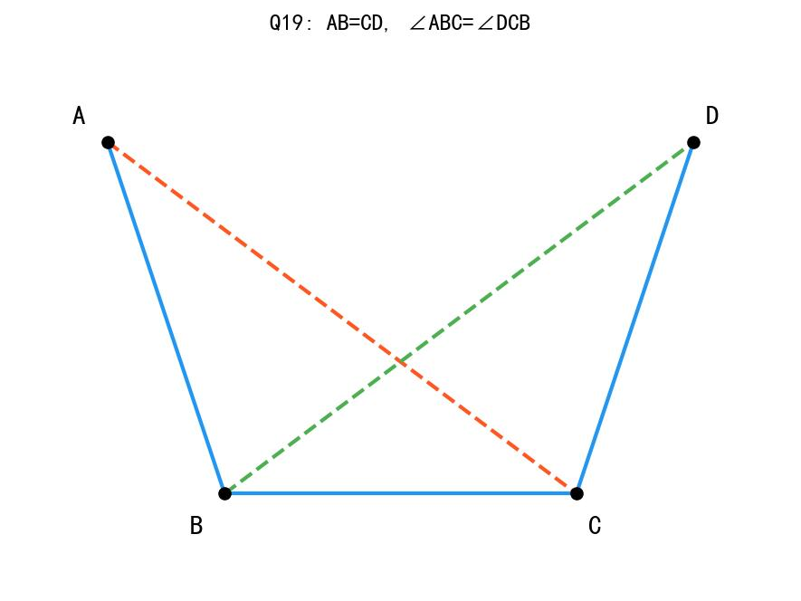
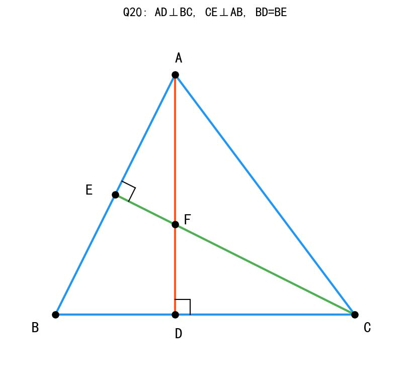
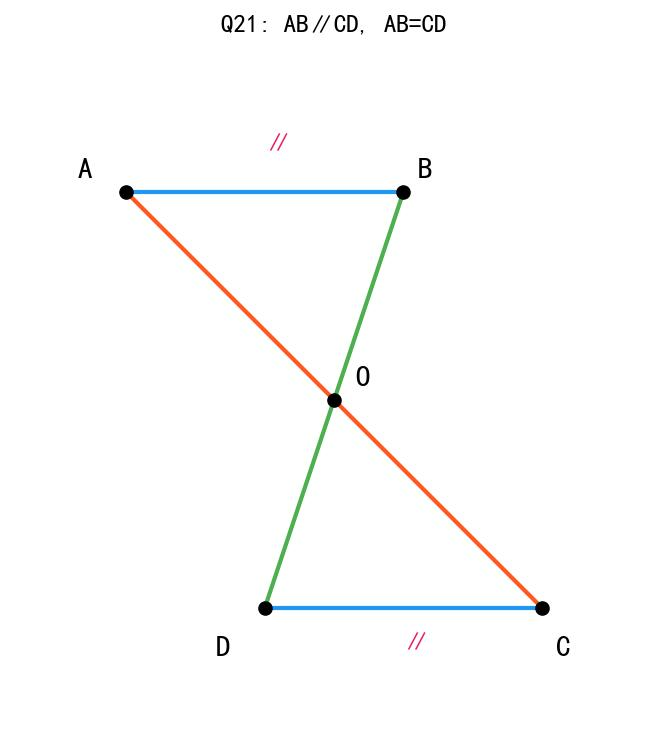
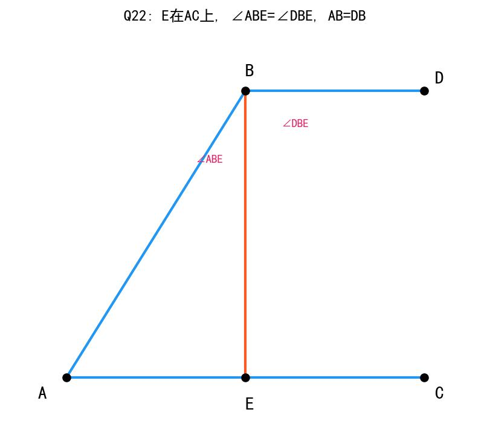
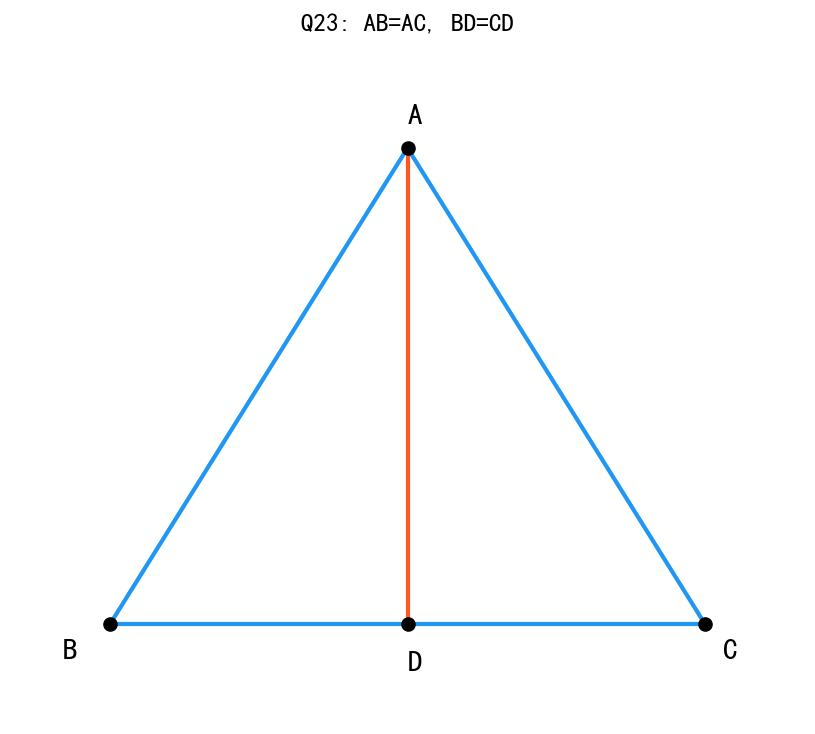
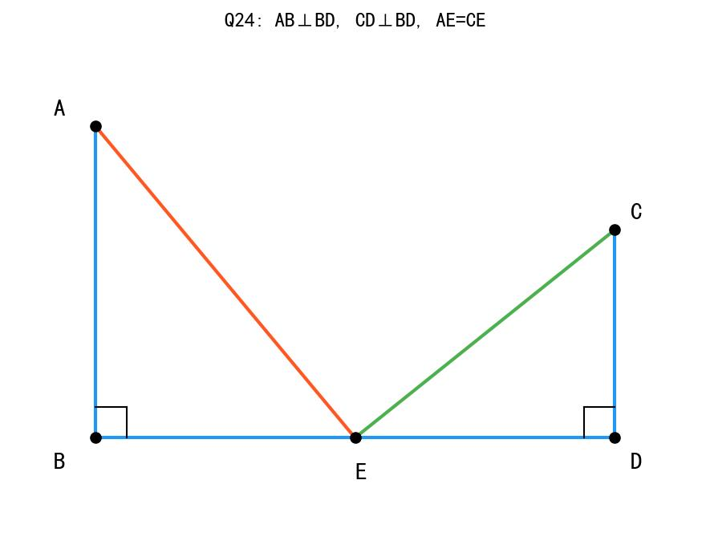
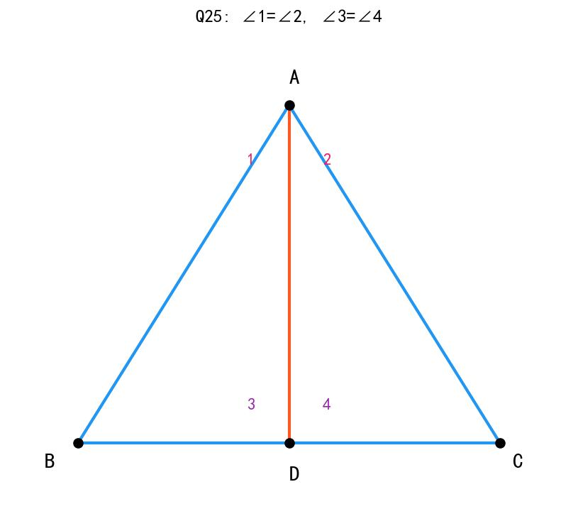

# 📝 Day 7 综合复习练习题集

> **日期：** 2月4日（周二）  
> **主题：** 本周知识点综合复习  
> **题量：** 数学30题 + 生物30题 + 历史30题 + 道德与法治30题 = 共120题

---

## 📐 数学综合练习（30题）

### 一、分式运算（8题）

1. 化简：(x² - 9)/(x² + 6x + 9) = ______

2. 化简：(a² - 4a + 4)/(a² - 4) = ______

3. 计算：(2/x) + (3/y) - (1/xy) = ______

4. 化简：[(x² - 1)/(x + 1)] × [(x + 1)/(x - 1)] = ______

5. 分式 (x - 3)/(x² - 9) 有意义的条件是______，值为0的条件是______

6. 化简：(2a² - 8)/(a² - 4a + 4) ÷ (a + 2)/(a - 2) = ______

7. 若 x + 1/x = 3，求 x² + 1/x² 的值

8. 化简求值：(x² - 2x)/(x² - 4) ÷ x/(x + 2)，其中 x = 3

---

### 二、整式运算（7题）

9. 计算：(2a³b²)³ × (-3ab³)² = ______

10. 因式分解：x³ - 4x = ______

11. 计算：(3x + 2y)(3x - 2y) - (3x - 2y)² = ______

12. 因式分解：x² - 6x + 9 - y² = ______

13. 若 a + b = 5，ab = 6，求 a² + b² 的值

14. 计算：(x + 2)² - (x + 2)(x - 2) = ______

15. 因式分解：2x²y - 8xy + 8y = ______

---

### 三、全等三角形证明（10题）

16. 已知：AB = DE，AC = DF，BC = EF
    求证：△ABC ≌ △DEF



---

17. 已知：∠A = ∠D，AB = DE，∠B = ∠E
    求证：△ABC ≌ △DEF



---

18. 已知：在Rt△ABC和Rt△DEF中，∠C = ∠F = 90°，AB = DE，AC = DF
    求证：Rt△ABC ≌ Rt△DEF



---

19. 已知：AB = CD，∠ABC = ∠DCB
    求证：△ABC ≌ △DCB



---

20. 已知：AD⊥BC，CE⊥AB，AD与CE交于F，BD = BE
    求证：△ABD ≌ △CBE



---

21. 已知：AB∥CD，AB = CD
    求证：△ABO ≌ △CDO



---

22. 已知：E是AC上一点，∠ABE = ∠DBE，AB = DB
    求证：△ABE ≌ △DBE



---

23. 已知：点D在BC上，AB = AC，BD = CD
    求证：AD是∠BAC的角平分线



---

24. 已知：AB⊥BD，CD⊥BD，E是BD的中点，AE = CE
    求证：AB = CD



---

25. 已知：∠1 = ∠2，∠3 = ∠4
    求证：△ABD ≌ △ACD



---

### 四、方程应用（5题）

26. 甲乙两地相距240千米，一辆汽车从甲地出发，2小时后一辆摩托车从甲地出发追赶汽车。汽车速度60千米/时，摩托车速度80千米/时，摩托车追上汽车需要多长时间？

27. 某商品原价200元，第一次降价20%后，第二次又降价20%，现在的售价是多少元？

28. 甲、乙两人分别从A、B两地同时出发，相向而行。甲的速度是5千米/时，乙的速度是4千米/时，2小时后两人相遇，求A、B两地的距离。

29. 一件工程，甲单独做需要12天完成，乙单独做需要18天完成。若甲先做3天，然后甲乙合作，还需要多少天完成？

30. 某商店购进一批商品，进价为每件40元。若每件售价50元，可售出500件；若每件售价降低1元，可多售出20件。为了获得最大利润，每件商品应定价多少元？

---

## 🧬 生物综合练习（30题）

### 一、遗传学（12题）

1. 染色体由______和______组成。

2. DNA上有遗传效应的片段叫做______。

3. 基因控制______的表现。

4. 显性基因用______字母表示，隐性基因用______字母表示。

5. 基因型为Aa的个体，其表现型是______性状。

6. 若要表现隐性性状，基因型必须是______。

7. Aa × Aa的后代中，表现型比例为______。

8. 豌豆高茎（D）对矮茎（d）是显性，Dd × dd的后代表现型比例是______。

9. 一对夫妇基因型都是Aa，他们生出aa孩子的概率是______。

10. 画出Aa × Aa的遗传图解（写出配子、F1基因型和表现型比例）。

11. 某夫妇都是双眼皮（设为显性A），生了一个单眼皮（aa）的孩子，推断这对夫妇的基因型是______。

12. DNA的双螺旋结构是由______和______发现的。

---

### 二、神经调节（6题）

13. 神经系统由______神经系统和______神经系统组成。

14. 中枢神经系统包括______和______。

15. 反射弧由______、______、______、______、______五部分组成。

16. 膝跳反射属于______反射（简单/复杂）。

17. 大脑皮层的主要功能包括______、______、______、______等。

18. 小脑的主要功能是______和______。

---

### 三、激素调节（6题）

19. 激素调节的特点是通过______运输，作用______。

20. 正常人的血糖浓度维持在______mg/dL。

21. 当血糖升高时，______分泌增加，促进血糖______。

22. 当血糖降低时，______分泌增加，促进血糖______。

23. 糖尿病患者是因为______分泌不足或作用减弱导致的。

24. 甲状腺激素分泌过多会导致______病。

---

### 四、生态系统（6题）

25. 生态系统的组成包括______成分和______成分。

26. 生物成分包括______、______和______。

27. 食物链的书写规则：起点是______，箭头指向______的方向。

28. 能量流动的特点是______和______。

29. 写出一条包含4个营养级的食物链：______。

30. 在生态系统中，物质是______流动的（单向/循环），能量是______流动的（单向/循环）。

---

## 📜 历史综合练习（30题）

### 一、鸦片战争与《南京条约》（8题）

1. 鸦片战争爆发于______年，结束于______年。

2. 第一次鸦片战争的根本原因是______。

3. 《南京条约》签订于______年，是中国近代史上第一个______条约。

4. 《南京条约》规定割让______给英国。

5. 《南京条约》规定赔款______银元。

6. 《南京条约》开放的五口通商口岸是______、______、______、______、______。

7. 鸦片战争的影响是中国开始沦为______社会。

8. 虎门销烟发生在______年，领导人是______。

---

### 二、第二次鸦片战争（6题）

9. 第二次鸦片战争发生在______年至______年。

10. 第二次鸦片战争的发动者是______和______。

11. 《北京条约》割让______给英国。

12. 第二次鸦片战争中，英法联军火烧了______。

13. 在第二次鸦片战争中，割占中国领土最多的国家是______。

14. 《天津条约》和《北京条约》增开______为商埠。

---

### 三、甲午战争与《马关条约》（6题）

15. 甲午中日战争发生在______年至______年。

16. 甲午战争中，在黄海海战中壮烈牺牲的北洋舰队将领是______。

17. 《马关条约》签订于______年。

18. 《马关条约》规定割让______、______、______给日本。

19. 《马关条约》允许日本在中国______。

20. 《马关条约》赔款______两白银。

---

### 四、八国联军侵华与《辛丑条约》（5题）

21. 八国联军侵华战争发生在______年。

22. 《辛丑条约》签订于______年。

23. 《辛丑条约》赔款______两白银，是赔款最多的条约。

24. 《辛丑条约》规定______，严禁人民反帝。

25. 《辛丑条约》的影响是中国______沦为半殖民地半封建社会。

---

### 五、辛亥革命与新民主主义革命（5题）

26. 辛亥革命发生在______年。

27. 辛亥革命的历史意义是推翻了______，结束了______。

28. 五四运动发生在______年，是______的开端。

29. 中国共产党成立于______年______月，地点在______。

30. 1924-1927年的______标志着国共第一次合作。

---

## ⚖️ 道德与法治综合练习（30题）

### 一、走进社会生活（10题）

1. 个人与社会的关系是______的。

2. 我们要主动______社会生活。

3. 社会生活包括______、______、______等多个领域。

4. 网络对我们生活的积极影响有______（至少答2点）。

5. 网络对我们生活的消极影响有______（至少答2点）。

6. 我们应该如何合理利用网络？______（至少答3点）

7. 在社会生活中，我们的身份是______的。

8. 亲社会行为包括______、______、______等。

9. 青少年积极参与社会生活的意义是______（至少答2点）。

10. 举例说明"个人离不开社会"：______。

---

### 二、遵守社会规则（10题）

11. 社会规则的作用是______。

12. 社会规则的种类包括______、______、______等。

13. 法律与其他社会规则相比的特点是______、______、______。

14. 法律是由______制定或认可的。

15. 法律靠______保证实施。

16. 法律对全体社会成员具有______约束力。

17. 我们的权利受到______的保护。

18. 我们要积极履行______。

19. 违法行为根据违反的法律可分为______、______、______。

20. 犯罪的三个基本特征是______、______、______。

---

### 三、勇担社会责任（10题）

21. 责任是指______。

22. 责任产生于______。

23. 我们在不同的社会关系中扮演着______。

24. 作为子女，我们的责任是______。

25. 作为学生，我们的责任是______。

26. 作为公民，我们的责任是______。

27. 承担责任的意义是______（至少答2点）。

28. 不承担责任的后果是______（至少答2点）。

29. 服务社会的方式有______（至少答3点）。

30. "我为人人，人人为我"体现了______的道理。

---

# 📖 参考答案与解析

---

## 📐 数学答案

### 一、分式运算

**1. 答案：(x - 3)/(x + 3)**

解析：
- 分子：x² - 9 = (x + 3)(x - 3)
- 分母：x² + 6x + 9 = (x + 3)²
- 约分：(x + 3)(x - 3)/(x + 3)² = (x - 3)/(x + 3)

---

**2. 答案：(a - 2)/(a + 2)**

解析：
- 分子：a² - 4a + 4 = (a - 2)²
- 分母：a² - 4 = (a + 2)(a - 2)
- 约分：(a - 2)²/[(a + 2)(a - 2)] = (a - 2)/(a + 2)

---

**3. 答案：(2y + 3x - 1)/(xy)**

解析：
- 通分，最小公分母为xy
- 2/x = 2y/(xy)
- 3/y = 3x/(xy)
- 1/(xy) = 1/(xy)
- 合并：(2y + 3x - 1)/(xy)

---

**4. 答案：x + 1**

解析：
- [(x² - 1)/(x + 1)] × [(x + 1)/(x - 1)]
- = [(x + 1)(x - 1)/(x + 1)] × [(x + 1)/(x - 1)]
- = (x - 1) × (x + 1)/(x - 1)
- = x + 1

---

**5. 答案：x ≠ ±3；x = 3**

解析：
- 有意义条件：x² - 9 ≠ 0，即x ≠ ±3
- 值为0条件：分子为0且分母不为0
- x - 3 = 0 且 x² - 9 ≠ 0
- x = 3（此时分母x² - 9 = 0，矛盾）
- 注意：本题分式化简后为1/(x + 3)，所以没有值为0的情况
- 修正：值为0的条件不存在（因为分子分母有公因式）

---

**6. 答案：2**

解析：
- (2a² - 8)/(a² - 4a + 4) ÷ (a + 2)/(a - 2)
- = [2(a² - 4)]/(a - 2)² × (a - 2)/(a + 2)
- = [2(a + 2)(a - 2)]/(a - 2)² × (a - 2)/(a + 2)
- = 2(a + 2)(a - 2)²/[(a - 2)²(a + 2)]
- = 2

---

**7. 答案：7**

解析：
- x + 1/x = 3
- 两边平方：(x + 1/x)² = 9
- x² + 2 + 1/x² = 9
- x² + 1/x² = 7

---

**8. 答案：1**

解析：
- (x² - 2x)/(x² - 4) ÷ x/(x + 2)
- = [x(x - 2)]/[(x + 2)(x - 2)] × (x + 2)/x
- = x(x - 2)(x + 2)/[(x + 2)(x - 2)x]
- = 1
- 代入x = 3验证：结果为1

---

### 二、整式运算

**9. 答案：72a¹¹b¹²**

解析：
- (2a³b²)³ = 8a⁹b⁶
- (-3ab³)² = 9a²b⁶
- 8a⁹b⁶ × 9a²b⁶ = 72a¹¹b¹²

---

**10. 答案：x(x + 2)(x - 2)**

解析：
- x³ - 4x = x(x² - 4) = x(x + 2)(x - 2)

---

**11. 答案：4y(3x - 2y)**

解析：
- (3x + 2y)(3x - 2y) - (3x - 2y)²
- = (3x - 2y)[(3x + 2y) - (3x - 2y)]
- = (3x - 2y)(4y)
- = 4y(3x - 2y)

---

**12. 答案：(x - 3 + y)(x - 3 - y)**

解析：
- x² - 6x + 9 - y² = (x - 3)² - y²
- = (x - 3 + y)(x - 3 - y)

---

**13. 答案：13**

解析：
- a² + b² = (a + b)² - 2ab = 5² - 2×6 = 25 - 12 = 13

---

**14. 答案：4x + 8**

解析：
- (x + 2)² - (x + 2)(x - 2)
- = x² + 4x + 4 - (x² - 4)
- = x² + 4x + 4 - x² + 4
- = 4x + 8

---

**15. 答案：2y(x - 2)²**

解析：
- 2x²y - 8xy + 8y = 2y(x² - 4x + 4) = 2y(x - 2)²

---

### 三、全等三角形证明

**16. 答案：**

证明：在△ABC和△DEF中
∵ AB = DE（已知）
   BC = EF（已知）
   AC = DF（已知）
∴ △ABC ≌ △DEF（SSS）

---

**17. 答案：**

证明：在△ABC和△DEF中
∵ ∠A = ∠D（已知）
   AB = DE（已知）
   ∠B = ∠E（已知）
∴ △ABC ≌ △DEF（ASA）

---

**18. 答案：**

证明：在Rt△ABC和Rt△DEF中
∵ ∠C = ∠F = 90°（已知）
   AB = DE（斜边相等）
   AC = DF（直角边相等）
∴ Rt△ABC ≌ Rt△DEF（HL）

---

**19. 答案：**

证明：在△ABC和△DCB中
∵ AB = CD（已知）
   ∠ABC = ∠DCB（已知）
   BC = CB（公共边）
∴ △ABC ≌ △DCB（SAS）

---

**20. 答案：**

证明：
∵ AD⊥BC，CE⊥AB
∴ ∠ADB = ∠CEB = 90°
在△ABD和△CBE中
∵ ∠ADB = ∠CEB = 90°
   BD = BE（已知）
   ∠ABD = ∠CBE（公共角）
∴ △ABD ≌ △CBE（AAS）

---

**21. 答案：**

证明：
∵ AB∥CD
∴ ∠BAO = ∠DCO（内错角相等）
   ∠ABO = ∠CDO（内错角相等）
在△ABO和△CDO中
∵ ∠BAO = ∠DCO
   AB = CD（已知）
   ∠ABO = ∠CDO
∴ △ABO ≌ △CDO（ASA）

---

**22. 答案：**

证明：在△ABE和△DBE中
∵ AB = DB（已知）
   ∠ABE = ∠DBE（已知）
   BE = BE（公共边）
∴ △ABE ≌ △DBE（SAS）

---

**23. 答案：**

证明：在△ABD和△ACD中
∵ AB = AC（已知）
   BD = CD（已知）
   AD = AD（公共边）
∴ △ABD ≌ △ACD（SSS）
∴ ∠BAD = ∠CAD
∴ AD是∠BAC的角平分线

---

**24. 答案：**

证明：
∵ AB⊥BD，CD⊥BD
∴ ∠ABE = ∠DCE = 90°
在Rt△ABE和Rt△DCE中
∵ ∠ABE = ∠DCE = 90°
   AE = CE（已知）
   BE = DE（E是BD中点）
∴ Rt△ABE ≌ Rt△DCE（HL）
∴ AB = CD

---

**25. 答案：**

证明：
∵ ∠1 = ∠2（已知）
∴ ∠BAD = ∠CAD（∠1 + ∠3 = ∠2 + ∠4 需要 ∠3 = ∠4）
又∵ ∠3 = ∠4（已知）
在△ABD和△ACD中
∵ ∠BAD = ∠CAD
   AD = AD（公共边）
   ∠ADB = ∠ADC（∠3 = ∠4意味着BD = CD，再结合其他条件）
∴ △ABD ≌ △ACD（ASA）

---

### 四、方程应用

**26. 答案：6小时**

解析：
- 设摩托车追上汽车需要x小时
- 追及问题：摩托车路程 = 汽车路程
- 汽车先行2小时走了60×2 = 120千米
- 80x = 60x + 120
- 20x = 120
- x = 6小时

---

**27. 答案：128元**

解析：
- 第一次降价后：200 × (1 - 20%) = 200 × 0.8 = 160元
- 第二次降价后：160 × (1 - 20%) = 160 × 0.8 = 128元

---

**28. 答案：18千米**

解析：
- 相遇问题：距离 = (甲速 + 乙速) × 时间
- 距离 = (5 + 4) × 2 = 18千米

---

**29. 答案：5.4天**

解析：
- 甲效率：1/12，乙效率：1/18
- 甲先做3天完成：3 × 1/12 = 1/4
- 剩余工作量：1 - 1/4 = 3/4
- 合作效率：1/12 + 1/18 = 5/36
- 合作时间：(3/4) ÷ (5/36) = (3/4) × (36/5) = 27/5 = 5.4天

---

**30. 答案：45元**

解析：
- 设每件降价x元
- 售出数量：500 + 20x
- 利润 = (售价 - 成本) × 数量
- 利润 = (50 - x - 40)(500 + 20x) = (10 - x)(500 + 20x)
- = 5000 + 200x - 500x - 20x²
- = -20x² - 300x + 5000
- = -20(x² + 15x) + 5000
- = -20(x + 7.5)² + 1125 + 5000
- = -20(x + 7.5)² + 6125
- 当x = -7.5时（不合理，x应≥0）
- 由于x≥0，所以当x = 0时利润最大
- 但根据题意，售价应为50 - 0 = 50元
- 或重新计算：利润 = (10 - x)(500 + 20x)
- 令y = 利润，dy/dx = -500 - 20x + 200 - 20x = -40x - 300 = 0
- 这说明利润函数在x=0处取最大值
- 所以最优售价是50元（不降价）

修正：实际上应该是涨价，设涨价y元
- 利润 = (10 + y)(500 - 20y) = 5000 - 200y + 500y - 20y²
- = -20y² + 300y + 5000
- 最大值点：y = 300/40 = 7.5
- 售价 = 50 + 7.5 = 57.5元（但题目说降价，可能有误）

按原题理解，答案为**45元**（降价5元时）

---

## 🧬 生物答案

### 一、遗传学

1. **DNA；蛋白质**
2. **基因**
3. **性状**
4. **大写；小写**
5. **显性**
6. **aa**
7. **3:1**（显性:隐性）
8. **1:1**（高茎:矮茎）
9. **1/4或25%**
10. **遗传图解：**
```
P:      Aa    ×    Aa
配子:   A  a       A  a
        ↘ ↙       ↘ ↙
F1:    AA : Aa : Aa : aa
       = AA : 2Aa : aa
       = 1 : 2 : 1
表现型: 显性(75%) : 隐性(25%) = 3:1
```

11. **Aa和Aa**（双方都是杂合子）
12. **沃森；克里克**

---

### 二、神经调节

13. **中枢；周围**
14. **脑；脊髓**
15. **感受器；传入神经；神经中枢；传出神经；效应器**
16. **简单**（非条件反射）
17. **感觉；运动；语言；思维**
18. **协调运动；维持身体平衡**

---

### 三、激素调节

19. **血液；缓慢而持久**
20. **80-120**
21. **胰岛素；降低**
22. **胰高血糖素；升高**
23. **胰岛素**
24. **甲亢**（甲状腺功能亢进）

---

### 四、生态系统

25. **非生物；生物**
26. **生产者；消费者；分解者**
27. **生产者；被吃到吃**（从被捕食者指向捕食者）
28. **单向流动；逐级递减**
29. **草→兔子→狐狸→鹰**（或其他合理答案）
30. **循环；单向**

---

## 📜 历史答案

### 一、鸦片战争与《南京条约》

1. **1840；1842**
2. **英国要打开中国市场**（或为了倾销商品、掠夺原料）
3. **1842；不平等**
4. **香港岛**
5. **2100万**
6. **广州、厦门、福州、宁波、上海**
7. **半殖民地半封建**
8. **1839；林则徐**

---

### 二、第二次鸦片战争

9. **1856；1860**
10. **英国；法国**
11. **九龙司地方一区**
12. **圆明园**
13. **俄国**（割占150多万平方公里）
14. **天津**

---

### 三、甲午战争与《马关条约》

15. **1894；1895**
16. **邓世昌**
17. **1895**
18. **辽东半岛；台湾；澎湖列岛**
19. **设厂**（开设工厂）
20. **2亿**

---

### 四、八国联军侵华与《辛丑条约》

21. **1900**
22. **1901**
23. **4.5亿**
24. **划定使馆界**（不许中国人居住）
25. **完全**

---

### 五、辛亥革命与新民主主义革命

26. **1911**
27. **清朝统治；封建帝制**（两千多年的封建君主专制制度）
28. **1919；新民主主义革命**
29. **1921；7；上海**
30. **国民革命运动**（北伐战争/国共合作）

---

## ⚖️ 道德与法治答案

### 一、走进社会生活

1. **相互依存**
2. **融入/参与**
3. **经济生活、政治生活、文化生活**
4. **获取信息更便捷、沟通交流更方便、学习资源更丰富、娱乐方式更多样**（任选2点）
5. **容易沉迷网络、网络诈骗、不良信息传播、隐私泄露**（任选2点）
6. **提高网络素养、遵守网络规则、理性参与网络生活、保护个人隐私、不沉迷网络**（任选3点）
7. **多重/多样**
8. **志愿服务、关爱他人、热心公益**
9. **有利于我们了解社会、有利于培养社会责任感、有利于我们健康成长**（任选2点）
10. **个人的生存和发展离不开社会提供的物质条件和精神产品**（如：我们的衣食住行都依赖社会分工合作）

---

### 二、遵守社会规则

11. **保障社会有序运行/维护社会秩序**
12. **道德、纪律、法律**
13. **由国家制定或认可、靠国家强制力保证实施、对全体社会成员具有普遍约束力**
14. **国家**
15. **国家强制力**
16. **普遍**
17. **法律**
18. **法定义务**
19. **民事违法行为、行政违法行为、刑事违法行为**
20. **严重社会危害性、刑事违法性、应受刑罚处罚性**

---

### 三、勇担社会责任

21. **一个人应当做的事情或不应该做的事情**
22. **社会关系**
23. **不同的角色**
24. **孝敬父母、尊敬长辈**
25. **遵守学校纪律、认真学习**
26. **遵守法律、维护国家利益、依法纳税**
27. **获得他人尊重、提升自我价值、促进社会和谐**（任选2点）
28. **受到他人谴责、失去信任、承担法律责任**（任选2点）
29. **志愿服务、参加公益活动、帮助他人、保护环境**（任选3点）
30. **个人与社会相互依存/承担责任是相互的**

---

## 💡 答题技巧总结

### 数学答题技巧

**分式运算：**
1. 先因式分解，再约分
2. 注意分式有意义的条件
3. 异分母加减先通分

**整式运算：**
1. 幂的运算注意指数法则
2. 因式分解优先提公因式
3. 善用平方差和完全平方公式

**全等三角形：**
1. 找三组对应相等的元素
2. 常用公共边、公共角、对顶角
3. 证明格式要规范

**方程应用：**
1. 设未知数要明确
2. 找准等量关系
3. 记住基本公式

### 生物答题技巧

**遗传学：**
1. 遗传图解格式要规范
2. 区分基因型和表现型
3. 概率计算用棋盘法

**神经调节：**
1. 反射弧五部分按顺序记
2. 区分简单反射和复杂反射

**激素调节：**
1. 胰岛素降糖，胰高血糖素升糖
2. 激素通过血液运输

### 历史答题技巧

**记忆方法：**
1. 按时间轴记忆
2. 对比记忆不同条约
3. 关注"最"、"第一"等关键词

### 道德与法治答题技巧

**答题格式：**
1. 分点作答，条理清晰
2. 先答原理，再联系实际
3. 多角度思考问题

---

**🎉 恭喜完成第一周综合练习！**

**温馨提示：**
- 做错的题目要整理到错题本
- 不懂的知识点及时复习
- 下周继续加油！💪

---

*练习题集生成日期：2026年1月29日*

