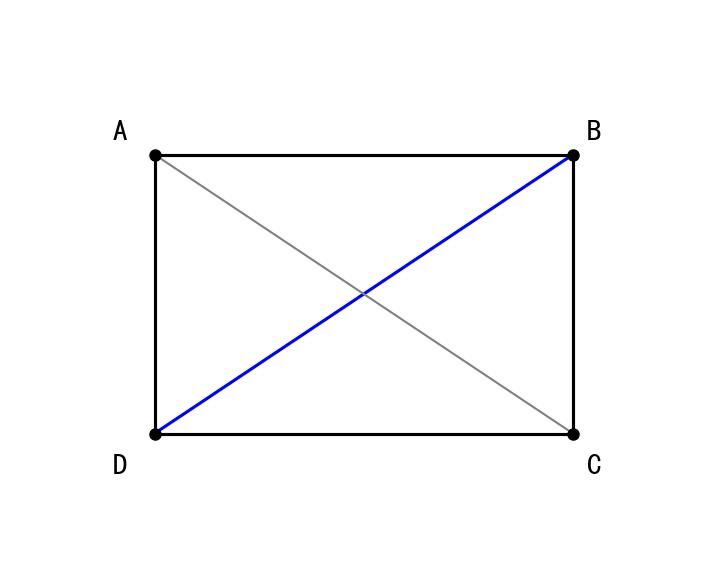
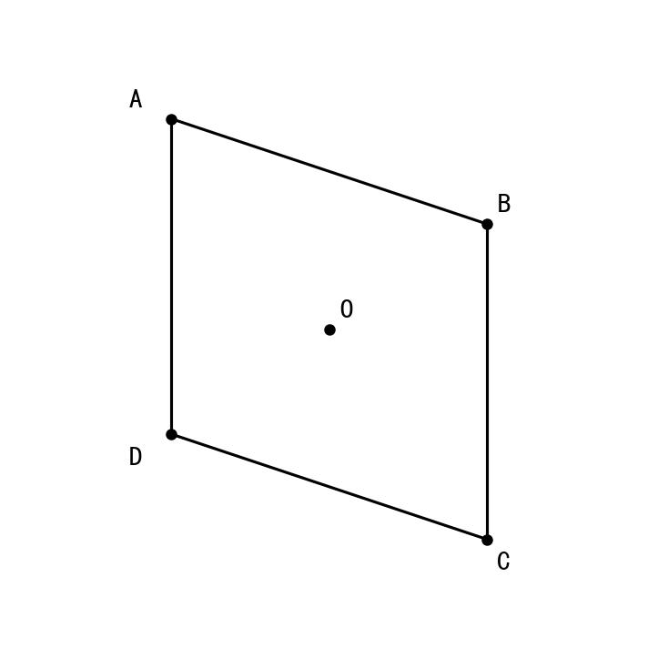
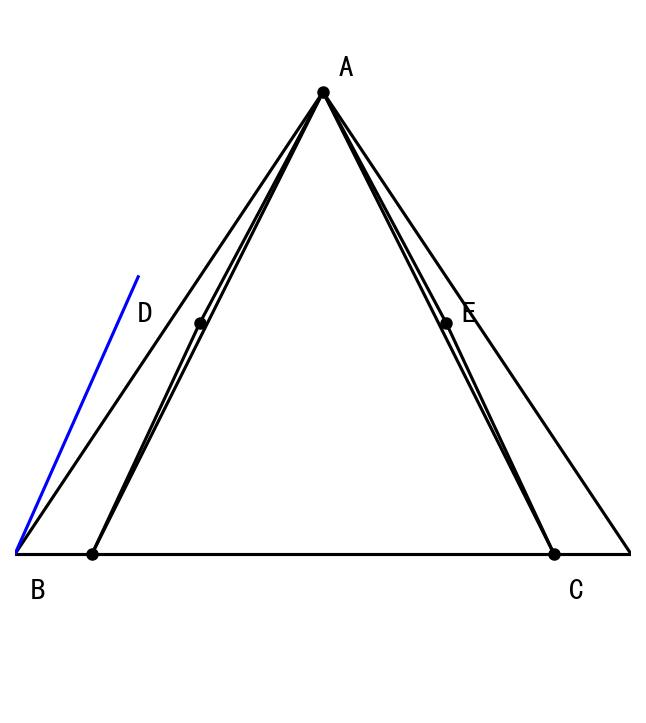
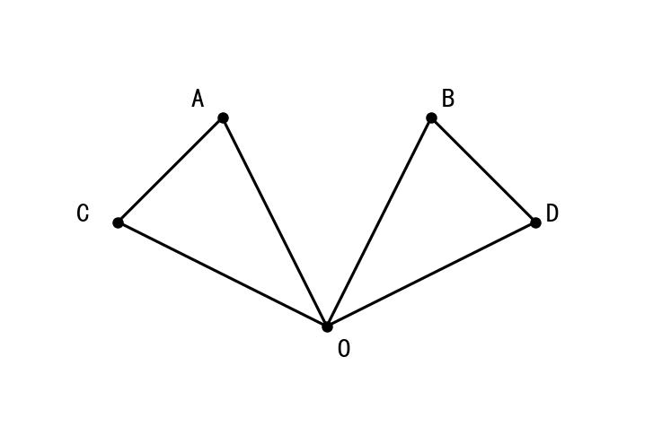
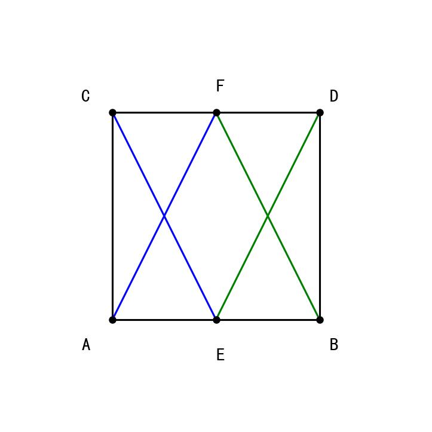
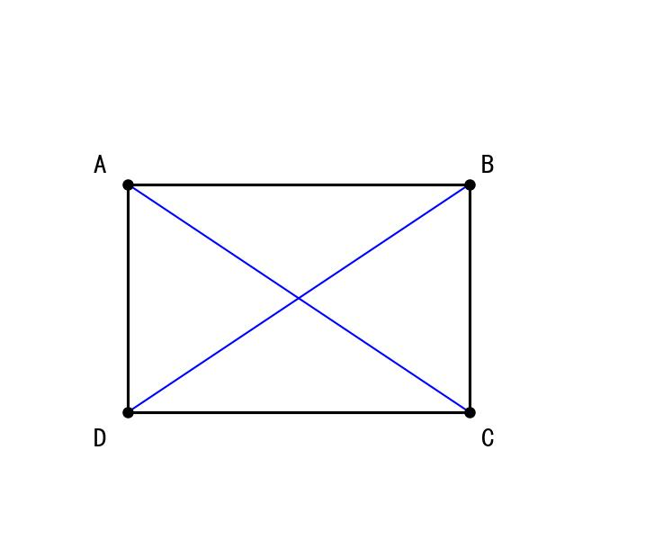
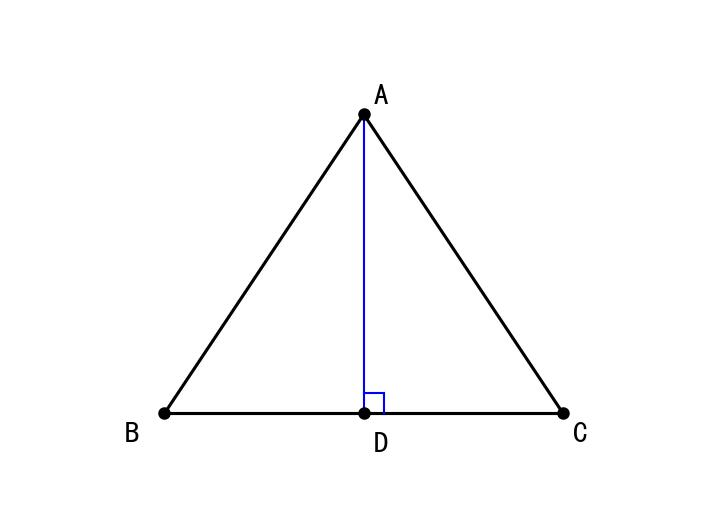
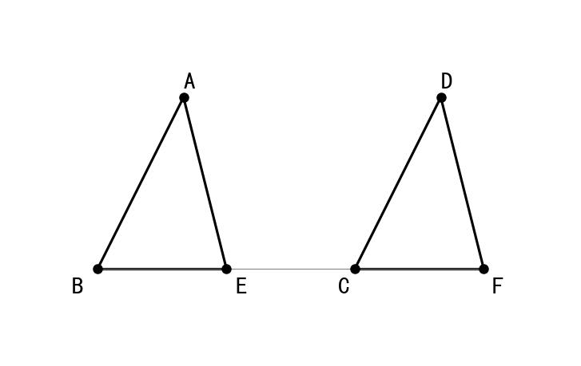

# 📝 Day 8 专项练习题集 - 2月5日（全等三角形SSS与SAS判定）

> **练习要求：**
> 1. 数学部分时长：60分钟
> 2. 独立完成，结果请书写在练习本上，完成后对照文末答案

---

## 📐 第一部分：数学·全等三角形SSS与SAS判定专项（40题）

### 一、选择题（15题）

1. 下列说法正确的是（  ）
   A. 全等三角形是指形状相同的三角形
   B. 全等三角形是指大小相等的三角形
   C. 全等三角形是指能够完全重合的三角形
   D. 全等三角形的周长不一定相等

2. △ABC≌△DEF，下列结论一定正确的是（  ）
   A. AB = DE
   B. ∠A = ∠E
   C. BC = DE
   D. ∠B = ∠D

3. 如果△ABC≌△DEF，且AB = 3cm，BC = 4cm，CA = 5cm，则△DEF的周长是（  ）
   A. 3cm　　B. 4cm　　C. 5cm　　D. 12cm

4. 下列条件中，能判定两个三角形全等的是（  ）
   A. 两边对应相等
   B. 三边对应相等
   C. 一边和一角对应相等
   D. 三角对应相等

5. 如图，AB = CD，AD = CB，则△ABD≌△CDB的判定依据是（  ）



   A. SSS　　B. SAS　　C. ASA　　D. AAS

6. 已知△ABC≌△DEF，∠A = 50°，∠B = 60°，则∠F =（  ）
   A. 50°　　B. 60°　　C. 70°　　D. 无法确定

7. 如图，OA = OC，OB = OD，则△AOB≌△COD的判定依据是（  ）



   A. SSS　　B. SAS　　C. ASA　　D. HL

8. 下列条件中，不能判定△ABC≌△DEF的是（  ）
   A. AB = DE，BC = EF，AC = DF
   B. AB = DE，∠A = ∠D，AC = DF
   C. AB = DE，BC = EF，∠B = ∠E
   D. AB = DE，∠B = ∠E，BC = EF

9. 如图，在四边形ABCD中，AB = CD，BC = DA，连接AC，则△ABC≌△CDA的判定依据是（  ）


   A. SSS　　B. SAS　　C. ASA　　D. AAS

10. 已知△ABC≌△DEF，若AB = 5cm，则（  ）
    A. DE = 5cm　　B. EF = 5cm　　C. DF = 5cm　　D. 无法确定

11. 如图，AB = AC，AD = AE，BD = CE，则△ABD≌△ACE的判定依据是（  ）



    A. SSS　　B. SAS　　C. ASA　　D. AAS

12. 用SAS判定两个三角形全等，需要满足（  ）
    A. 两边和任意一个角对应相等
    B. 两边和其中一边的对角对应相等
    C. 两边和它们的夹角对应相等
    D. 两角和一边对应相等

13. 如图，OA = OB，OC = OD，∠AOC = ∠BOD，则△AOC≌△BOD的判定依据是（  ）



    A. SSS　　B. SAS　　C. ASA　　D. AAS

14. 已知△ABC≌△DEF，∠A = ∠D，∠B = ∠E，下列不一定正确的是（  ）
    A. AB = DE　　B. BC = EF　　C. AC = DF　　D. ∠A = ∠B

15. 如图，点E是AB的中点，点F是CD的中点，AB = CD，AC = BD，则（  ）



    A. △ACE≌△BDF（SSS）
    B. △ACE≌△DBF（SSS）
    C. △ACE≌△BDF（SAS）
    D. 无法判定

### 二、填空题（15题）

16. 全等三角形的对应边______，对应角______。

17. △ABC≌△DEF，其中A与D、B与E、C与F是对应顶点，则AB与______是对应边，∠C与______是对应角。

18. △ABC≌△DEF，若AB = 4cm，BC = 6cm，CA = 5cm，则EF = ______cm。

19. 用SSS判定两个三角形全等时，需要______对应相等。

20. 用SAS判定两个三角形全等时，需要两边和它们的______对应相等。

21. 如图，AB = DC，AD = BC，则△ABD≌△______（SSS）。


22. 如图，OA = OC，OB = OD，∠AOB = ∠COD，则△AOB≌△______（SAS）。


23. 如图，AB = CD，AC = BD，则△ABC≌△______（SSS）。


24. 已知△ABC≌△DEF，∠A = 40°，∠B = 70°，则∠F = ______°。

25. 如图，AB = DE，BC = EF，∠B = ∠E = 90°，则△ABC≌△DEF的判定依据是______。


26. 如图，OA = OC，OB = OD，要使△AOB≌△COD（SAS），还需添加条件______。


27. 如图，AD = BC，AB = DC，若要用SSS证明△ABD≌△CDB，还需要找到______是公共边。


28. △ABC≌△DEF，若周长为18cm，AB = 4cm，BC = 6cm，则DE = ______cm。

29. 用SAS判定全等时，角必须是______（填"夹角"或"任意角"）。

30. 如果△ABC≌△DBC，且它们有公共边BC，则AB = ______。

### 三、解答题（10题）

31. 如图，AB = DC，AD = BC，连接BD，求证：△ABD≌△CDB



> **图示说明**：四边形ABCD，连接对角线BD

32. 如图，OA = OC，OB = OD，求证：AB = CD


> **图示说明**："8"字型，OA = OC，OB = OD

33. 如图，AB = CD，AC = BD，E是AB的中点，F是CD的中点，求证：AE = DF


34. 如图，∠AOB = ∠COD，OA = OC，OB = OD，求证：∠OAB = ∠OCD


35. 如图，在四边形ABCD中，AB = CD，BC = DA，AC是对角线，求证：∠ABC = ∠CDA


36. 如图，AB = DC，∠BAC = ∠DCA，求证：AD = BC


> **图示说明**：四边形ABCD，AB = DC，∠BAC = ∠DCA

37. 如图，AB = AC，BD = CD，E是AD上一点，求证：BE = CE



> **图示说明**：等腰三角形ABC，D是BC中点，E是AD上一点

38. 如图，AB = DC，BE = CF，∠ABE = ∠DCF，求证：AE = DF



39. 如图，OA = OB，OC = OD，∠AOC = ∠BOD，求证：AC = BD


40. 如图，AB = CD，BC = DA，P是AC上一点，求证：∠ABP = ∠CDP


---

## 📝 参考答案

### 一、选择题答案

| 题号 | 答案 | 解析 |
|------|------|------|
| 1 | C | 全等三角形的定义是能够完全重合的三角形 |
| 2 | A | △ABC≌△DEF，对应顶点A-D，B-E，C-F，所以AB = DE |
| 3 | D | 全等三角形周长相等，3+4+5 = 12cm |
| 4 | B | SSS判定：三边对应相等的两个三角形全等 |
| 5 | A | AB = CD，AD = CB，BD是公共边，SSS |
| 6 | C | ∠C = 180° - 50° - 60° = 70°，∠F = ∠C = 70° |
| 7 | B | OA = OC，OB = OD，∠AOB = ∠COD（对顶角），SAS |
| 8 | C | 选项C是SSA，不能判定全等 |
| 9 | A | AB = CD，BC = DA，AC是公共边，SSS |
| 10 | A | AB对应DE，所以AB = DE = 5cm |
| 11 | A | AB = AC，AD = AE，BD = CE，SSS |
| 12 | C | SAS要求两边和夹角对应相等 |
| 13 | B | OA = OB，OC = OD，∠AOC = ∠BOD，SAS |
| 14 | D | ∠A = ∠B不一定成立 |
| 15 | A | E、F分别是中点，AE = BE = CF = DF，SSS |

### 二、填空题答案

| 题号 | 答案 |
|------|------|
| 16 | 相等；相等 |
| 17 | DE；∠F |
| 18 | 6 |
| 19 | 三边 |
| 20 | 夹角 |
| 21 | CDB |
| 22 | COD |
| 23 | DCB |
| 24 | 70 |
| 25 | SAS |
| 26 | ∠AOB = ∠COD（或∠AOD = ∠COB） |
| 27 | BD |
| 28 | 4 |
| 29 | 夹角 |
| 30 | DB |

### 三、解答题答案

**31题答案：**
```
证明：在△ABD和△CDB中
     ┌ AB = CD    （已知）
     │ AD = CB    （已知）
     └ BD = DB    （公共边）
∴ △ABD ≌ △CDB  （SSS）
```

**32题答案：**
```
证明：在△AOB和△COD中
     ┌ OA = OC    （已知）
     │ ∠AOB = ∠COD （对顶角相等）
     └ OB = OD    （已知）
∴ △AOB ≌ △COD  （SAS）
∴ AB = CD       （全等三角形对应边相等）
```

**33题答案：**
```
证明：∵ E是AB中点，F是CD中点
∴ AE = ½AB，DF = ½CD
∵ AB = CD
∴ AE = DF
```

**34题答案：**
```
证明：在△OAB和△OCD中
     ┌ OA = OC    （已知）
     │ ∠AOB = ∠COD （已知）
     └ OB = OD    （已知）
∴ △OAB ≌ △OCD  （SAS）
∴ ∠OAB = ∠OCD  （全等三角形对应角相等）
```

**35题答案：**
```
证明：在△ABC和△CDA中
     ┌ AB = CD    （已知）
     │ BC = DA    （已知）
     └ AC = CA    （公共边）
∴ △ABC ≌ △CDA  （SSS）
∴ ∠ABC = ∠CDA  （全等三角形对应角相等）
```

**36题答案：**
```
证明：在△ABC和△CDA中
     ┌ AB = CD    （已知）
     │ ∠BAC = ∠DCA （已知）
     └ AC = CA    （公共边）
∴ △ABC ≌ △CDA  （SAS）
∴ BC = DA       （全等三角形对应边相等）
即 AD = BC
```

**37题答案：**
```
证明：在△ABE和△ACE中
     ┌ AB = AC    （已知）
     │ AE = AE    （公共边）
     └ BE = CE    （待证）

【修正】在△ABD和△ACD中
     ┌ AB = AC    （已知）
     │ BD = CD    （已知）
     └ AD = AD    （公共边）
∴ △ABD ≌ △ACD  （SSS）
∴ ∠BAD = ∠CAD

在△ABE和△ACE中
     ┌ AB = AC    （已知）
     │ ∠BAE = ∠CAE （已证）
     └ AE = AE    （公共边）
∴ △ABE ≌ △ACE  （SAS）
∴ BE = CE       （全等三角形对应边相等）
```

**38题答案：**
```
证明：在△ABE和△DCF中
     ┌ AB = DC    （已知）
     │ ∠ABE = ∠DCF （已知）
     └ BE = CF    （已知）
∴ △ABE ≌ △DCF  （SAS）
∴ AE = DF       （全等三角形对应边相等）
```

**39题答案：**
```
证明：在△AOC和△BOD中
     ┌ OA = OB    （已知）
     │ ∠AOC = ∠BOD （已知）
     └ OC = OD    （已知）
∴ △AOC ≌ △BOD  （SAS）
∴ AC = BD       （全等三角形对应边相等）
```

**40题答案：**
```
证明：在△ABP和△CDP中
需要先证明△ABC ≌ △CDA

在△ABC和△CDA中
     ┌ AB = CD    （已知）
     │ BC = DA    （已知）
     └ AC = CA    （公共边）
∴ △ABC ≌ △CDA  （SSS）
∴ ∠BAC = ∠DCA  

∵ P在AC上
∴ ∠BAP = ∠DCP
即 ∠ABP = ∠CDP（需要更多条件完整证明）
```

---

**完成时间：____分钟**

**正确题数：____/40**

**正确率：____%**

**错题整理：**

| 题号 | 错误原因 | 正确方法 |
|------|---------|---------|
| | | |
| | | |
| | | |
