# 📝 Day 9 专项练习题集 - 2月6日（全等三角形ASA、AAS、HL判定）

> **练习要求：**
> 1. 数学部分时长：60分钟
> 2. 独立完成，完成后对照文末答案

---

## 📐 第一部分：数学·ASA、AAS、HL判定专项（40题）

### 一、选择题（15题）

1. 用ASA判定两个三角形全等，需要（  ）
   A. 两角和任意一边对应相等
   B. 两角和它们的夹边对应相等
   C. 两角和其中一角的对边对应相等
   D. 三个角对应相等

2. 用AAS判定两个三角形全等，需要（  ）
   A. 两角和任意一边对应相等
   B. 两角和它们的夹边对应相等
   C. 两角和其中一角的对边对应相等
   D. 两边和一角对应相等

3. HL判定只能用于（  ）
   A. 任意三角形
   B. 等腰三角形
   C. 直角三角形
   D. 等边三角形

4. 如图，AB∥CD，AB = CD，则△ABE≌△DCE的判定依据是（  ）

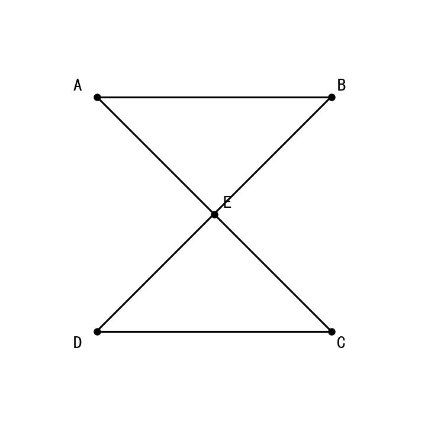

   A. SSS　　B. SAS　　C. ASA　　D. HL

5. 如图，∠A = ∠D，∠B = ∠E，AC = DF，则△ABC≌△DEF的判定依据是（  ）

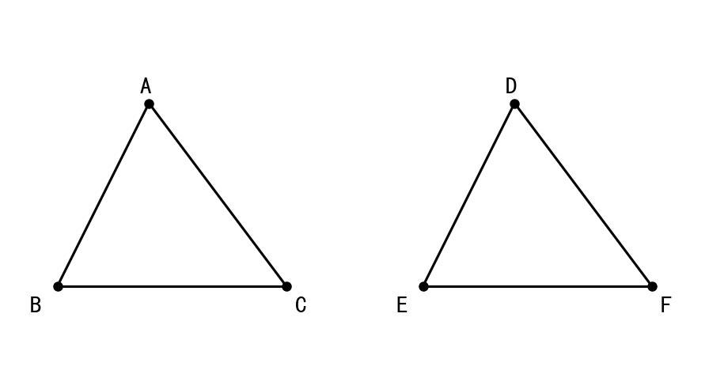

   A. ASA　　B. AAS　　C. SAS　　D. SSS

6. 如图，Rt△ABC和Rt△DEF中，∠C = ∠F = 90°，AB = DE，AC = DF，则△ABC≌△DEF的判定依据是（  ）

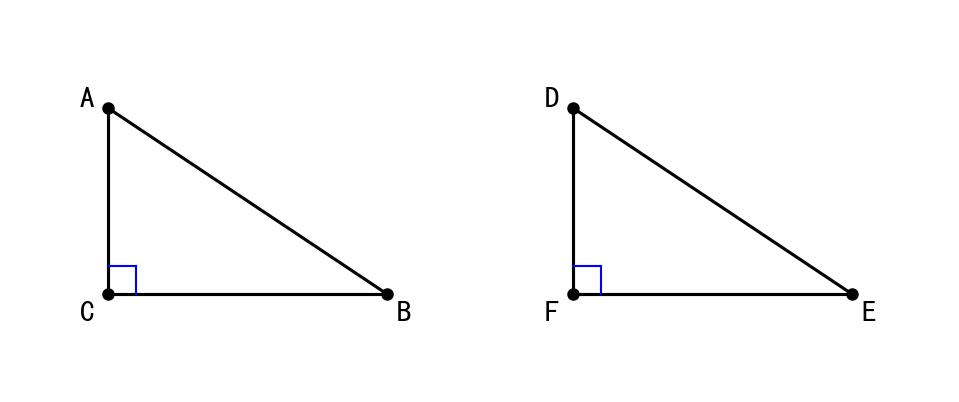

   A. SSS　　B. SAS　　C. ASA　　D. HL

7. 如图，∠BAC = ∠DAC，∠B = ∠D，则△ABC≌△ADC的判定依据是（  ）

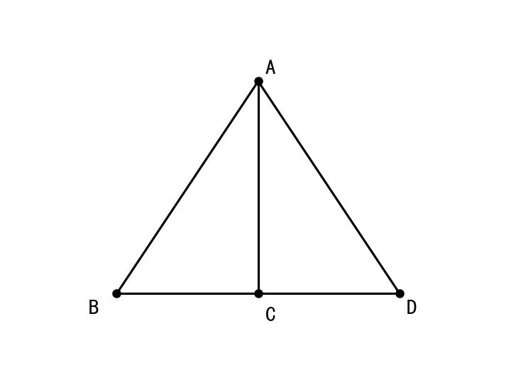

   A. SSS　　B. SAS　　C. ASA　　D. AAS

8. 下列条件中，不能判定两个三角形全等的是（  ）
   A. 两角和夹边对应相等
   B. 两角和一角的对边对应相等
   C. 三个角对应相等
   D. 斜边和一条直角边对应相等

9. 如图，AB⊥BC，CD⊥BC，AB = CD，AC = BD，则△ABC≌△DCB的判定依据是（  ）


   A. SSS　　B. SAS　　C. HL　　D. ASA

10. 如图，∠1 = ∠2，∠3 = ∠4，AC = BD，则△ABC≌△BAD的判定依据是（  ）

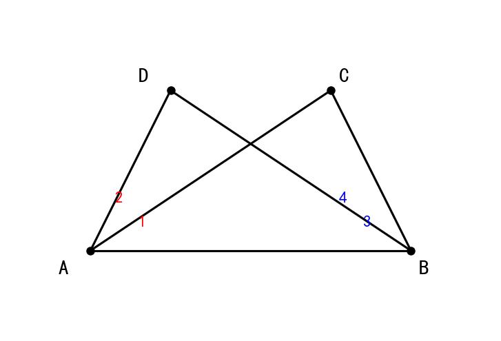

    A. SSS　　B. SAS　　C. ASA　　D. AAS

11. 如图，∠ACB = ∠DEB = 90°，∠ABC = ∠DBE，BC = BE，则△ABC≌△DBE的判定依据是（  ）

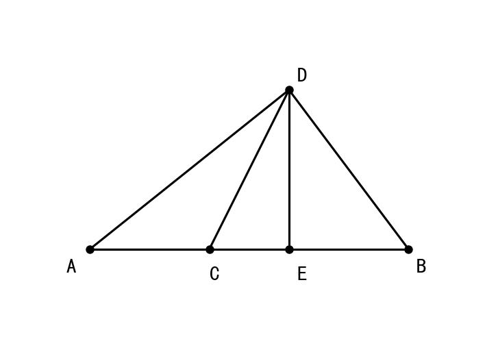

    A. SSS　　B. SAS　　C. ASA　　D. HL

12. 用HL判定直角三角形全等时，需要（  ）
    A. 斜边和任意一边相等
    B. 斜边和一条直角边相等
    C. 两条直角边相等
    D. 一个锐角和一边相等

13. 如图，AB∥DC，∠A = ∠D，AB = DC，则△ABE≌△DCE的判定依据是（  ）

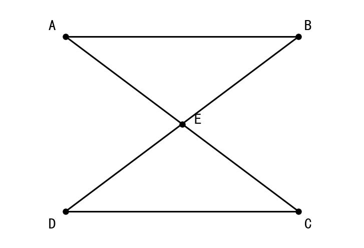

    A. SSS　　B. SAS　　C. ASA　　D. AAS

14. 已知△ABC≌△DEF（ASA），若∠A = 50°，AC = 6cm，则（  ）
    A. ∠D = 50°，DF = 6cm
    B. ∠E = 50°，EF = 6cm
    C. ∠F = 50°，DE = 6cm
    D. 无法确定

15. 下列说法正确的是（  ）
    A. SSA可以判定三角形全等
    B. AAA可以判定三角形全等
    C. HL只能判定直角三角形全等
    D. ASA和AAS判定的条件完全相同

### 二、填空题（15题）

16. ASA判定的条件是：两角和它们的______对应相等。

17. AAS判定的条件是：两角和其中一角的______对应相等。

18. HL判定的条件是：______和一条______对应相等。

19. 判定两个直角三角形全等，除了通用的四种方法外，还有特殊方法______。

20. 如图，∠A = ∠D，∠ACB = ∠DCE，BC = CE，则△ABC≌△______（AAS）。


21. 如图，AB∥CD，∠ABE = ∠DCE，BE = CE，则△ABE≌△______（ASA）。


22. 如图，∠ACB = ∠ADB = 90°，AC = AD，则Rt△ACB≌Rt△______（HL）。


23. 如图，∠1 = ∠2，∠B = ∠C，要用ASA证明△ABD≌△ACE，还需添加条件______。

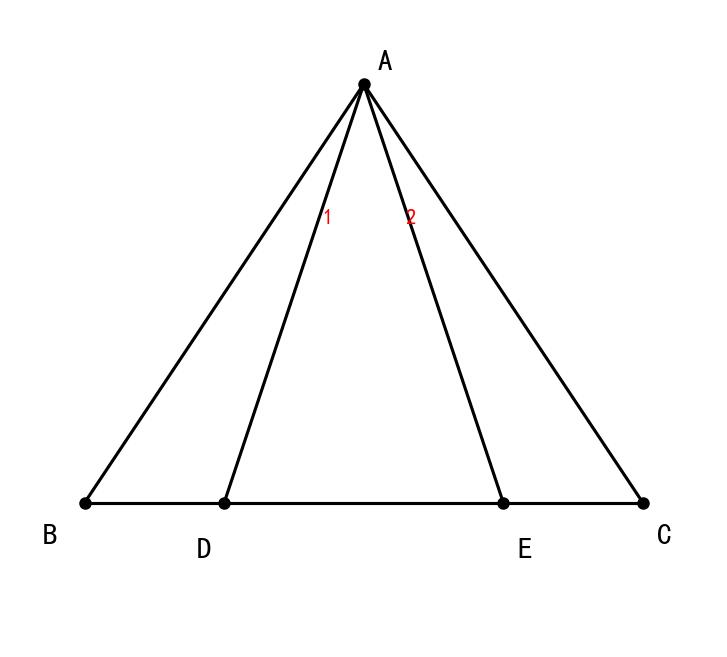

24. 如图，AB⊥BD，CD⊥BD，AB = CD，要用HL证明Rt△ABE≌Rt△DCE，还需添加条件______。

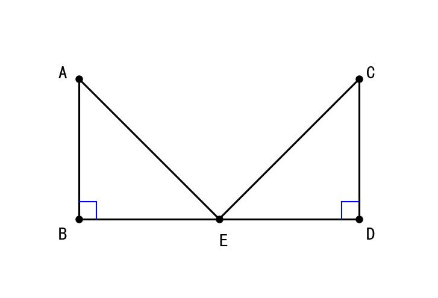

25. 全等三角形的判定方法共有______种，分别是______。

26. 在Rt△ABC和Rt△DEF中，若∠C = ∠F = 90°，AB = DE，要用HL判定全等，还需条件______。

27. 如果两个三角形的三个角对应相等，这两个三角形______(填"一定"或"不一定")全等。

28. ASA和AAS的区别是：ASA中的边是______，AAS中的边是______。

29. 如图，∠B = ∠C = 90°，∠1 = ∠2，AB = AC，则△ABD≌△ACE的判定依据是______。

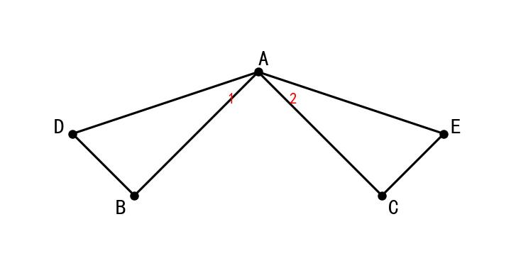

30. 如图，AB⊥BC，DC⊥BC，AB = DC，则Rt△ABC≌Rt△DCB的判定依据是______。

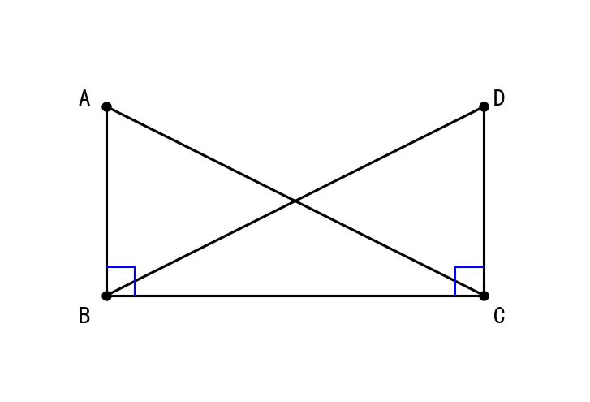

### 三、解答题（10题）

31. 如图，AB∥CD，AB = CD，求证：△ABE≌△DCE

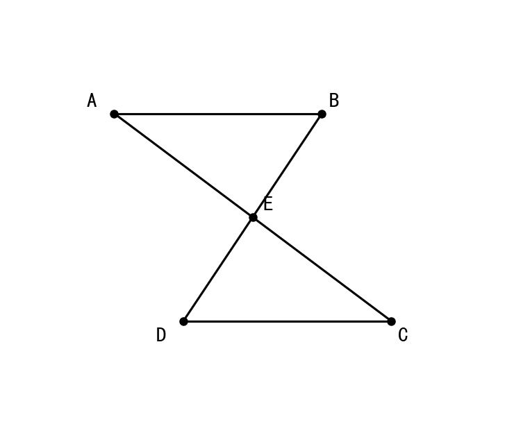

32. 如图，∠A = ∠D，∠B = ∠E，BC = EF，求证：AC = DF


33. 如图，AB⊥BD，CD⊥BD，AB = CD，AC = BD，求证：△ABC≌△DCB（用HL）


34. 如图，∠1 = ∠2，∠A = ∠D，求证：AB = DC


35. 如图，∠ACB = ∠ADB = 90°，AC = AD，求证：BC = BD


36. 如图，AE⊥EC，BF⊥FC，AE = BF，EC = FC，求证：AC = BC

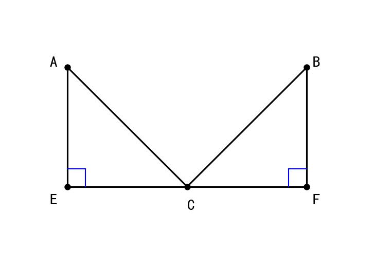

37. 如图，AB∥DC，∠ABD = ∠CDB，求证：AD = CB

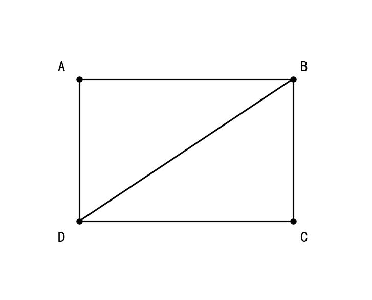

38. 如图，∠BAD = ∠CAD，∠ABD = ∠ACD，求证：BD = CD

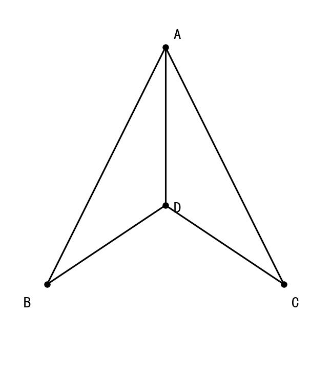

39. 如图，AB⊥BC，DC⊥BC，E是BC中点，AE = DE，求证：AB = DC

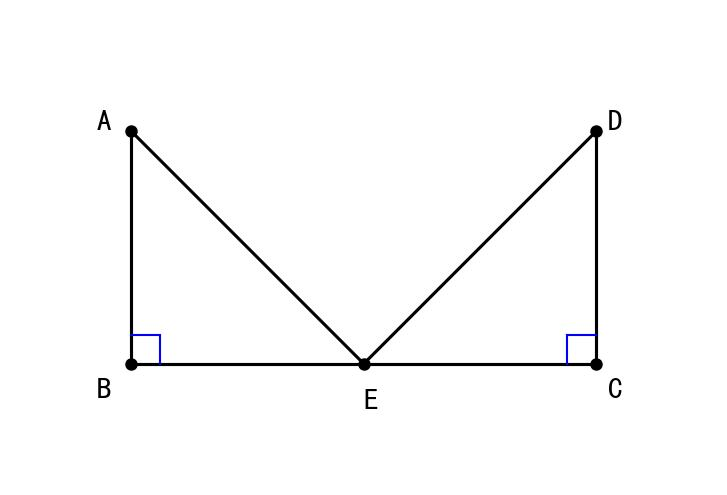

40. 如图，∠B = ∠C = 90°，∠BAD = ∠CAE，AD = AE，求证：BD = CE

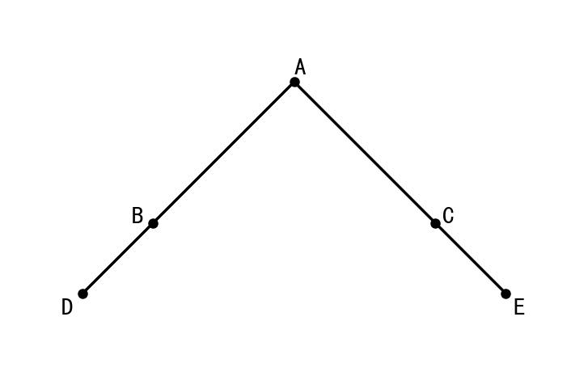

---

## 📝 参考答案

### 一、选择题答案

| 题号 | 答案 | 解析 |
|------|------|------|
| 1 | B | ASA：两角和夹边对应相等 |
| 2 | C | AAS：两角和一角的对边对应相等 |
| 3 | C | HL只用于直角三角形 |
| 4 | C | AB∥CD→内错角相等，ASA |
| 5 | B | 两角和对边，AAS |
| 6 | D | 直角三角形，斜边+直角边，HL |
| 7 | C | ∠BAC = ∠DAC，AC是公共边，∠B = ∠D，ASA |
| 8 | C | AAA不能判定全等 |
| 9 | C | 直角三角形，斜边AC = BD，直角边BC公共，HL |
| 10 | C | ∠1 = ∠2，AB公共边，∠3 = ∠4，ASA |
| 11 | C | ∠ACB = ∠DEB = 90°，∠ABC = ∠DBE，BC = BE，ASA |
| 12 | B | HL：斜边+一条直角边 |
| 13 | C | AB∥DC→∠BAE = ∠DCE，∠A = ∠D，AB = DC，ASA |
| 14 | A | 对应关系：A-D，C-F |
| 15 | C | HL只能用于直角三角形 |

### 二、填空题答案

| 题号 | 答案 |
|------|------|
| 16 | 夹边 |
| 17 | 对边 |
| 18 | 斜边；直角边 |
| 19 | HL |
| 20 | DEC |
| 21 | DCE |
| 22 | ADB |
| 23 | BD = CE（或AD = AE） |
| 24 | AE = DE（斜边相等） |
| 25 | 5；SSS、SAS、ASA、AAS、HL |
| 26 | AC = DF（或BC = EF） |
| 27 | 不一定 |
| 28 | 夹边；对边 |
| 29 | AAS（或ASA） |
| 30 | HL |

### 三、解答题答案

**31题答案：**
```
证明：∵ AB ∥ CD
∴ ∠ABE = ∠DCE （内错角相等）
  ∠BAE = ∠CDE （内错角相等）

在 △ABE 和 △DCE 中
     ┌ ∠ABE = ∠DCE （已证）
     │ AB = DC      （已知）
     └ ∠BAE = ∠CDE （已证）
∴ △ABE ≌ △DCE  （ASA）
```

**32题答案：**
```
证明：在 △ABC 和 △DEF 中
     ┌ ∠A = ∠D    （已知）
     │ ∠B = ∠E    （已知）
     └ BC = EF    （已知）
∴ △ABC ≌ △DEF  （AAS）
∴ AC = DF       （全等三角形对应边相等）
```

**33题答案：**
```
证明：∵ AB ⊥ BD，CD ⊥ BD
∴ ∠ABD = ∠CDB = 90°
∴ △ABC 和 △DCB 都是直角三角形

在 Rt△ABC 和 Rt△DCB 中
     ┌ AC = BD    （斜边，已知）
     └ AB = DC    （直角边，已知）
∴ Rt△ABC ≌ Rt△DCB  （HL）
```

**34题答案：**
```
证明：∵ ∠1 = ∠2
∴ ∠ABD = ∠DCB 或相关角度关系

在 △ABD 和 △DCB 中（根据图形）
     ┌ ∠A = ∠D     （已知）
     │ ∠1 = ∠2     （已知）
     └ BD = DB     （公共边）
∴ △ABD ≌ △DCB  （AAS）
∴ AB = DC       （全等三角形对应边相等）
```

**35题答案：**
```
证明：∵ ∠ACB = ∠ADB = 90°
∴ Rt△ACB 和 Rt△ADB 都是直角三角形

在 Rt△ACB 和 Rt△ADB 中
     ┌ AB = AB    （公共边/斜边）
     └ AC = AD    （直角边，已知）
∴ Rt△ACB ≌ Rt△ADB  （HL）
∴ BC = BD       （全等三角形对应边相等）
```

**36-40题：** 证明过程类似，运用ASA、AAS或HL判定。

---

**完成时间：____分钟**

**正确题数：____/40**

**正确率：____%**
