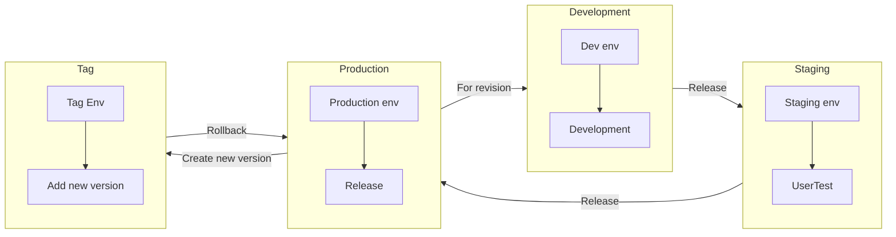

# 中华圈-Dify 平台 AI 项目版本管理规范

## 0. 版本信息

| Date       | Author                   | Version | Remarks      |
| ---------- | ------------------------ | ------- | ------------ |
| 2026-01-20 | Xing Yun（CH71 AI_Tec_M) | 1.00    | New creation |
|            |                          |         |              |

------

## 1. 背景与目标

### 1.1 背景

- Dify 是低代码 AI 应用构建平台，核心资产包括：**Prompt 模板、Workflow 编排、Knowledge Base、Tool 配置、变量定义等**
- 这些内容虽无需传统编码，但属于**可变、可迭代、需协作的“AI 应用源码”**
- Prompt 并非“写在 LLM 里”，而是由开发者在 Dify 中编写、保存、调用的**结构化输入模板**

### 1.2 目标

- 建立统一的命名标准，提升可读性与协作效率  
- 利用 SVN 对 Dify 导出配置进行有效版本控制  
- 明确 Release 与回滚机制，保障生产环境稳定性

------

## 2. 命名规约

### 2.1 通用原则

- 使用 **英文小写**（避免中文、空格、特殊符号）  
- 允许字符：`a-z`、`0-9`、`-`（短横线）、`_`（下划线）  
- 名称应体现 **业务域 + 功能 + 科室**

### 2.2 Dify 应用命名（Application Name）

格式：`{科室}_{业务域}_{功能描述}`

说明：{科室}：BE的各个科室: CH71/CH72/CH73/CH74

​           {业务域}: Sales/CS/Logistics/Planning/PM/PE/HR/ACC/GA/Legal

​				仅需要到对应的业务function即可，不需要再细分

​	  {功能描述}：具体的业务内容，简短，有意义，单词间用"-"连接

​          {PIC name}: 只需要在开发环境注明，具体开发者的名字

示例：

- `CH71_sales_crm-trip-report-search`  

- `CH71_sales_crm-trip-report-search`  

  

### 2.3 导出文件命名（SVN 中存储的 DSL/JSON/YAML 文件）

格式：`{科室}_{业务域}_{功能描述}_{组件类型}.{dsl|md|json|yaml|py}`
说明：

​	  {科室}：BE的各个科室: CH71/CH72/CH73/CH74

​           {业务域}: Sales/CS/Logistics/Planning/PM/PE/HR/ACC/GA/Legal

​				仅需要到对应的业务function即可，不需要再细分

​	  {功能描述}：具体的业务内容，简短，有意义，单词间用"-"连接

​          {PIC name}: 只需要在开发环境注明，具体开发者的名字

​	  {组件类型}: `prompt`、`workflow`、`chatflow`、`agent`、`chatbot`、`kb`（知识库）

示例：

- `CH71_sales_crm-trip-report-search_chatflow.dsl`  

- `CH71_sales_crm-trip-report-search_prompt.md`  

- `CH73_cs_edi-message-formater_python.py`  

  

### 2.4 Knowledge Base 命名

- Dify 中 KB 名称：`kb_{科室}_{业务}_{内容类型}`

- 说明：

  ​	  {科室}：BE的各个科室: CH71/CH72/CH73/CH74

  ​           {业务域}: Sales/CS/Logistics/Planning/PM/PE/HR/ACC/GA/Legal

  ​				仅需要到对应的业务function即可，不需要再细分

  ​	  {内容类型}：具体的业务内容，简短，有意义，单词间用"-"连接

- 示例：`kb_CH71_trip-report`

### 2.5 自定义 Tool / Agent 命名（如适用）

- Tool 名：`{科室}_{功能名称}_tool` → `CH71_markdown-file-conversion_tool`  

------

## 3. Dify 内容的 SVN 版本管理

### 3.1 核心方法：**“导出 + SVN 归档”**

由于 Dify 当前（2026 年初）不提供原生 SVN/Git 集成，团队需**手动或半自动导出配置并提交至 SVN**。

### 3.2 SVN 仓库结构建议

项目结构与我们一直在使用的项目结构相同，同时所有的代码等需要放在03.Program里

```
/SVN root
   │
   ├── projects/
   	   ├── (dify-projects)/
   	       ├── 00.Meeting minutes/
   	       ├── 01.BD document/
   	       ├── 02.FD document/
   	       ├── 03.Program/
           │    │
           │    ├── trunk/
           │    │   └── apps/
           │    │       └── crm-trip-report-search/
           │    │           ├── CH71_sales_crm-trip-report-search_chatflow.dsl      ← 当前主干最新版
           │    │           ├── CH71_sales_crm-trip-report-search_prompt.md         ← 当前主干最新版
           │    │           └── CHANGELOG.txt
           |    |
           |    |
           │    ├── tags/
           │    │   └── apps/
           │    │       └── crm-trip-report-search/
           |    |           └── (Version)/
           │    │                 ├── CH71_sales_crm-trip-report-search_chatflow.dsl     
           │    │                 ├── CH71_sales_crm-trip-report-search_prompt.md        
           │    │                 └── CHANGELOG.txt
           │    │
           │    ├── staging/
           │    │   └── apps/
           │    │       └── crm-trip-report-search/
           │    │           ├── CH71_sales_crm-trip-report-search_chatflow.dsl   
           │    │           ├── CH71_sales_crm-trip-report-search_prompt.md         
           │    │           └── CHANGELOG.txt
           │    └── dev/
           │        └── apps/
           │            └── (pic name)/
           │                ├── crm-trip-report-search/
           │                ├── CH71_sales_crm-trip-report-search_chatflow.dsl      
           │                ├── CH71_sales_crm-trip-report-search_prompt.md         
           │                └── CHANGELOG.txt
           ├── 04.Test Report/
           ├── 05.Dispatch & Release/
           ├── 06.Issue Management/
           ├── 07.User Manual/
           ├── 08.WBS/
           ├── 09.Output/
           └── 99.Contracts&Invoice/
           

```

### 3.3 操作流程

1. **开发修改**  
   - 在 Dify **dev 或 staging 环境**中编辑 Prompt / Workflow
2. **导出配置**  
   - 点击 Dify 应用页的 **“导出”** 按钮，下载 JSON /DSL文件
   - 对于应用内的Prompt, Python等，需要手动copy/past到py/md文件
3. **重命名 & 归档**  
   - 按 [2.3] 规则重命名文件  
   - 放入 SVN 对应目录（如 `branches/feature-xxx/`）
4. **提交 SVN**  
   - 提交日志格式：
     `[类型] 应用名: 变更说明`
     示例：  
     - `[feat] crm-customer-support: 新增多轮澄清逻辑`  
     - `[fix] hr-onboarding: 修正政策引用错误`  
     - `[export] finance-expense-query: v1.1 导出备份`

### 3.4 变更记录（CHANGELOG）

- 每个应用目录下必须包含 `CHANGELOG.txt`  

- 格式示例：

  ```
  v1.2 (2026-01-20)
  - 新增用户意图澄清分支
  - 优化知识库检索关键词提取
  Author: 李四
  
  v1.1 (2026-01-10)
  - 修复回复中泄露内部指令问题
  Author: 王五
  ```

------

## 4. Release 管理

### 4.1 Release 类型

| 类型  | 触发条件                         | 发布频率     |
| ----- | -------------------------------- | ------------ |
| Patch | Prompt 微调、错别字、小逻辑修正  | 按需（≤1周） |
| Minor | 新增子流程、路由逻辑、KB 更新    | 按月         |
| Major | 架构调整、Agent 重构、多应用集成 | 按月         |

### 4.2 Release 流程

1. **开发完成** → 在 Dify dev 环境验证  

2. **导出 & 提交** → 提交至 SVN `branches/feature-xxx`  

3. **Staging 验证** → 在 Dify staging 应用导入配置，端到端测试  

4. **合并至主干** → 将最终 JSON 复制到 `trunk/apps/{app}/`  

5. **打标签（Tag）**  

   ```bash
   svn copy \
     https://svn.yourcompany.com/dify-projects/trunk/apps/crm-customer-support \
     https://svn.yourcompany.com/dify-projects/tags/release-crm-support-v1.3-20260120 \
     -m "Release v1.3 for CRM support"
   ```

6. **Prod 部署**  

   - 从 `tags/...` 下载 JSON  
   - 在 Dify **prod 应用**中点击“导入”覆盖配置

7. **更新文档** → 同步 Wiki 或 README

​	




### 4.3 回滚机制

- 若上线后异常：
  a) 从 SVN `tags/` 中检出上一版本 JSON
  b) 在 Dify prod 应用中重新导入
  c) 记录事故原因至 `INCIDENT_LOG.md`

------

## 5. 补充建议

### 5.1 自动化辅助（可选）

- 编写 Python 脚本自动：

  - 重命名导出文件
  - 生成 CHANGELOG 模板
  - 执行 SVN add/commit（需配置凭证）

- 示例脚本功能：

  ```python
  # auto_export_dify.py
  rename_export("app_export.json", "crm-support_fullapp_20260120.json")
  update_changelog("v1.3", "新增多轮澄清", author="张三")
  ```

### 5.2 权限与安全

- SVN 目录权限控制：`tags/` 只读，`trunk/` 需 review 后提交


