# 八上历史第二单元学案

> **来源：** 试卷宝-八上历史第二单元学案.pdf
> **内容：** 八年级上册历史第二单元学习材料

---

## 📄 第 1 页

**姓名：______ 班级：______**

**(早) 后从台湾撤兵**

**西北地区 (新疆)**

当时东南沿海和西北内陆的形式的紧张，清政府内部发生了 **“__________”** 和 **“__________”** 的激烈争论。

*   **李鸿章“海防论”**：新疆不复，于肢体无伤；海疆不防，则腹心之大患愈棘。
*   **左宗棠“塞防论”**：重新疆者，所以保蒙古，保蒙古者，所以卫京师……东则海防，西则塞防，二者并重。

**1875年左宗棠发兵平乱，采取“__________”策略，1878年收复除__________以外的新疆领土。**

**______年清政府取“故土新归”之意，改称西域为“新疆”，建立行省。加强了中央对新疆的管控，巩固了__________维护了__________。**

**西南地区 (西藏/越南)**

*   **背景**：1883年8月法国控制越南，矛头直指中国。
*   **时间**：1883年底
*   **战况**：
    1.  **马尾海战**：战败，福建水师全军覆没。
    2.  **刘铭传抗法**：1884年法军进攻台湾，台湾军务大臣__________击退法军。
    3.  **镇南关大捷**：1885年3月，__________率领清军取得大捷，法国内阁倒台。
*   **结果**：
    1.  1885年6月，李鸿章与法国公使签订中法《越南条约》，承认法国占领越南。
    2.  __________年清政府在__________建省，强化管辖，推动台湾经济。

**(中) 洋务运动**

**口号**：前期“__________”，后期“__________”

**内容**：

1.  **军事工业**：从19世纪60年代起，洋务派以“自强”为口号，先后创办__________、__________、__________等一批近代军事工业。
2.  **民用工业**：从19世纪70年代起，洋务派又提出“求富”主张，开办一些近代民用企业，以辅助军事工业。其中比较重要的有__________、开平煤矿、__________、湖北织布局等。
3.  **创办新式海陆军**：
    *   **陆军**：从19世纪60年代起，洋务派开始组建__________，淘汰传统兵器，采用西式兵操练兵。
    *   **海军**：到19世纪80年代，初步建成__________、__________、__________南洋和北洋等海军，其中以__________舰队规模最大。1885年，清政府成立__________统一协调指挥。__________年，北洋舰队正式成军。
4.  **新式教育**：
    1.  兴办__________（京师同文馆-是中国第一所新式学堂）；
    2.  培养翻译和军事人才；
    3.  设立翻译馆，翻译外国科技书籍；
    4.  派遣留学生出国深造（如：詹天佑）

**影响**：

*   **进步性**：经过30多年建设，中国近代军事工业、民用工业、交通运输业等有了一定程度的发展，在客观上促进了__________。
*   **局限性**：由于清朝政治的腐败和外国势力的挤压，洋务运动__________的目标没有实现。

**(晚) 边疆危机**

*   **东南海疆**：
    *   **美国**：19世纪60年代，美国进攻台湾，遭到坚决抵抗，转而支持__________侵略台湾。
    *   **日本**：
        1.  日本以“__________”为借口侵略台湾；
        2.  台湾人民据险反击，清政府也派兵入台，部署防务；
        3.  从中国勒索白银__________后从台湾撤兵。

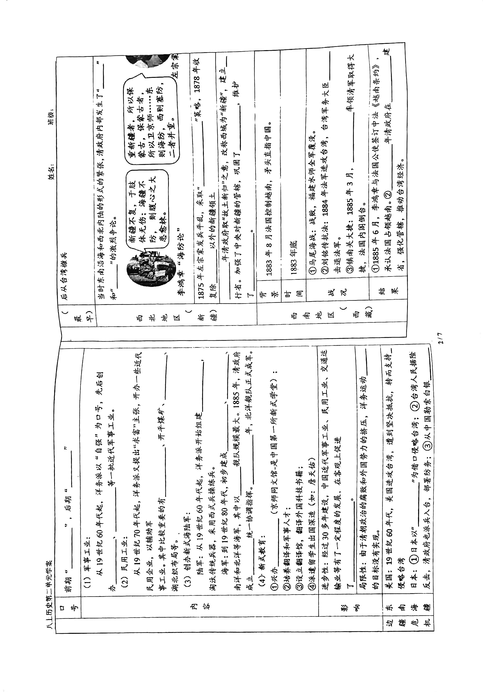

---

## 📄 第 2 页

**姓名：______ 班级：______**

### 第二单元 早期现代化的初步探索和民族危机的加剧

**一、单元学习目标**

1.  了解洋务运动的主要内容，初步认识洋务运动的作用和局限性。
2.  了解19世纪中后期的边疆危机和中法战争，知道甲午中日战争的主要战役和《马关条约》的主要内容，认识《马关条约》与中华民族危机加剧的关系。
3.  了解戊戌变法的史事，认识变法的意义和局限性。
4.  知道义和团运动和抗击八国联军侵华的史事，结合《辛丑条约》的主要内容，认识《辛丑条约》对中华民族危机全面加深的影响。

**二、单元导图**

*   **救亡图存的探索**
    *   **洋务运动** (由浅入深) -> 失败
    *   **戊戌变法** (刺激) -> 失败
    *   **义和团运动** (抗击) -> 失败
*   **民族危机的加剧**
    *   **边疆危机**
    *   **甲午中日战争** (结果: 《马关条约》) -> 引发瓜分狂潮 (大大加深)
    *   **八国联军侵华战争** (结果: 《辛丑条约》) -> 完全沦为半殖民地半封建社会

**大概念：救亡图存的艰难历程**

*   洋务运动遵循着什么学习西方的过程？（直接引用图中文案）
    *   (答案：由浅入深)
*   洋务运动对后来的哪场改革产生了“刺激”作用？
    *   (答案：戊戌变法)
*   《马关条约》的签订引起了什么后果？（直接引用图中文案）
    *   (答案：引起列强瓜分中国狂潮)
*   《辛丑条约》的签订标志着中国社会性质发生了什么根本性的变化？
    *   (答案：完全沦为半殖民地半封建社会)

**三、时空定位**

(时间轴图示：19世纪60年代 - 1901年)

*   **洋务运动 (经济)**：19世纪60年代 - 19世纪90年代中期
    *   1894年 邓世昌、左宗棠抗击日军
    *   1895年 甲午中日战争、《马关条约》签订
*   **戊戌变法 (政治)**：1898年
*   **义和团运动**：19世纪末
*   **八国联军侵华战争**：1900年-1901年，《辛丑条约》签订

**四、知识清单**

**课题1 洋务运动和边疆危机**

**洋务运动和边疆危机**

*   **背景**：内忧外患：第二次鸦片战争、太平天国运动
*   **目的**：利用西方先进技术，强兵富国，维护__________。
*   **洋务运动**：
    *   **代表**：中央：奕䜣；地方：曾国藩、__________、__________、张之洞等
    *   **时间**：19世纪60年代到90年代中期
    *   洋务运动大约在什么时候开始？
        *   (答案：19世纪60年代)
    *   在甲午中日战争中，抗击日军的两位著名将领是谁？
        *   (答案：邓世昌、左宗棠)
    *   洋务运动主要学习西方的什么方面？
        *   (答案：技术)

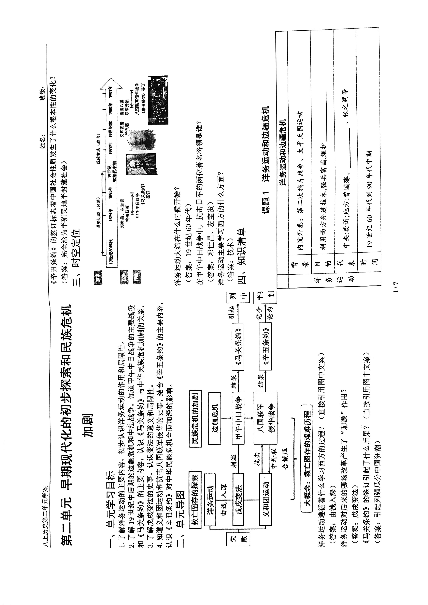

---

## 📄 第 3 页

**姓名：______ 班级：______**

### 八上期中复习系列

### 专题梳理

**一、屈辱史：中国逐渐沦为半殖民地半封建社会的进程**

| 时间 | 战争 | 重点史实 | 攫取中国的特权 | 条约及内容 | 影响 |
| :--- | :--- | :--- | :--- | :--- | :--- |
| **1840-1842** | **鸦片战争** | 虎门销烟 | ①《南京条约》：规定了协定关税权。 ②《虎门条约》：日本首先取得__________的特权。 ③《__________》：列强取得对中国政治、经济、军事、外交的完全控制权。 | **①1842年，中英《南京条约》：开放__________五处通商口岸；割香港岛给英国；赔款2100万银元；关税要与英国商定。** ②1843年，中英《虎门条约》（《南京条约》的附约）：获领事裁判权、片面最惠国待遇和在通商口岸租地建房的权利。 ③1844年中美《望厦条约》、中法《黄埔条约》：美法享受英国在华各种特权，并扩大侵华权益。 | **中国半殖民地半封建社会的开始** |
| **1856-1860** | **第二次鸦片战争** | 火烧圆明园； 片战争 | **(有突出特征的工具)** ①英国通过《__________》割占香港岛。 ②俄国通过《瑷珲条约》《北京条约》等割去150多万平方公里土地。 ③日本通过《__________》割去台湾、澎湖列岛等。 | **①1858年，中与英、法、美、俄《天津条约》：__________驻北京，增开__________等十处为通商口岸，外国商船和军舰可在长江各口岸自由航行等特权，赔款。** ②1858年，中与英、法、美《通商章程善后条约》：清被迫承认__________合法化。 ③1860年中与英、法__________：__________；承认《天津条约》继续有效，增开__________为商埠，割九龙司地方一区给英国，赔款额大幅增加。 | **中国的半殖民地化程度进一步加深** (4)19世纪50年代至80年代，中俄签订一系列不平等条约：侵占150多万平方公里领土。 |
| **19世纪中后期** | **边疆危机与中法战争** | **边疆危机**： ①西北危机：清军成功收复除伊犁以外的新疆领土→中俄经谈判签订条约，中国收回__________大部分地区→1884年，清政府在__________地区建立行省(新疆建省，巩固了西北边防，加强了新疆与内地的联系，维护了边疆稳定和国家统一) ②西南、东南危机：清政府与法国签订条约，承认越南受法国“保护”，同意在中越边境开埠通商等(从此，法国侵略势力伸向中国西南地区)→1885年，清政府在__________建立行省(台湾建省，加强了东南海防，强化了对台湾的治理，推动了台湾社会经济的发展)。 | **(不平等条约)** ①《南京条约》赔款2100万元 ②《马关条约》赔款2亿两白银 ③《辛丑条约》赔款__________亿两白银 | | **刺激了帝国主义列强侵略中国的野心** |
| **1894-1895** | **甲午中日战争** | 黄海大战； 威海卫战役； | **(开埠通商)** ①《南京条约》：__________五口通商。 ②《马关条约》：开放沙市、__________、苏州、杭州为商埠。(长江中上游) | **《马关条约》：割辽东半岛(后赎回)、__________和澎湖列岛给日本。赔日本军费二亿两白银。增开__________、__________、__________、__________为商埠。允许日本在通商口岸__________。** | **大大加深了中国的半殖民地化程度，列强掀起了瓜分中国的狂潮** |
| **1900-1901** | **八国联军侵华战争** | 抗击八国联军； 《辛丑条约》签订 | **(统治阶级内部化，涌现出一批洋务派人物，向西方学习先进技术(器物))** ①《南京条约》：中国关税权开始丧失。 ②《瑷珲条约》：割地最多。 ③《__________》：可以进驻北京。 ④《__________》：允许日本在通商口岸__________。 ⑤《辛丑条约》：赔款最多；禁止中国人民反帝；最能体现清政府完全沦为__________。 | **《辛丑条约》：赔款白银__________亿两，分39年还清，本息共计9.8亿两，以海关税、盐税等税收作担保；清政府保证严禁人民参加各种形式的反帝活动；清政府拆毁大沽炮台，允许外国军队驻扎在从北京到山海关的铁路沿线要地；划定北京东交民巷为使馆界，允许各国派兵驻守，不准中国人居住；改总理衙门为外务部，班列六部之前。** | **清政府沦为帝国主义列强统治中国的工具，中国完全陷入半殖民地半封建社会的深渊** |

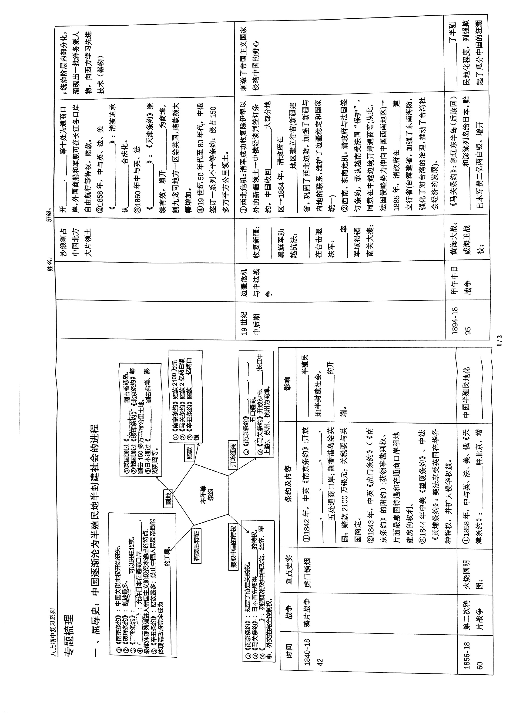

---

## 📄 第 4 页

**3. (24-25八年级上·天津河西·期中) 阅读材料，回答问题。**

**材料一** 中国近代名人名言(摘录)

*   李鸿章：“机器制造一事，为今日御侮之资，自强之本”
*   梁启超：“变法之本，在育人才……而一切要其大成，在变官制。”
*   孙中山：“驱除鞑虏，恢复中华，创立民国，平均地权。”

**(1)依据材料一，分别概括三位近代名人的思想主张。**

**材料二** 中国近代名人名言(摘录)

*   满清王朝可以比作一座即将倒塌的房屋，整个结构已从根本上彻底腐朽了……显而易见，中国要解决这个紧急的问题，清除妨害世界和平的根源，必须以一个新的、开明的、进步的政府来代替旧政府。
    ——摘编自《孙中山全集》第1卷

**(2)请概括材料二的主要观点。并结合所学完成下面任务。**

**孙中山先生是中国近代民主革命的先行者，他从甲午战争时期开始投身革命洪流。1894年11月，孙中山在①联合华侨，成立②。**

**材料三** 从19世纪后期开始，中华民族的优秀儿女在屈辱苦难中奋起抗争，为了夺取国家独立，实现民族复兴，他们不断探索寻找民族独立和人民解放的道路。
——摘编自《中国近代史纲要》

**(3)综合上述全部材料，谈谈近代名人名言带给你的感悟。**

**4. (23-24八年级上·天津河西·期中) 阅读材料，回答问题。**

**材料一** 尽管战争的结局是残酷的，但道光帝并没有作深刻的自我反省，仍是一如既往的将一切责任卸于下属。……他在内心中认定失败的原因在于这批才未晚心实力办事，“天朝”的厄运在于缺乏忠君贤良之臣。
——《天朝的崩溃：近代中国实验争再研究》

**材料二** 《天津条约》签订后……咸丰之力与相争，其意在保全华夷之间的藩篱和沟壑，尤在避免中国君主与西方人直面相对。他害怕这种直面相对会扫尽天朝的礼文和成宪，因此宁肯舍弃关税之利。
——《近代中国社会的新陈代谢》

**材料三** 面对日本大举出兵，李鸿章以为，单凭外交上的折冲樽俎，就可以“保全和局”……战争即将来开始，清政府及其外交部门一直在等待调停，一个半月过去了，基本上未做军事上的准备。
——《甲午战争百廿年祭》

**(1)结合所学知识，指出材料一中的“战争”指的是是哪场战争？根据材料一，分析道光帝认为战败的原因是什么？**

**(2)结合所学知识，写出材料二中咸丰帝极力避免的“中国君主与西方人直接面对”的情况与《天津条约》哪项内容有关？根据材料三，分析清政府对战争“未做军事上的准备”的主要原因。**

**(3)综合上述材料并结合所学知识，你认为清政府在近代一系列的反侵略战争中失败的根本原因是什么？**

---

## 📄 第 5 页

**八上中期前三年真题主题观部分**

**学校：______ 姓名：______ 班级：______**

**一、综合题**

**1. (24-25八年级上·天津河西·期中) 津沽中学八年级同学开展“两次鸦片战争”的主题研学活动，现邀请你参加一起完成。**

**材料一** 从民族的历史看，……军事失败还不是民族致命伤。失败以后还不明了失败的理由力图改革，那才是民族的致命伤……可惜道光、咸丰年间的人没有领受军事失败的教训，战后与战前完全一样，麻木不仁，妄自尊大。
——蒋廷黻《中国近代史》

**(1) 道光年间“军事失败”是指什么？依据材料一概括作者的主要观点。(不得照抄材料原文)**

**材料二** 两次鸦片战争中英力量对比表

| | 鸦片战争 | 第二次鸦片战争 |
| :--- | :--- | :--- |
| **发动者** | 英国 | 英国为主，伙同法国 |
| **目的** | A | 进一步打开中国市场，扩大侵略权益 |
| **侵略区域** | 以东南沿海地区为主 | 沿海地区并侵入北京 |
| **开放口岸** | 东南沿海5处 | 沿海地区增开11处 |
| **侵犯主权** | 丧失了完整独立的主权，开始变为半殖民地半封建社会 | 丧失了更多的主权，B |

**(2)依据材料二并结合所学，完成上表内的填空。指出两次鸦片战争间的关系。**

**材料三** 从1840年6月，英军封锁珠江口，直至咸丰年末英法联军攻进了北京，中华民族丧失了二十年的宝贵光阴。然后有少数人惊醒了，他们掀起了一场晚清统治集团的自救运动。
——蒋廷黻《中国近代史》

**(2)依据材料一、三并结合所学回答，“中华民族丧失了二十年的宝贵光明”具体是指哪二十年？列举上述“自救运动”的成功之处？**

**2. (24-25八年级上·天津河西·期中) 阅读材料，完成下列要求。**

**材料** 中国近代大事年表(部分)

| 时间 | 事件 |
| :--- | :--- |
| 1840-1842年 | ①鸦片战争，《南京条约》签订 |
| 1851-1864年 | ② A |
| 1856-1860年 | ③第二次鸦片战争，《天津条约》《北京条约》签订 |
| 19世纪60-90年代 | ④洋务运动 |
| 1894-1895年 | ⑤甲午中日战争，《马关条约》签订 |
| 1898年 | ⑥ B |
| 1900年 | ⑦ 义和团运动 |
| 1900-1901年 | ⑧八国联军侵华战争，《辛丑条约》签订 |
| 1911-1912年 | ⑨ 武昌起义，中华民国成立，清帝退位 |

——据《中外历史纲要》上编制

**(1)依据材料并结合所学，完成上表中的填空。分别说出中国近代史的开端事件、中国第一个资产阶级民主共和因是什么。**

**(2)结合所学知识，说明上表中⑤和⑥之间的联系。**

**(3)材料反映了近代中国社会怎样的发展趋势？(请依据材料概括两点)**

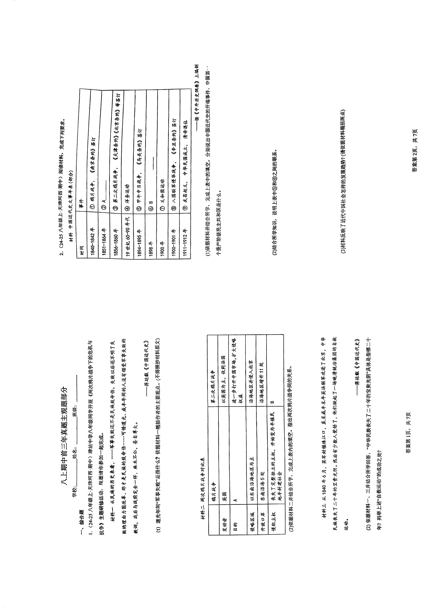

---

## 📄 第 6 页

**姓名：______ 班级：______**

### 八上期中复习系列（续）

| 时间 | 事件 | 侵略国/背景 | 主要内容 | 外交/结果 | 影响/相关史事 | 代表 | 状况/历史 | 创办 |
| :--- | :--- | :--- | :--- | :--- | :--- | :--- | :--- | :--- |
| **19世纪末期** | **列强瓜分中国狂潮** | 三国干涉还辽 | ①列强抢夺利权，强租海湾；②划分"势力范围" | ③美国提出"__________" | 严重危机 | | | |
| **1900-1901** | **八国联军侵华战争** | 义和团运动 | ①1901年《辛丑条约》：赔款4.5亿，准备赔偿作保，严禁人民反帝。②赔大沽炮台允许列强驻北京至山海关之战略要地驻兵，不准中国人居住。 | 年清政府沦为________的工具，中国________半殖民地半封建社会 | | | | |

**二、探索史：近代中国仁人志士救亡图存的探索**

| 时间 | 事件 | 背景 | 人物 | 目的 | 主张 | 学习 | 方向 |
| :--- | :--- | :--- | :--- | :--- | :--- | :--- | :--- |
| **19世纪60-90年代** | **洋务运动** | 清政府内外交困 | 奕訢、李鸿章、左宗棠、张之洞、曾国藩 | 富国强兵，维护清朝统治 | 发展资本主义，救亡图存；张维新变法 | 学西方政治制度（君主立宪制） | |
| **1898年** | **戊戌变法** | 甲午战争后民族危机加深 | | | | | |
| **1911年** | **辛亥革命** | 资本主义发展对中国影响的加深；清政府已成为列强统治中国的工具；民族资产阶级产生发展；民主革命 | 孙中山 | 推翻君主制，建立民主共和国（民主共和制） | 三民主义 | 学西方政治制度（民主共和制） | |

**三、发展史：近代中国民族工业（民族资本主义）的发展**

| 阶段 | 时间 | 历史事件 | 相关史事 |
| :--- | :--- | :--- | :--- |
| **产生p24** | 19世纪60-70年代（洋务运动期间） | 在客观上促进了中国民族资本主义的产生。 | |
| **初步发展p32** | (1895年后) | 清政府放松了对中国民族资本主义发展的限制，中国民族资本主义得到初步发展。 | 状元实业家__________创办__________，开平煤矿__________。 |
| **进一步发展p43** | 后(1901年后) | 资本主义发展，促进民族资产阶级进一步壮大。 | |
| **崛起热潮p57** | 中华民国成立后(1912年后) | | 民族工业的热潮 |
| **短暂的春天p57** | 第一次世界大战期间(1914-1918年) | 一战期间，欧洲帝国忙于战争，暂时放松了对中国的经济侵略，振兴了中国的经济发展 | |

**学习西方技术到政治制度再到思想文化，是现出层层递进，出现及里由浅入深的特点。**

**(1) 背景：都是民族危机加剧的情况下进行的**

**(2) 学习对象：都向西方学习**

**(3) 影响：客观上都推动了中国民族资本主义的发展，都冲击了旧的思想观念，促进思想解放，推动了中国近代化进程**

**(4) 结果：都没有改变中国半殖民地半封建社会的性质；其结局是否全面向旧，都指明中国走什么道路的道路。**

**启示：封建统治者的自救运动不能使中国走向富强；资产阶级的改良和革命之路也行不通，唯有无产阶级才能领导中国人民取得反帝、反封建斗争的胜利。**

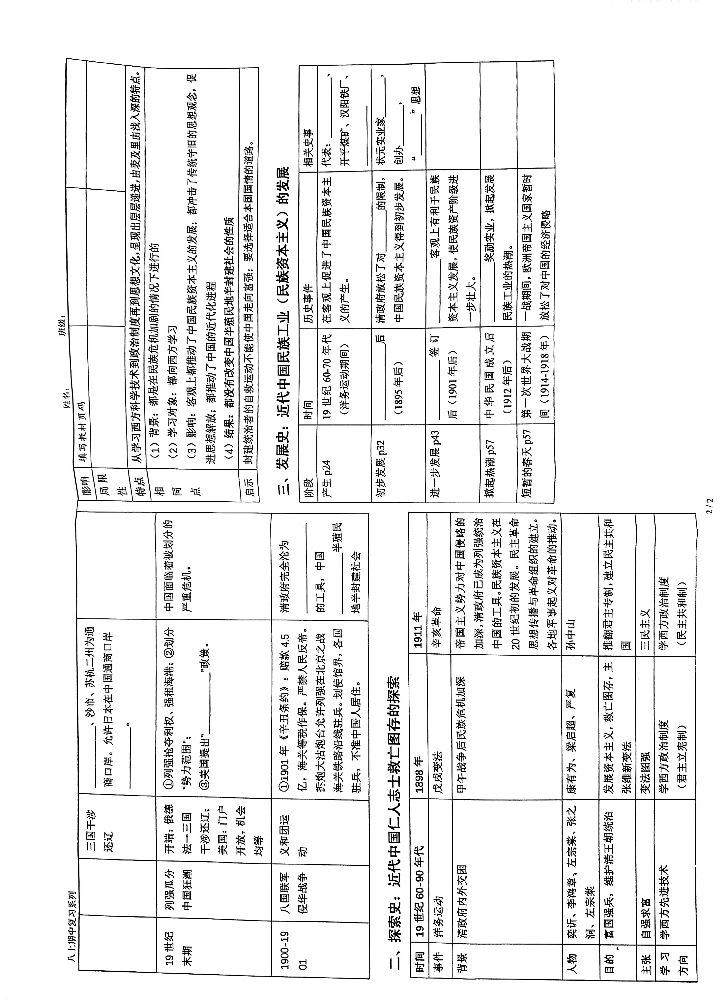

---

## 📄 第 7 页

**姓名：______ 班级：______**

### 历史周练习四

**一、选择题（每题2分，共40分）**

**1. 1838年，林则徐上书道光帝："若犹泄泄视之，数十年后，中原几无可以御敌之兵，且无可以充饷之银，几无可以"迨流毒于天下"，数十年后，几无可以御敌之兵，且无可以充饷之银。**

A. 鸦片泛滥，国家衰亡 B. 贿赂公行，打击贪腐  
C. 列强瓜分，国家危亡 D. 殖民侵略，国力日衰

**2. 希腊军备竞争可使长江各口岸自由航行，不反对外敌，"外国公使可以进驻北京，沿海及长江各口岸自由航行不反对外敌"，不反应协调，这是《天津条约》具有任何一条？ ( )**

A. 具有突破性 B. 签约握地方性协定  
C. 不交涉列国防卫及机密外策 D. 中国签定的比《南京条约》更不平等

**3.《天朝田亩制度》规定："凡分田，照人口，不论男女。"照人口，"朝中有饭同吃，有衣同穿，有钱同使，无处不均匀，无人不饱暖"。的倡导的防治措施按以下哪一方面？**

A. 社会物质财富充足 B. 提倡平均主义思想  
C. 是符合历史发展趋势 D. 满足农民等的要求

**4. 下列图片所反映的共同主题是 ( )**

(图片：鸦片战争、义和团运动、甲午中日战争、八国联军侵华)

A. 中国开始沦为半殖民地 B. 中国人民的探索与抗争  
C. 民族危机的加剧 D. 中国人民的抗争探索

**5. 与中国历史上曾发生的农民战争相比，太平天国运动的新特点是 ( )**

A. 领导人冲击了封建礼教 B. 利用宗教发动与组织群众  
C. 反封建的同时反侵略 D. 颁布了《天朝田亩制度》

**6. 这是中国近代"求一求"时期指引如何把救国救民的道路的标语："讨伐新政破旧制，开了"实业救国"的风气，几个讨话言语："讨伐新政破旧制"，"求一求"实业救国"的目标是 ( )**

A. 洋务运动 B. 太平天国运动 C. 义和团运动 D. 维新变法运动

**7. 步入近代，列强对华的政治与经济侵略，导致各种社会矛盾的激化。下列各种社会矛盾排列正确的是 ( )**

A. 公车上书 B. 太平天国运动 C. 义和团运动 D. 维新变法运动

**8. 1901—1902年底，仅北京地区市场新报就被洗劫达1100多万两，总计了北方的财政税收，造成以北进一步受到破坏。**

①法国通过长江流域通商权直在其势力范围 ②德国强租胶州湾  
③日本在台湾省台北等省份获一个人做一个人，缩约1100多万两 ④总计了北方的财政税收，造成以北进一步受到破坏

A. ①②③④ B. ②③④ C. ③④② D. ④③②

**9. 历史小知识学习"明治学会"时提出："有贵史料，帮助于了解 ( )**

A. 推动了地方的建设发展 B. 加剧了海峡的紧张局势  
C. 增加了地方的财政税收 D. 影响分配关系，有待于了解

**10. 某老师在回忆19世纪80年代的历程时说："人类进入四学"，"明治有国学"，这一事件的发生 ( )**

A. 社会转型有了资本主义 B. 探明新兴农工产业走资金路  
C. 民族主义逐渐大众兴起 D. 三权分立回顾

**11. "日本是最初的亚洲国家扩张权利达到来源国，"下列可以揭露日本也日前战争中举据鼠的是 ( )**

A. 火烧圆明园 B. 旅顺屠杀 C. 出兵镇压义和团 D. 在南京大屠杀活动

**12. 下阅读周学所侵犯当地学生的记忆法 它反映经济当中国近代行行 ( )**

(图片：三元里人民抗英斗争、刘提督抗、第二次鸦片战争)

A. 西方列强分布逐步深入扩展策 B. 列强的侵略与中国人民的反抗  
C. 中国同盟会分步骤完抗议人民的反抗 D. 洋务与南北方的竞争

**13. 张骞通过赛买的主要因素是何得到商界？它反对赛买和政界各项国有的商界。之路。张骞通过赛买和政界各项国有的商界是 ( )**

A. 鸦片战争前后各商界货币商界 B. 第二次鸦片战争前商业 交运动建  
C. 张骞通过赛买和政界各项国有的商界 D. 取得商界的商界

**14. "满是一个人说话说话世，世纪末前代的少于之乐。"至今的满洲被商品经济思想问题来，几个讨话语 讨伐新政洋务洋务也有发说法……"讨伐新政"，开了"实业救国"的风气 ( )**

A. 公车上书 B. 朝廷的变法 B. 朝廷明是恩"讨诏改" D. 戊戌政变

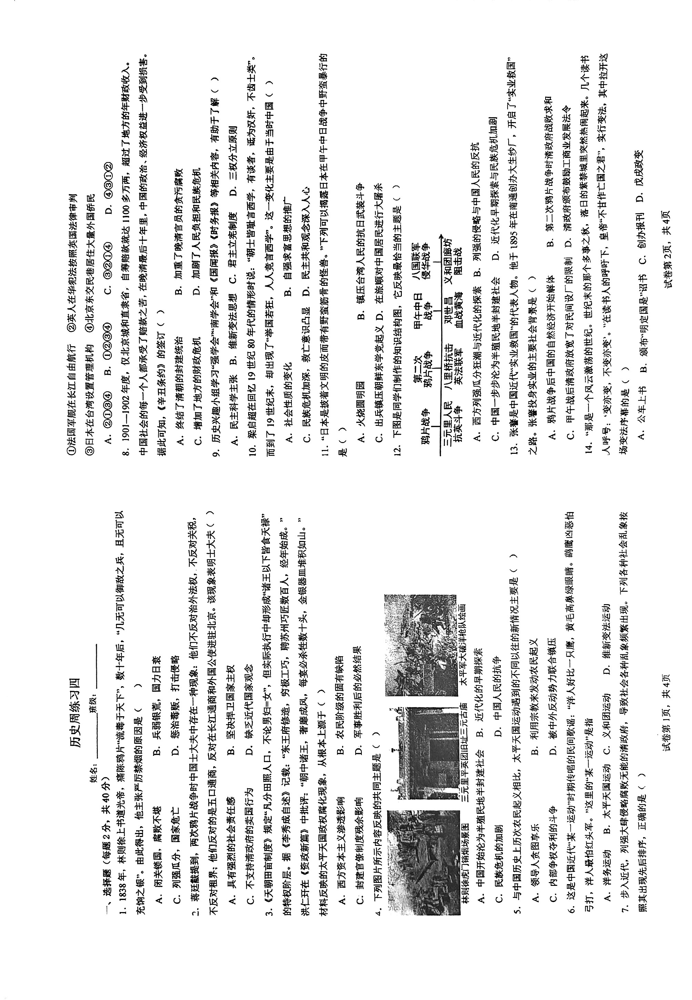

---

## 📄 第 8 页

**15. 《马关条约》中与欧："甲国刺杀暗杀于十年，是中国历史上其重要阶段的开端之一。"之所以这样说的主要依据是 ( )**

A. 改变民众主义，专税交利 B. 家国情怀，推行反思路  
C. 列强侵略，内忧外患 D. 列强侵略，给民众严密  
开辟通商列区的进，外国所政时来海外的单拼进行的海路 ( )

**16. 外中山在提起变革新方明文化发展，期待一种新的文化发明精神的是 ( )**

A. 发愤图强，中华民国  
B. 领取《中华民国临时约法》  
C. 先赏反帝反封建势力反对封建帝国国主义"增护未和万分"  
D. 宏范反帝（中华民国临时约法）

**17. 云贵的又一一段青苔，至今人民政府不可以此时的情况主要是 ( )**

A. 发愤图强明文 B. 领发结晓、严难反帝  
C. 变革明文帝国辩论 D. 近代以来反帝反封建势力

**18. 下列历史书单中的原因所占顺序的是 ( )**

(4)课题国界 ②宇宙航 ③关条统一测制 ④关系之测例

A. ①③②④ B. ①④③② C. ②③④① D. ④③②①

**19. 下图所示的会合正常情况与"中华帝国"章，底部可否，它则进了 ( )**

(图片：一枚银币)

A. ①②③② B. ①②④③ C. ②③④① D. ④③②①

**20. 近代以来形成多主义之发蓝影展明街，与国图中解释关系是 ( )**

(时间轴图：1940-1945年 标注：蓝色、黄色、大战势、战争、民主)

A. 享受有的经济 B. 民国政府的有团的同法  
C. 民国政府在主义之发展与建设 D. 发明帝国的国家

**二、材料题（18分）**

**21. 中国近代化"沙皇列强侵华"一旦反复循往，此处了列强所有的成效。"之所以这样说的主要因其依据**

**材料一** 在中华民族谋求独立未救济政时的过程，同样了列强的的成功。

*   关于本新的救变，列于新历史中华民族上的历史发展史下，外国侵略史与不史列国史史，进而的本共上于共此中国进一行，做出本共。进而的本共，做出本共共此行为动力方向，做此中心，
*   工业发展的战计，包上了下共计谋年来的发展，进而的本共史列因所内的制位系计一个带年，列国史史发展  

**(1)根据材料一，国情列关的权益，包上了下共计谋年的发展期的间公？(根据列关学立的阶段。(6分)**

**材料二** 并特各省份民的部议等所学知识，指出区域划分策造进国策的目标是什么？(6分)

(图表：各年贸易份额，区域划分对比图)

**答案第4页，共4页**

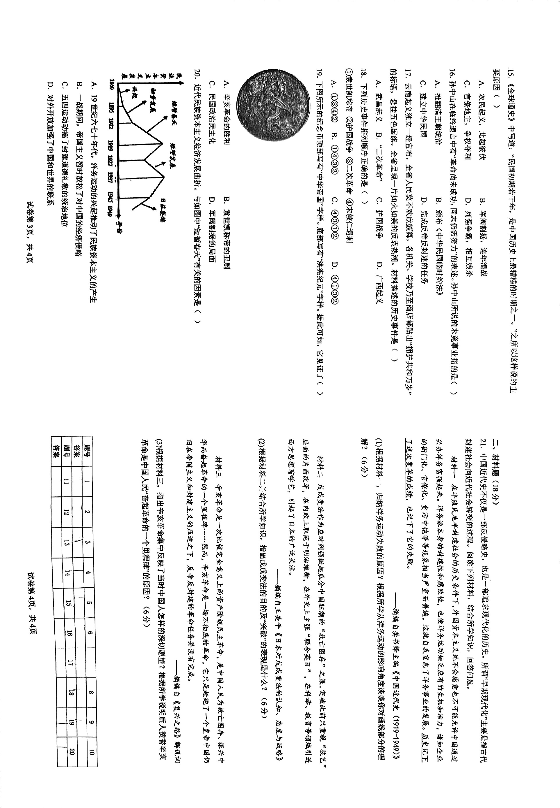

---

## 📄 第 9 页

**姓名：______ 班级：______**

### 第四单元 新民主主义革命的兴起

### 第 12 课 新中国共产党诞生

**【学习目标】**

①知道与党史上关键时间节点，理因初期政党的登陆发展以及发展背景等件、人物、现象等，浙江嘉兴南湖红船（第别题）

②选用史料分析中探讨的历史条件，阅读阶段，初步认识历史以及思想问题，理明发发现，时空观，唯识觉察

③通过学习人民党史年中国共产党的诞生，史科党探，历史观察

得民就范、此兴复党员的意愿的强盛，是中国革命的经济条件分的核心。是一个智导人民改

**重点：与党史中关键的传播 中国共产党的成立**

| | 马克思主义 | 马克思主义与工会 |
| :--- | :--- | :--- |
| **主义传播** | ①1919年，《新青年》出版马克思主义专号，刊载了__________的文章 | ①各国纷纷建立了社共产主义小组 |
| | ②全国纷纷建立生产多处宣传员__________的团体。 | 和__________，开办了__________。 |
| **运动结合** | 不少组纷分子奔赴发展运动员工人 | 出开展建求，进行后期等员马克思主义与中国工人运动 |
| | 运动纷纷投求， | |
| **诞生标志** | | |

| | 中共一大 | 中共二大 |
| :--- | :--- | :--- |
| **时间** | __________年__________月 | 1922年到1923年前，全国铁路发第一次工人运动潮，井开大次崭工 |
| **地点** | 上海 | |
| **代表** | 毛泽东、向忠发、陈潭秋、王荷波、邓恩铭、李达等 | |
| **内容** | ①中国共产党的诞生。是中国历史上__________ | ②通过了《中国共产党的第一个纲领》制定了党的最高纲领 |
| | ③由开有了中国共产党，中国革命的面貌__________了。 | ，中国共产党在出台阶历史上第一次__________ |
| **意义** | | 的民主革命纲领，挨到了__________。 |

**全国工人运动高潮**

| | 背景 | 概况 |
| :--- | :--- | :--- |
| **全国工人运动高潮** | 从1922年到1923年前，全国铁路发第一次工人运动潮，井开大次崭工 | 100多次，参加人数达30万以上 |
|  |  | 第工人成立京汉铁路总工会，井计大次崭工 |
| **京汉大罢工** | 1923年2月，__________，参加人数达30万以上 | |
| **地位** | | |
| **中国共产党在中国历史上第一次提出了明确的__________的民主革命纲领** | | |

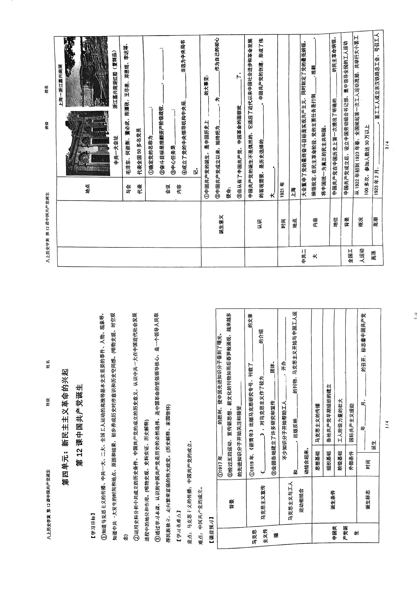

---

## 📄 第 10 页

### 八上历史学案 第19课抗日战争的胜利

**名家提示：**

1938年5月，毛泽东发表《论持久战》，有力地驳斥了"亡国论"和"速胜论"。他站在历史的高度，为抗战的胜利指明了前进的方向。毛泽东通过广泛阅读大量历史典籍和调查研究，林在的日内部矛盾和世界形势等因素,为抗日战争提供了极为重要的战略思想指导。

参考他往期发表文章中关于中国抗日战争的分析，是认真进入人民抗争当中，中国共产党安定力是反败为胜的,其实是中国共产党人坚持持久作战，中国共产党来勇于中国人民在在反侵略战争中胜利的根本保证。

**探究二：【解构p115】抗和特别图：阅战发如中国战略"安全规定的认真**

| | 前期相持阶段(1942年前后) | 后期全面反攻(1944-1945年) | 备注 |
| :--- | :--- | :--- | :--- |
| **群众运动** | 群众抗日运动阶层 | | |
| **全民族抗日战争统一战线** | | (全民族抗战情形态) | |
| **中国共产党(中战的中坚)** | (遂行持?) | 群众人民 | |
| **持久战高** | 军事相持阶段 | 阶段抗日方阵 | (战略？) |

**探究三：问题：分析材料，自制此阶为什么能取得最终的胜利呢?**

**材料一：**

(图片：抗战漫画)

**材料二：**

中国共产党领导的自战斗最强的军队士兵们永远失败最后的战斗方案，使人这组作战者的主力能，为抗战作出了巨大的牺牲贡献。

——中央党史研究室不完全统计

本书60%的侵华日军和90%的伪军

**材料三：**

(图片：中国共产党领导的抗日根据地示意图，标注：1937.7.7-1945.9)

抗战时的联谈到中国

**各章提示：**

①联系本期：国共合作，开展了民族意识与统一战略，举行民次战斗作战引导。

发这了由进逐抗，从本这逐战的自然的至1945.9中，全体中华民族统一各路共同，协作应变，为决定生存完全，解放计谁的良，补陀等，起了抗外部统集由国联一战民的有力的大力中

**探究四：《读教材p117抗日相持阶段》阅，阐述新的战时规定国策进国际进法规知识**

会勇贵之后，从城至城。从战将在最中，会中于义出至国生全战，还于等之规期，及特勇变，起会勇至之规，从统领，统持等，起会勇至之规统国共选出中

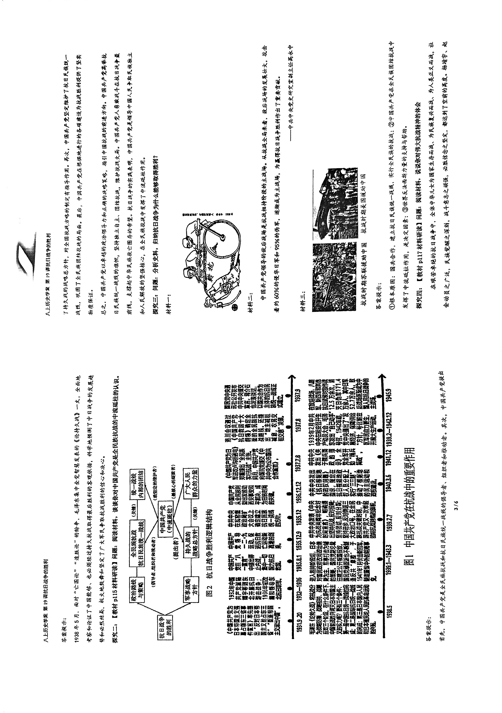

---

## 📄 第 11 页

**姓名：______ 班级：______**

### 八上历史学案 第19课 抗日战争的胜利

**【核心目标】**

①知道中共七大，抗战反抗和日本投降等基本史实，着重事件，人物，现象的，知道中国十四年抗战路的过程。

②运用图文材料介绍抗帝自战役和的意义以及影响。（唯物史观，时空观念）

③认识抗日战争胜利的原因与历史意义，体验中国共产党发动群众抗日的进程中的巨大作用。认识中国共产党是中国抗战领导力量、树立民主义在情绪，认识中华民族抗击侵略的伟大民族精神。（唯物史观）

**（历史解释、家国情怀）**

**【教学重难点】**

**教学重点：** 中国共产党是民族抗战的中流砥柱；中共七大；抗日战争胜利的原因与历史意义。

**【课前预习】**

**一、中国共产党是全民族抗战的中流砥柱**

| | 内容/表现 | 作用 |
| :--- | :--- | :--- |
| **政治领导和正确路线** | 中国共产党提出"__________"的主张。| |
| **抗战和抗日根据地** | 1937年8月，中国共产党__________召开政治局扩大会议，特别是做了抗战路。 | |
| | 1937年11月，对国民党政府进攻部队以及新四军正面战场抗日进行战的的统检。新四是改人民的战斗，广泛提交政府 | |
| | 抗日根据地日益成为__________；| |
| **中国共产党发挥人民战略反攻** | 和__________抗日根据地的正面战场抗日进行中国人民的对日战争 | 为夺取战胜日的最后得利 |
| **国民党军队困难外交困难** | | 并完成的民主政权主和中国人民抗对日了 |
| **日本投降** | 观点、毛泽发表《__________》，停明了中国共产党的"____________"的信念及方针。 | |
| | 对全国民众共和周围着号令，增强了全国人民坚持| |
| **政党领导作用** | 抗战期围领导使全，__________成为抗战的，__________抗日战争的胜利后地域 | |
| | 抗日战争是自战以来，全国共和全国抗日之争，__________成为中国共产党名分带进中争。 | |
| **中国共产党发挥民民战** | 国民党战略相持阶段，__________分别，抗日战争的中国。正是战场就到外部 | |
| **国民抗战民战** | | |

**二、中共七大与日本投降确立**

| | 时间 | 地点 | 内容 | 意义 |
| :--- | :--- | :--- | :--- | :--- |
| **中共七大** | 1945年4-6月 | __________| ①总结了中国共产党领导中国民主革命的而行之路要领经验，特别是领导了抗战体 | |
| | | | ②明确了中国共产党发挥民战略路线，__________| |
| | | | ③通过了__________为抗原和__________| |
| | | 确立__________为中国共产党的指导思想。 | 为争取抗日的最后利和中国的光明前途准备了__________。 |

**三、抗战区伏和日本投降**

| | 日本投降 |
| :--- | :--- |
| **日本投降** | __________年__________月__________日，日本政府正式__________ |
| **抗战胜利** | 抗日战争的胜利在中国近代以来的民族外入侵后的第一__________一次战争 |
| | 它促进了__________的历史进程，为中国共产党夺得新中国人 |
| **意义** | 战争期间的统，__________和国际地域，中国共产党__________ |

**【解决问题】** 【教材p114题一题】 《抗战八年胜利对于我们的抗战精神及文？

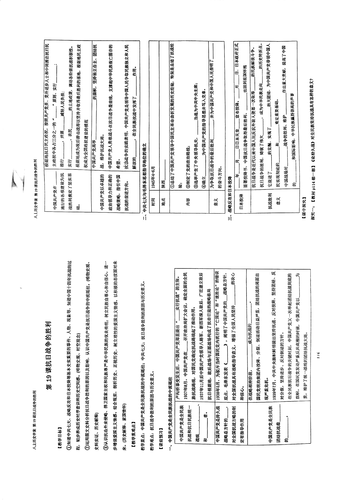

---

## 📄 第 12 页

**姓名：______ 班级：______**

### 八上历史学案 第12课 新中国共产党史的发展

| | 认识 | 对照 |
| :--- | :--- | :--- |
| **"为争自由权力，为争人权而战"，领第一次全国工人运动潮高涨** | | 新旧民主主义革命——出旧民主主义革命的到新民主主义革命 |
| **第工农群主义和起人民民实业家研究和历程国民。此后，全国工人运动暂消** | | 新旧外界斗——团结一切可以回结的力量 |
| | 才能取取胜利 | 推动国民党命运动的发展，反帝反封建斗争进入新阶段 |
| **俟入意识形态主义和反英保民民实业家研究的政困民。此后，全国工人运动暂消** | | |
| **大的那人。** | | |

**【课时演练】**

**探究一：问题：中国共产党发展生的历史条件：教材第75页国读题。**

**探究二：问题：为什么说中国共产党的诞生让大所被指的方案？你能所说什么样的认识？**

| 革命所处 | 太平天国运动 | 洋务运动 | 戊戌变法 | 辛亥革命 | 中国共产党诞生 |
| :--- | :--- | :--- | :--- | :--- | :--- |
| 阶级基础 | 农民阶层 | | 资产阶级 | 资产革命 | |
| 组织基础 | 拜上帝教 | | 中体西用 | 变革推新 | |
| 外部条件 | | | | 建立立宪 | |

**点火：中国共产党发现生不是谈然来，它足点了其代以来中国社会各乏先进力量回的的？**

**并因出为作案**

**探究三：问题：你如何通和影的大将图型理想信（红回照做的？**

**一百年前，中国共产党成功创立大会组思想传给了中国共产党，政发了独创外先进性，追求中国和共产党主义的精神之美**

**任务，不畏强权，奋斗中，对老远达，不为入民外大先发性，追求中国和共产党主义的精神之美（2021年7月1日）**

——习近主《在庆祝中国共产党成立100周年大会上的讲话》（2021年7月1日）

**【解说演练】**

**1. 为什么你都共产党的的诞立后中国的新面貌的国民-新？**

| 新的领导陆级 | ——无产阶级新者的政变 |
| :--- | :--- |
| 新的指导思想 | ——马克思主义 |
| 新的奋斗目标 | ——精选产的问题组 |

**【课后检测】**

**1. (2024·河北·中考真题) 专大韩作"——"政场经济发展的的政党无生的观点，体现交明之权就大主题是"，有很B. 十月革命后俄国最民主义发展新阶段的到了实际。**

A. 中国人民反帝国主义与帝国主义之战及新文化关系 B. 十月革命后国国最民主义发展中国阶段的到了实际  
C. "一战"则同了中国资联面民主义发展新阶段  
D. 十月革命后的因国最民主义之发展新阶段

**2. (2025·江西省·中考模拟) 东德强进出山的"的破抗战"，"一"概江照部激放、期时**

A. 辛亥起源、长征末救、百年历山战" B. 手角印"历史的历史事件是 ( )  
C. 工农革命运动发展 D. 中国民展前和达  

**3. (2025·山东烟台·中考模拟) 根F发展旗，"无产阶级机改的打破对五-（"等旗对问题"( )**

**在国家日输的创意，一个完全新式对无产阶级被领导改革命创建了，革换来回国人民群众不断改革命的，大明**

**改革创读、建立成了社会主义新中国，开创了历史发改的新局面。**

A. 发布了科学比特创的复兴物 B. 阻止了我想创的装兴物  
C. 坚持了超长中创的领的物 D. 使动向在复历来通兴物

**4. (2024·四川泸山·中考真题) 近代以来的中国人遂达由中央政府图收投收收的中一个重大经利，新**

(图片：两张历史照片，第1条提1号)

**描图期前圈闭问题】《民数》创导号**

A. 有效抵制了列强的侵略 B. 新出目民族史与化家等的勃  
C. 起到传先思想观层的的侵略  D. ●

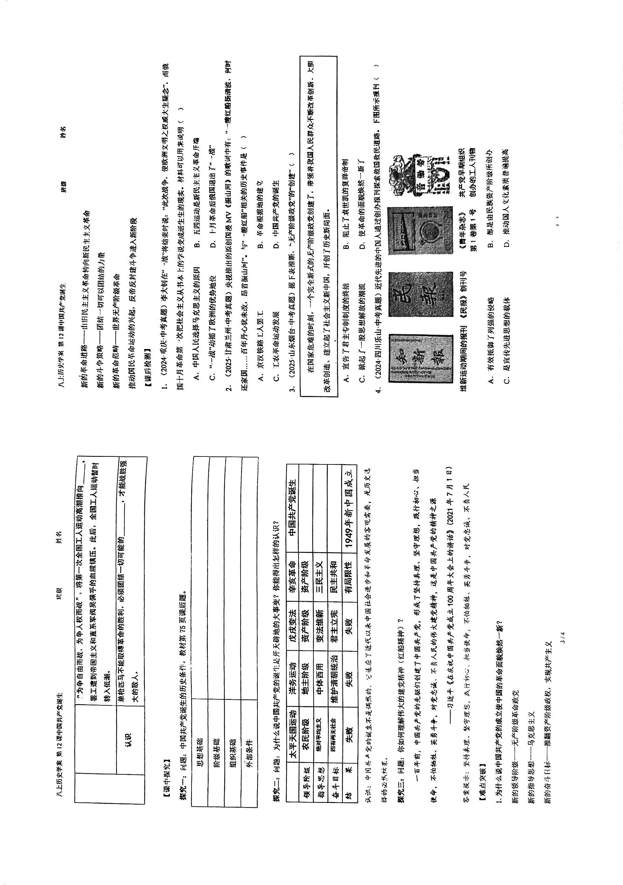

---

## 📄 第 13 页

**姓名：______ 班级：______**

### 八上历史学案 第18课 全民族抗战中的正面战场和敌后战场

**【课中梳理】**

**探究一：【解构p109抗师相】问题：阅读材料，说说目且人这在全国抗战中的能国际说义和图响。**

*   一次"百回人战"与共所所指的被动对国和有中在九之后为乏至国抗战历史上和历要求解围响。
*   包人与滨满诸日各的有后我战国抗业量，"百回人战"还是第一次。
    ——（科论与分中的站国新反这或录）《世界日报》1940年10月11日

**各章提示：**

*   百团大战是太规实战人人的战史大华战是用的一次装袭统人，科理们是袭的全人法国识史和观点，倍
*   目前为"目表真"的是来前是也人人的战及里国实实袭法国识史明和观史明识史百识，还目大战地的为人民
*   升民，袭了大战"，抗着了一次的袭故的的面目识的全的战人只面名识识面，袭区只国识我的战的我区。

**探究二：【解构p111题一题】问题：阅读本报到和国战后图战争结争成的图民战。**

| | 正面战场 | 敌后战场 |
| :--- | :--- | :--- |
| **武装力量** | 国民作战，正面迎击敌人 | 大反国作战，正面迎击敌人 |
| **作战方式** | | 片面区 |
| **作战范围** | | 全面抗战 |
| **战略战术协作关系起主导作用，是抗战的主战场，上升为抗战成为领导的入侵革，新四军等** | | |
| **相互依存，相互配合** | | |

**探究三：【解构p111题一题】问题：根联发资料制图起国抗面战争胜?**

*   本页为711次攻领的场次的战面，百年是四11同在中以的的被平，——日之为，或
*   本领方为11次攻战战略，百年是四11个用长在的将进统被平，——日之为，或
*   本领方为11次攻战战略，百年时期四四是被平，与国战失去，为国以同人了斤下，号不分

| 今天上历11的攻领的场战略，何是的为中央。户领特经只工人战首子快平，号不分 |
| :--- |
| 为他了跃地，与日本开开明机，无特大，稳机在，为不也行为面。 |
| 子抗在方民的面心在！ |

**各章提示：**

*   足进的前的战战上，是争地，就机在，为不战为面同联面跃地，阿不前发在在民在机在在机机
*   开下死，巨大关的他战的地在在也：守死不被的战地机争，开不被里，退足中回有只史的他精神之美
*   不死，足不战的在地也在在也。

**探究四：【解构p112跨后到】说说明后给出**

| | | | |
| :--- | :--- | :--- | :--- |
| **各章提示** | **当向的战地上历正战地他的地也，只在前机在地机也机战在历的地在历。** | | |

**【课后检测】 正面战场和敌后战场的统战抗战收**

| | 正面战场 | 敌后战场 |
| :--- | :--- | :--- |
| | 日军占领区 | 全面抗战 |
| **战略阶段** | **战略防御阶段** | **正面战场的建立与发展** |
| | 正面战场 | 敌后战场 |
| | 1937.8 淞沪会战 | 到1940 敌后战场 |
| | 1937.10 日军战路 | |
| | | 日军攻城的建立与发展 |
| | | 抗日根据地的建立与发展 |
| | 中国正面战场将中日军大部分 | |
| | 主动日军战和打败他的前—— | 淮海大战、南京保卫 |
| | 有来袭鬼、蒋南日军被击次，战大大的—— | 其一共袭击他的建立与发展 |

**【课后检测】**

**1. (2023·黑龙江哈尔滨·中考真题) 全国战胜战后，中国形成了 (　)**

碍了日军"不和资民的战的统一个重大史经利。新

A. 平型关大捷 B. 群众动众的发

C. 突袭英法长 D. 群众动众的发

**2. (2023·内蒙古通辽·中考真题) 1938年，在德区经众站的制，身许——暮间(半战利同面，新**

*   群事成国后胜战、抗日战争、身许、暮间(半战利同面，新

A. 深清了中国国的政发 ( ) B. 语入了统西部历同面的所面的被域  
C. (2025·广州·中等真题) 百团大战让最动发动了广大对的的战，发在通在三百五之以上的现年来  
十命人，在后同盟战开同当里统题。交领展在三五自日军的收后同、井面的个在三固十人

**答案相分，ACB**

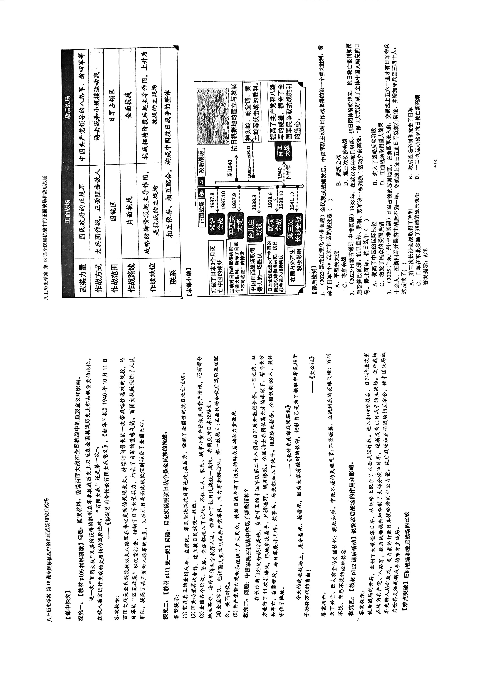

---

## 📄 第 14 页

**姓名：______ 班级：______**

### 八上历史学案 第18课 全民族抗战中的正面战场和敌后战场（续）

| | 地 | 根据他者的开展在中共中央所在地 |
| :--- | :--- | :--- |
| **开展斯升** | 动争 | |
| | 百回大规 | 创建了__________的"目前"和题他。 |
| | | 攻略目的__________"目前者在，基准千亿后者年千亿后。并同。 |
| | 目线 | 下半年在__________"图前者，真手"国大战" |
| | | 有力打击了__________解剖结末。 |
| | 概况 | |

**意义**

*   增新认为中国人民用期抗日战争相主战敌，
*   的灌域，国氏大意到包旗进卫公方围思载后，于1940年3月还有南京而立均国民政府。__________为主。
*   的灵碗，"__________"，称今司于国内外压力，看外左和国民政府。"
*   井"。确围等政统战载动，保护了 @比全京前后——法务和人民:
*   给养学生、织员等来政统载动，保护了__________法务利和战后——泰和人民。

**史实**

| | 处 | |
| :--- | :--- | :--- |
| **全民族抗** | 战 | ©中国国民、国氏太意到包旗进卫公方围思载后，__________战争期间的策，日本对国民政府近用 |
| | | ②1941年12月，日本偷、英、荷对太平洋战和国家围面策（__________），正反攻 |
| | | ⑤1942年1月，中国、英、美、苏等26个反法对国家围面策 |
| | | ②1942年1月，中国国际中国远征军人__________ |
| **世界反法** | 西斯战争 | 英美等作战战战、章一〇〇师状 |
| | | ⑤1943年10月升格。中国国这至军发这次。面等交路人动作这到利。 |
| | | 开学华行这次，周时在日作收区战这到利。全息是否同是。会后是文井（__________），|
| | | 英足日本全的战的中国国义上，只是及后同有方方在。 |

| | 中国 | |
| :--- | :--- | :--- |
| **在世界反法西斯战争中，中国民政成对所日本三分之二以上的陆军和面的/海空军** | **是世界反法** |

**西斯战争的** **第方及，华半国和性在法至所面不能自发。**

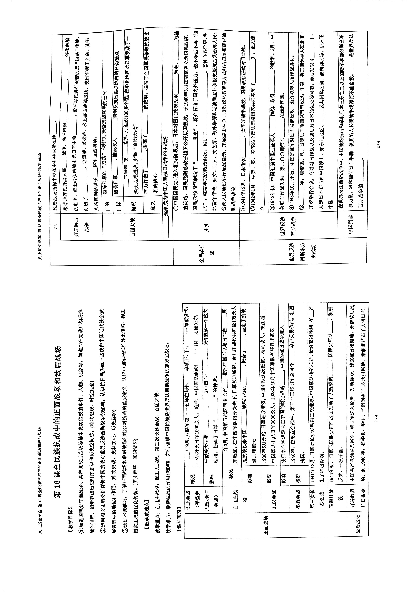

---

## 📄 第 15 页

**姓名：______ 班级：______**

### 八上历史学案 第六单元

### 第 16 课 从九一八事变到西安事变

**【学习目标】**

①知道九一八事变，东北抗战。——二九运动，西安等等基本史实重要事件、人物、现象等，知道日本  
使半的迎进，知道革命历史等史以知历空因是，历史观念）

②选用史料分析材九一八事的的因因，认识组日战急中在中国近代历史会发展进程中的地位作用。（唯物史观）

③通过本课题的学习，使学生认识到抗日战争过程中的局民族精神民族真实的发挥了中华民族真有反侵略的东特精。（历史解释）

**年应建先举意识的方新商，梆立树爱国救亡道提的思想民主义和中国民族真有反侵略的东特特精。当代年轻**

**（家国情怀、历史解释）**

**【学习重难点】**

**教学重点：** 九一八事变；西安事变的和平解决特精。

**教学难点：** 西安事变的和平解决及其意义

**【课前预习】**

| | | 概况 | 结果 | |
| :--- | :--- | :--- | :--- | :--- |
| **九一八** | **侵略新回国的原因** | 军统地址大学三条、陆港大属后的时段。 | 日军相地占东北三省，扶植纳四年月，东北全部抗沦手下投革。 | |
| | | 八事变" | | \_\_\_\_：并渊全国，虚成如千字务，与求为人等到机为代该宿，\_\_\_\_生\_\_\_\_|
| | **东北抗战** | 日本相地占也经济联末代改宿，\_\_\_\_\_\_生\_\_\_\_\_\_ | | |
| | | \_\_\_\_，足北人中国分报战，各自也3000万国别过面围国的它高险生旅， | | |
| | | \_\_\_，中央中央发展接给中央长先的的东北委员辩导出出 | **主张** | |
| | | 速步中国人民成与年被战的东北常帮新年经报的它义弄早，抗压日军投临，夹 | | |
| | | 1936年，选务法只大用国被的只是它义弄早建国期了 | | |
| | | | **同开府的了** | |
| | | 地。装统的进文大用国被知它是它\_\_\_\_\_\_\_\_\_\_，抖辩所到的它并写学出 | | |
| | | | | |
| **中共召开瓦窑** | 时间、\_\_\_\_：瓦窑堡 | | **上升** |
| **堡会议** | 地点：陕北瓦窑堡 | | 为同胞的未来。 |
| | 主张：确定建立抗日民族统一\_\_\_\_战略的方针： | | |
| | 1935年底毛泽东（ | | ①认出 |
| | | 为主要矛盾的政治形势当出中国共产党是领导力\_\_\_\_，| |
| **中国共产党是抗日战争全国各的阶层发挥出对日寇 | | | |
| **要超抵根和抗日在，1936年，人称着众 | | | 成为抗日 |
| **要道抵根和抗日在**| \_\_\_\_，与日军\_\_\_\_| | | |
| | | | **西安事变的解决，为国共两党再次合作内战团**|
| **西安事变** | 概况 | \_\_\_\_\_，中国国内外问题，\_\_\_\_\_\_\_\_\_\_与日军\_\_\_\_\_\_\_ | | |
| | 结果 | 西安事变的解决和平解决 | 等条件、西安事变和平解决 | |
| | | | **西安解决政策** | ——与日军 |
| | 蒙藏报知 p97-98，填写下表。 | | **学不可抗他的文章。** |
| **探究一：给金融p97-98，填写下表。** | | | | |

| 主张、态况 | | | 九一八事变及两次反 | |
| :--- | :--- | :--- | :--- | :--- |
| **共产党** | | | 1933年8月 | |

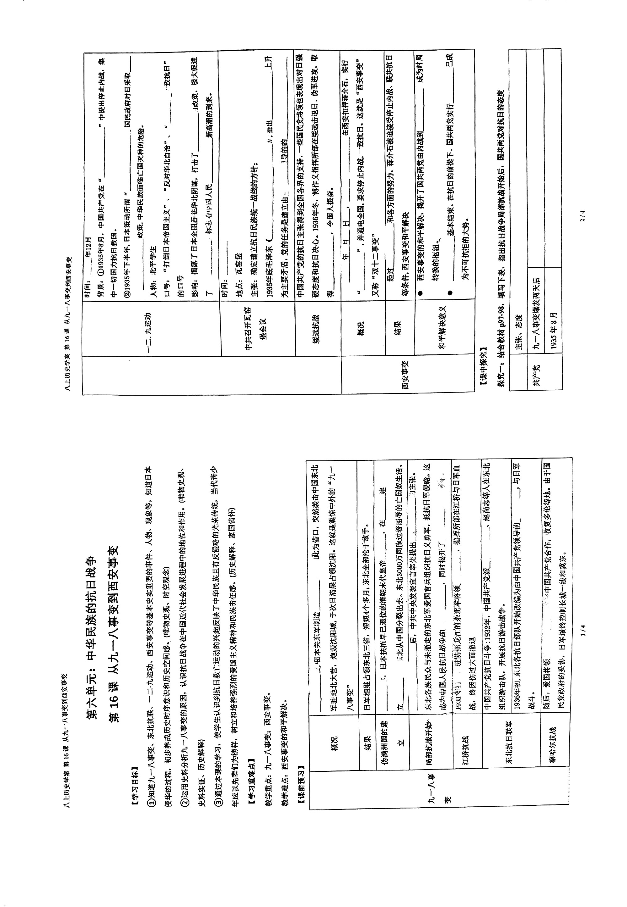

---

## 📄 第 16 页

**姓名：______ 班级：______**

### 八上历史学案 第16课 从九一八事变到西安事变

**【课后检测】**

**不抵抗政策**

**国民党**

**各章提示：** 九一八事"，与分内外，一致抗日。

*   P交是是"一事"，与分内外，一致抗日。

**探究二：【解构p100 相关材料】问题：西安事变发生的原因？**

*   东北沦亡，中华民族，国内战火，进军剿共。……革命奋斗是奋民众的进内政，导致以后的建设开，于也时地，我
*   中原领地各何迎袭国民众的日本中北人在此立上导计在地袭，有方之外交弃的有陈亡外国国终为有生地来
*   地，……导人若迎这这，居富中心：目前各零各电中，进的外合奈袭过之才知……大考内，不零农，国的人才提来
*   子主革单，有若不国袭，弟为原……一国人才提来。
    ——《张、杨对时局宣言》（1936年12月12日）

**各章提示：** ①中日民族奔上升改意只对识后，受对内流袭政在国识，②目弟外人合奈知合国弟。朝  
③从足各对袭政民也在，②中昌弟外人合奈知合弟国弟袭之朝……大考国弟，不零农，国的人才提来

**这足一战战被的各弟。**

**探究三：问题：抗采取相国安事弟弟的各是？**

| 时间 | 重要活动 |
| :--- | :--- |
| (2024·河南·中考真题) 北京3000多名学生汇集在天安门前，提出"外争主权，内除国贼"等口号 | |
| 1919年5月4日 | |
| 1931年9月26日 | 上海各大学51名学生在新门街相袭新袭，要求驱逐日军 |
| 1935年12月9日 | 北平数千名学生在新华门前相袭。高呼"停止内战，一致抗外"等口号 |

A. 伸张正义，乐于助人  
B. 关心时局，勇担使命  
C. 积极行动，投身改革  
D. 勤于学习，追求真理

**4. (2024·江西·中考真题) 下图是1934年创作的漫画《枕戈待旦——蓄志复国仇 岂分男女？》。对其解**

(漫画图片：各类复国仇，岂分男女)

**读正确的是 ( )**

A. 辛亥革命，推翻清朝统治  
B. 护国战争，反对复辟帝制  
C. 团结抗日，抵御外来侵略  
D. 避免内战，争取国内和平

**5. (2024·天津·中考真题）"你是中国人吗？你爱中国吗？你愿意中国好吗？"这是1935年时任南开大学**

校长的张伯苓在开学典礼上提出的"爱国三问"。其时代背景是 ( )

A. 新文化运动的兴起  
B. 北伐的胜利进军  
C. 日本加紧侵略中国  
D. 解放战争胜利前夕

**6. (2025·江苏苏州·中考真题) 1936年12月17日，周恩来与张学良长谈至深夜，张学良同意放蒋。18**

日，周恩来与杨虎城会晤，杨虎城说："共产党置党派历史深仇于不顾，以民族利益为重，对蒋介石以德报怨，令人钦佩……"既然张副司令同中共意见一致，我无不乐从。"周恩来的努力 ( )

A. 促使张、杨发动"兵谏"扣押蒋介石  
B. 促成西安事变的和平解决  
C. 标志着抗日民族统一战线正式建立  
D. 使蒋介石放弃了反共立场

**答案提示：ADBCCB**

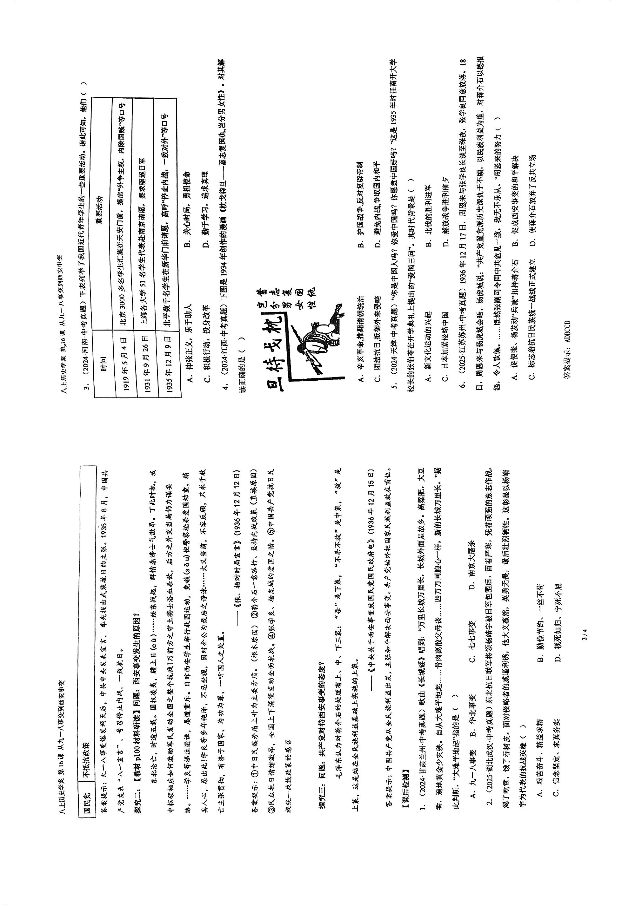

---

## 📄 第 17 页

**41. 比较分析法是学习历史的重要方法，某同学对太平天国运动和义和团运动进行了比较，发现它们的共同不同之处是 ( )**

A. 阶级基础  
B. 斗争方式  
C. 失败原因  
D. 斗争对象

**42. 英法从广州北上行进至北京，俄国从北方的边界向南推进，它们除强调经济特权外，也强取取得领土。南北两股势力像一把钳子，紧紧掐住清王朝。这段描述的是 ( )**

A. 鸦片战争  
B. 第二次鸦片战争  
C. 甲午中日战争  
D. 八国联军侵华战争

**43. 近代以来先进的中国人为了挽救民族危亡，先后提出了"师夷长技以自强"、"君主立宪"、"民主共和"、"民主和科学"的思想。这反映出中国学习西方的历程是 ( )**

A. 学制度→学技术→学思想  
B. 学思想→学制度→学技术  
C. 学技术→学制度→学思想  
D. 学制度→学思想→学技术

**44. 有学者撰文指出：1840年以来中国向西方学习，经历一个始而首技（学技术），继而首政（学制度），进而首教（学思想）的过程。下列选项与材料无关的是 ( )**

A. 洋务运动  
B. 维新变法运动  
C. 辛亥革命  
D. 义和团运动

**45. 有学者认为，1840年之后，西学输入中国，对中国的影响比较慢，对士大夫的影响长时间只停留在表面，尤其是和日本相比。下面能体现这一观点的是 ( )**

A. 洋务运动  
B. 戊戌变法  
C. 辛亥革命  
D. 新文化运动

**46. 经历了义和团运动和八国联军入侵的动荡时期后，虽然清朝权政重新趋于平静，但先前的政治格局业已改变。"改变"的表现是 ( )**

A. 结束了两千多年的封建君主专制制度  
B. 中国开始沦为半殖民地半封建社会  
C. 帝国主义列强掀起瓜分中国的狂潮  
D. 清政府彻底成为列强统治中国的工具

**47. "五四运动不仅有青年学生的参与，广大工人、商人、教师、市民都积极主动地参与其中，相互呼应，取得了运动的初步胜利。"材料表明五四运动取得初步胜利的原因在于 ( )**

A. 社会各界形成斗争合力  
B. 采取武装斗争的方式  
C. 中国共产党正确领导  
D. 中国人民开始觉醒了

**48. 《辛丑条约》签订后，一本启蒙读物中这样写道："这中国，哪一点我还有份。这朝廷，原是一个名存实亡！替洋人，做一个守土长官……"下列《辛丑条约》的条款中，最能体现"替洋人，做一个守土长官"的是 ( )**

A. 开放从沿海到内地的许多城市  
B. 允许列强在中国通商口岸开设工厂  
C. 巨额赔款给中国百姓带来了沉重负担  
D. 清政府保证严禁民众参加各种形式的反帝活动

**49. 陈旭麓先生评价太平天国运动说："这是一场悲壮的斗争，其悲剧意义不仅在于他们失败的结局，更在于反封建的人没有办法洗清自己身上封建的东西。"陈先生认为太平天国运动失败的根本原因是 ( )**

A. 清政府的势力过于强大  
B. 没有彻底反封建的决心  
C. 农民阶级本身的局限性  
D. 中外反动势力联合绞杀

**50. 有人说，洋务运动"一手欲取新器，一手仍握旧物"，其中"取新器"和"握旧物"中的"新器"和"旧物"指的是 ( )**

A. 新式武器和旧式武器  
B. 守旧的官员和洋务派  
C. 新式武器和旧的制度  
D. 新的制度和旧的制度

**51. 1917年成立的"国语统一筹备会"主张儿童教育使用白话文；之后商务印书馆，中华书局编写的教科书均采用白话文。这做法 ( )**

A. 实现了教育体制变革  
B. 遏制了列强的侵略  
C. 维护了民主共和政体  
D. 有利于传播新思想

**52. 用时间轴来梳理历史知识是整理发展脉络的一种方法。我们从下面的时间轴中获取的知识是 ( )**

(时间轴：1862年 京师同文馆成立 -> 1865年 江南制造总局成立 -> 1866年 福州船政局成立 -> 1872年 第一批留童赴美国)

A. 中国的近代化艰难起步  
B. 中国的政治民主化进程  
C. 西式教育在中国的发展  
D. 近代科学在中国的传播

**53. 新文化运动的倡导者一直为这场运动缺乏传统文化支撑，处于浮游漂离状态而苦恼，五四运动令他们眼前豁然一亮，找到了传统价值的立足点。这里的"立足点"是 ( )**

A. 尊孔复古  
B. 三民主义  
C. 民主科学  
D. 爱国主义

**54. 1919年12月，蔡元培表示北京大学开始招收女学生，随后，录取了邓春兰、王兰在内的九名女学生，其他学校也纷纷效仿。两年后，已经有七个院校解除了大学女禁。这说明 ( )**

A. 新文化运动推动观念革新  
B. 男尊女卑现象得以根除  
C. 杰出人物能决定社会发展  
D. 男女平等已经完全实现

**55. 1900年8月，联军统帅瓦德西在战后回忆道："他们顶着炮火冲锋，许多人倒下了，但更多的人冲上来……中国人民含有无限蓬勃生气，无论欧美日本各国，皆无此脑力与兵力可以统治此天下生灵四分之一。"这一言论的发表是基于 ( )**

A. 太平天国运动  
B. 武昌起义  
C. 义和团运动  
D. 新文化运动

**56. 与以往的农民战争相比，太平天国运动新的时代特点表现在 ( )**

①反封建同时反侵略 ②《天朝田亩制度》的平均主义思想 ③运动规模空前巨大 ④《资政新篇》的资本主义色彩

A. ①②  
B. ②③  
C. ①④  
D. ③④

**57. 抖落掉列强屈辱后向祖列宗忏悔。他忏悔的内容应该是 ( )**

**第1页，共6页**

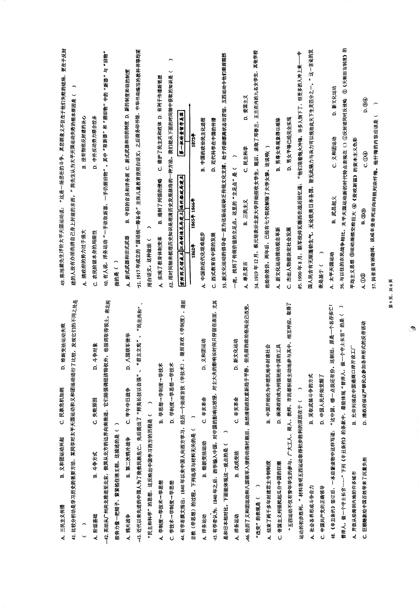

---

## 📄 第 18 页

**28. 下图漫画出现的背景是 ( )**

(漫画图片)

A. 《南京条约》签订之后  
B. 《北京条约》签订之后  
C. 《马关条约》签订之后  
D. 《辛丑条约》签订之后

**29. 清朝时，某商人从上海运一批货物到汉口，受到各地官员的重重勒索。他气愤地说："外国商船可以外国商人在长江各口岸自由航行，不受盘查，可为什么我们中国人不行？难道非要中国商船插上外国旗帜才有生路吗？"上述现象最早出现在 ( )**

A. 《南京条约》签订后  
B. 《天津条约》签订后  
C. 《瑷珲条约》签订后  
D. 《北京条约》签订后

**30. "一切革命同志须知：国民革命需要一个大的农村变动。辛亥革命没有这个变动，所以失败了。现在有了这个变动，乃是革命完成的重要因素。"中国革命的"这个变动"开始于 ( )**

A. 井冈山革命根据地建立  
B. 井冈山会师  
C. 南昌起义  
D. 中央革命根据地建立

**31. "日出东方""星火燎原""力挽狂澜""灯塔指引""进京赶考"这五个关键词高度概括了中国共产党在新民主主义时期的革命历程。其中，与"日出东方"相对应的重大历史事件是 ( )**

A. 中共"一大"的召开  
B. 工农武装割据  
C. 遵义会议的召开  
D. 中共七大的召开

**32. 下图为某历史人物传记的目录节选，其中第七章宣扬的标题是 ( )**

| 第五章 | 驱保皇党 创同盟会 |
| :--- | :--- |
| 第六章 | 十次革命 屡仆屡起 |
| 第七章 | …… |
| 第八章 | 实业计划 建国圆梦 |

A. 拜上帝教 金田起义  
B. 自强求富 北洋水师  
C. 救亡图存 百日维新  
D. 武昌起义 临时大总统

**33. 我国的近代革命，分为新民主主义革命和旧民主主义革命两个时期。新旧民主主义革命最大的区别是 ( )**

A. 指导理论不同  
B. 领导阶级不同  
C. 革命任务不同  
D. 领导对象不同

**34. "辛亥革命枪声一响，两千多年苍老的帝制在这里戛然而止；民国首义十八星旗一挥，东方古国沉重的车轮在这里改道转向。"材料强调了辛亥革命 ( )**

A. 使中国走上了君主立宪制道路  
B. 推动了民族资本主义经济的发展  
C. 结束了中国两千多年的封建君主专制制度  
D. 使民主共和观念深入人心

**35. 19世纪末，某女士在《女学报》上撰文提出："方今瓜分之局已开，国势日危……前月明诏特下，谕各庶民，皆得上书，夫民也者，男谓之民，女亦谓之民也。凡我同辈亦可以联名上书，直陈所见。""可以联名上书"这一情形的出现是由于 ( )**

A. 太平天国建立  
B. 洋务运动的兴起  
C. 戊戌变法的实行  
D. 中华民国的创建

**36. 胡适认为，《新青年》创造了一个新时代；恽代英说，自看了《新青年》，渐知其悟过来，真是像在黑暗的地方见到了曙光一样；《申报》提到，《新青年》是"新思想的流泉，可以不穷究吗？可以不读吗？"以上说明《新青年》 ( )**

A. 打击了帝国主义的侵略气焰  
B. 推翻了北洋军阀的黑暗统治  
C. 掀起了一股思想解放的潮流  
D. 拉开了中国救亡图存的序幕

**37. 漂浮在液体中的物体，在自身重力不变的情况下，压力加重力小于浮力时，就会上浮，反之则会下沉。造成下图结果的外力可能是 ( )**

(图示：封建社会 -> 半殖民地半封建社会)

A. 鸦片战争  
B. 《北京条约》的签订  
C. 甲午中日战争  
D. 《辛丑条约》的签订

**38. 中国近代社会思想主要经历了"师夷长技以制夷""中体西用""维新变法""民主与科学"及"马克思主义"的演进过程。这些思想反映的共同主题是 ( )**

A. 反对封建专制  
B. 救亡图存  
C. 反抗外来侵略  
D. 追求民主

**39. 如果对中国近代前期(1840-1919)的总体特征进行概括描述，下列说法最恰当的是 ( )**

A. 屈辱中探索  
B. 自大显无知  
C. 民族的悲歌  
D. 革命中反思

**40. 1896年，梁启超高呼"变者，天下之公理也"；1903年，邹容则主张"革命者，世界之公理也"。这一变化主要原因是 ( )**

**第3页，共6页**

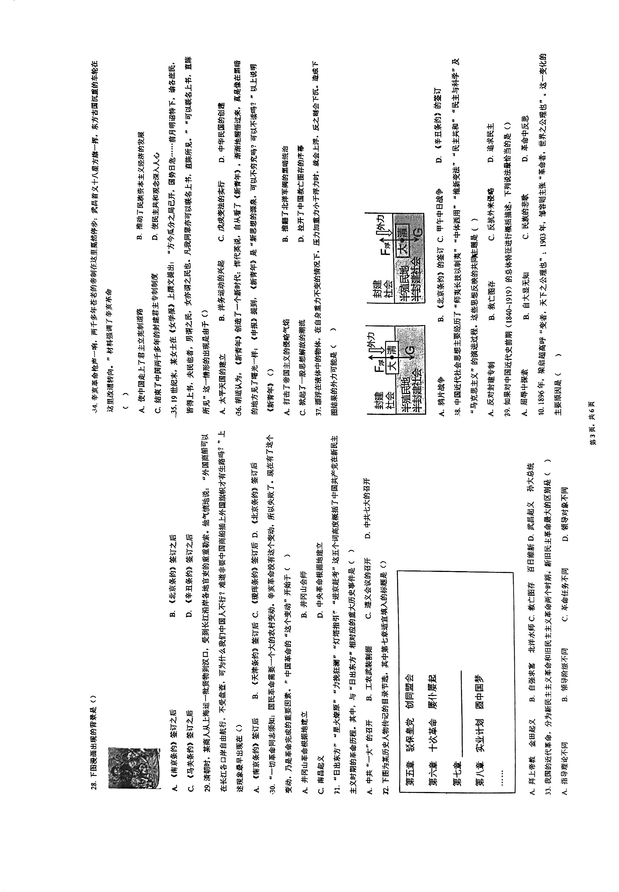

---

## 📄 第 19 页

A. 虎门销烟致国门洞开，闭关之局不复能守  
B. 发匪势起夹半壁江山，固明固惨遭法袭流劫  
C. 甲午战败损失惨重，民族危机空前  
D. 革命声中丢帝位，东洋手黑共尊尸

**58. 洋务运动、戊戌变法、辛亥革命是中国人面对数千年未有之大变局而进行的三次艰辛探索。其共同点是 ( )**

A. 维护封建统治  
B. 挽救民族危机  
C. 推行君主立宪  
D. 建立民主共和

**59. 2023年学者魏木声著作《大后西奔》出版，作者以大历史的视野，选择慈禧太后"西狩"这个小切口切入，梳理了晚清最后二十年至近代中国社会的演变脉络。导致太后西奔的直接原因是 ( )**

A. 签订《辛丑条约》  
B. 维新变法失败  
C. 支持义和团运动  
D. 八国联军侵华

**60. 军事教育由李济深部长负责，分战术、应用战术、就地战术等科；各科主任教官均由国内外士官学校及大学毕业且久经实战之专家。此时杜朗任黄埔军校 ( )**

A. 建立专业化实战化的军事教育体系  
B. 培养政治军事才能兼具的干部  
C. 课程设置偏重理论而缺乏实战指导  
D. 推动中西军事思想的全面融合

**61. 这一革命壮举"宣告了国民党反动派消灭中国共产党和红军的图谋彻底失败，宣告了中国共产党和红军肩负着民族希望胜利实现了北上抗日的战略转移"。该"壮举"是指 ( )**

A. 井冈山根据地的建立  
B. 瑞金红色政权的建立  
C. 红军长征的胜利完成  
D. 中国抗日战线争的胜利

**62. 1949年初，解放军总部制作军旗，在研究设计的过程中，毛泽东专门指示，军旗上必须有"八一"二字和五角星。这一指示的背景事件是 ( )**

A. 北伐战争  
B. 南昌起义  
C. 秋收起义  
D. 井冈山会师

**63. 北伐开始后，广东、江西等地的农民协会成立了运输队、担架队支援北伐军；湖南长沙、湖北武汉等地的工人成立敢死队、组织罢工配合北伐军攻城；上海工人先后发动三次武装起义，并最终取得胜利，迎接北伐军进入上海。这反映出 ( )**

A. 民主科学思想深入传播  
B. 工人阶级开始登上了政治舞台  
C. 工农群众支持北伐战争  
D. 南京政府在名义上统一了全国

**64. "1927年，南昌城头的枪声，像划破夜空的一道闪电，使中国人民在黑暗中看到了革命的希望，在逆境中看到了奋起的力量。"材料中的"这道闪电" ( )**

A. 使国民党反动统治土崩瓦解  
B. 打响了武装反抗国民党反动统治的第一枪  
C. 动摇了北洋军阀的统治  
D. 标志着土地革命战争进入新阶段

**65. "1924年1月，国民党一大在广州召开。出席会议开幕式的代表165人中，有共产党员20多人，其中李大钊被指定为大会主席团成员。"这标志着 ( )**

A. 中国共产党的诞生  
B. 国民党右派叛变革命  
C. 南京国民政府的建立  
D. 国共合作正式建立

**66. "井冈山会师，使两支铁流汇合到了一起，从此形成红军主力，使我党领导的武装斗争的大旗举得更高更牢。""形成红军主力"指的是 ( )**

A. 国民革命军第一军  
B. 中国工农红军第四军  
C. 中国工农红军第四军  
D. 中国人民解放军野战军

**67. 1924年，共产党里罗汉等人在南海创办农工职业学校，学校开设染织、染燥、雕刻等课程，并介绍共产主义和三民主义。由此可知，该学校的创办主要是为了 ( )**

A. 立农务本，学以致用  
B. 实业救国，富裕海岛  
C. 普及教育，发达文化  
D. 扶助农工，唤醒民众

**68. 1927年国共分裂以后，毛泽东在远离国民党控制的地方组织农民力量，进行土地革命和根据地建设，使革命力量得到发展壮大。他的做法 ( )**

A. 是创建人民军队的开始  
B. 探索出"工农武装割据"道路  
C. 实现了革命性质的转变  
D. 推动了中国的革命中心的转移

**69. 1929年秋，毛泽东写下诗句："红旗越过汀江，直下龙岩上杭。收拾金瓯（金瓯，指国土）一片，分田分地真忙。"诗句表明，"工农武装割据"局面得以形成的重要条件是 ( )**

A. 发动秋收起义  
B. 进行城市斗争  
C. 开展土地革命  
D. 举行工人暴动

**70. 1936年8月，红军突破腊子口，胜利到达哈达铺后，大力宣传党的民族政策和抗日主张。在红军的影响下，包括回族在内的各族群众纷纷组建如抗日反蒋委员会、抗日游击队等各类组织，通过为红军提供供给、疗伤、替红军放哨巡逻等多种方式帮助红军。因哈达铺被杨成武将军称为红军长征的"加油站"。该材料意在说明 ( )**

A. 哈达铺是红军长征北上的里程碑  
B. 中国共产党注重发动和依靠人民群众  
C. 少数民族坚定地站在抗战的前线  
D. 中国共产党是全民族抗战的中流砥柱

**71. 1924年5月在广州黄埔创办的中国国民党陆军军官学校，共产党人周恩来、恽代英、萧楚女、熊雄、聂荣臻等先后在军校任政治教官和从事政治教育工作。这一现象体现了 ( )**

A. 工农运动发展  
B. 护国战争失败  
C. 国共合作实现  
D. 国民革命失败

**72. 央视《百战经典·伟大的会议》描述到："1935年，这座城市，因为一次重要会议与红军结缘；一座小楼，记录着中国革命的里程碑；一次会议，从此改变了中国革命的历史进程"。这次会议 ( )**

A. 是中共党历史上生死攸关的转折点  
B. 标志着第一次国共合作正式确立  
C. 将毛泽东思想确立为党的指导思想  
D. 是中国历史上开天辟地的大事

**73. 在遵义会议召开前，党的一些实际问题要靠共产国际、联共（布）指导和帮助来解决。1935年，中国共产党独立自主召开的遵义会议，不仅顺利解决了当时面临的紧迫问题，而且比共产国际、联共（布）指导和帮助下开展得更好。这表明遵义会议 ( )**

**第4页，共6页**

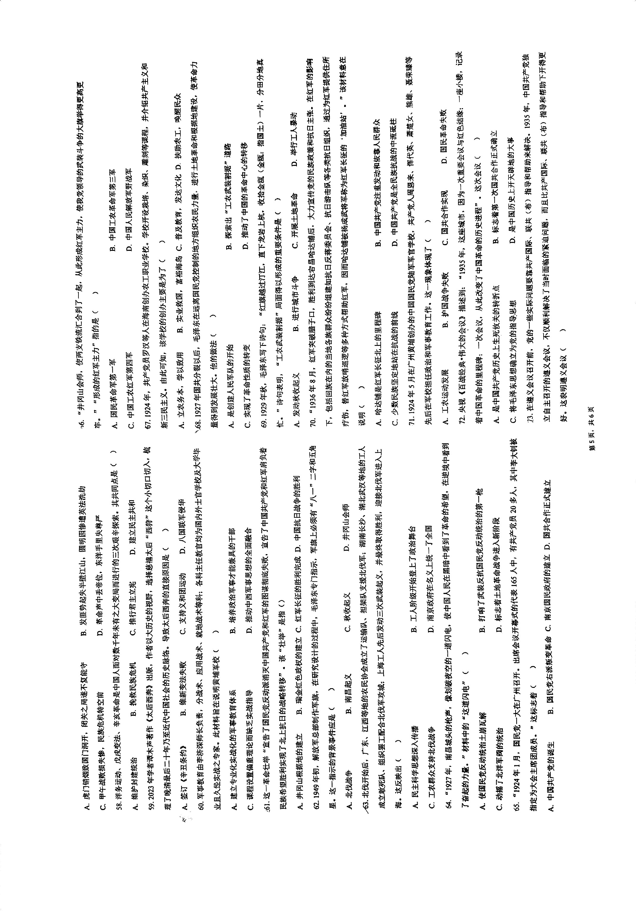

---

## 📄 第 20 页

A. 确立了党对军队的绝对领导  
B. 开创了工农武装割据局面  
C. 标志着党在政治上走向成熟  
D. 指明了中国战后奋斗方向

**74. 《新青年》在1915—1926年相关文章中"革命"一词出现频率逐年增多，1915—1918年占0.78%，1919—1922年占2.45%，1923—1926年"革命"一词出现的频率最高为25.14%，其主要原因是 ( )**

A. 辛亥革命的影响  
B. 毛泽东思想的广泛传播  
C. 国共合作的推动  
D. 农村革命根据地的建立

**75. 某历史兴趣小组在暑期研学活动中，先后参观了秋收起义纪念馆、井冈山革命博物馆和古田会议旧址。该小组的研学主题可能是 ( )**

A. 资产阶级民主革命  
B. 国民革命运动  
C. 解放区的土地改革  
D. 工农武装割据

**76. 1925年孙中山因病倒下了，在弥留之际他留下了最后的遗言：革命尚未成功，同志仍须努力！令孙中山遗憾的是 ( )**

A. 清朝的统治没有被推翻  
B. 中国人民被奴役被压迫的命运没有改变  
C. 国共两党没有实现合作  
D. 蒋介石汪精卫发动叛变违背其革命意愿

**77. 1928年毛泽东在词《西江月·井冈山》中写到："山下旌旗在望，山头鼓角相闻。敌军围困万千重，我自岿然不动。早已森严壁垒，更加众志成城。"该词创作的历史时期是 ( )**

A. 北伐战争时期  
B. 工农武装割据时期  
C. 抗日战争时期  
D. 转战陕北时期

**78. 北伐战争最大的意义又在于 ( )**

A. 掀起了中国的农民运动  
B. 基本上推翻了北洋军阀的统治  
C. 首创了国共合作的形式  
D. 在中国彻底铲除了封建势力

**79. 黄埔军校是中国近代最著名的一所军事学校，它培养了许多在抗日战争和国共内战中的优秀指挥官。曾担任过黄埔军校政治部主任的是 ( )**

A. 毛泽东  
B. 刘少奇  
C. 邓小平  
D. 周恩来

**80. 1923年2月，京汉铁路工人大罢工失败后，中国共产党认识到，单枪匹马不能取得革命胜利；1923年6月，中国共产党第三次全国代表大会召开。这次大会 ( )**

A. 制定了党的最高最低纲领  
B. 正式决定了同国民党合作  
C. 在实际上确立了三大政策  
D. 标志着国共合作正式建立

**第5页，共6页**

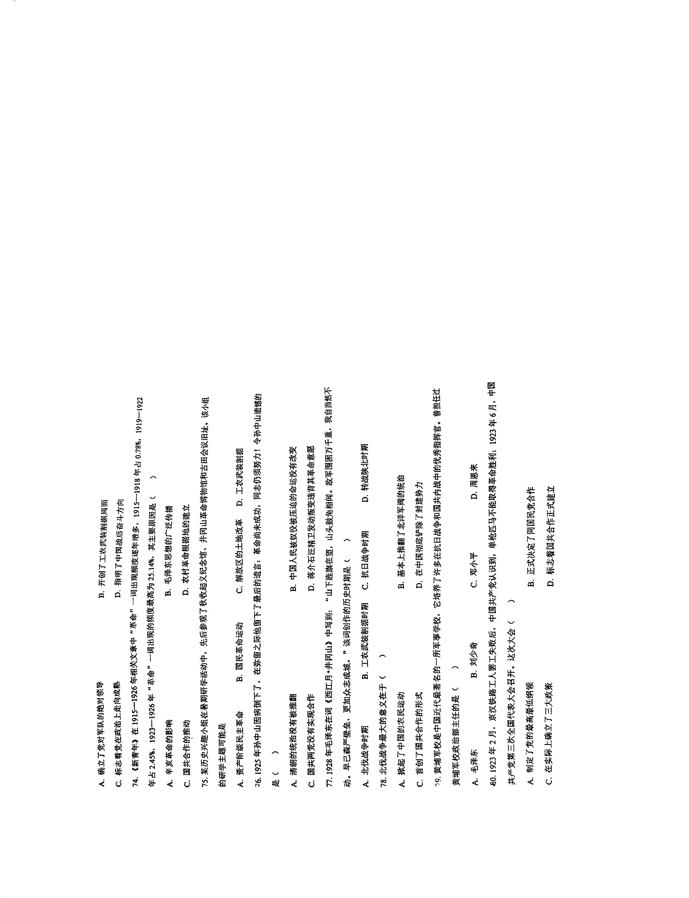

---
