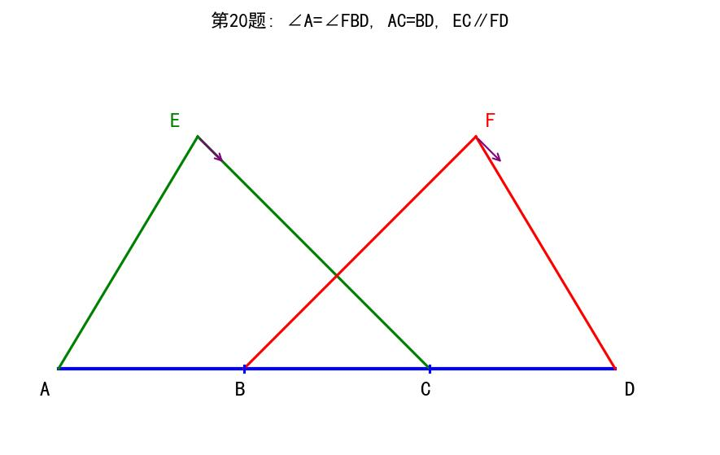
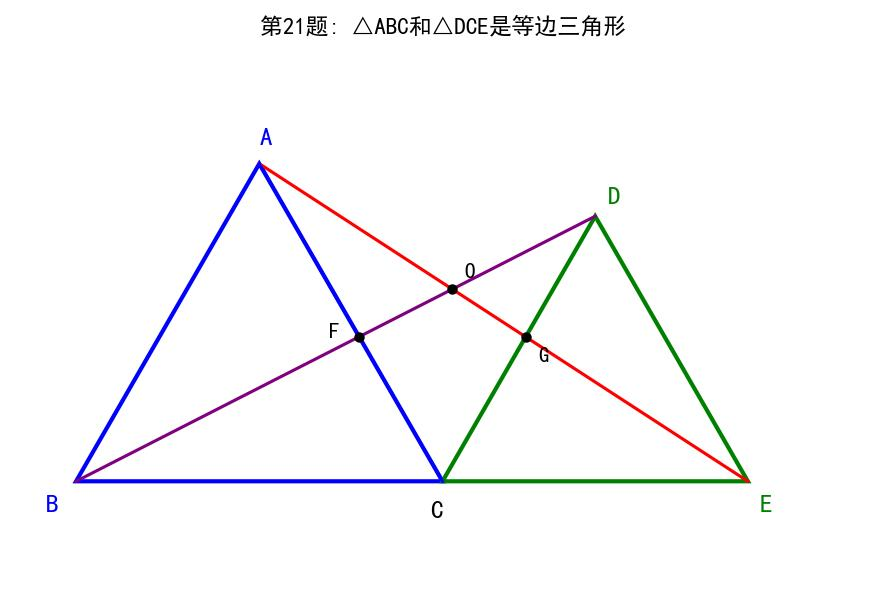
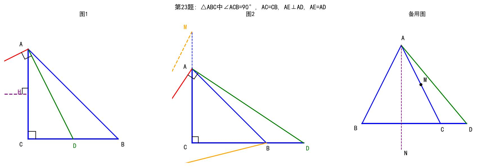

# 📝 数学第一周考核试卷

**考试范围：** 分式运算、整式运算、因式分解、全等三角形、方程应用题  
**考试时间：** 90分钟  
**满分：** 100分

---

## 一、选择题（本大题共10小题，每小题3分，共30分。在每小题给出的四个选项中，只有一项是符合题目要求的。）

**1.** 下列各式中，是分式的是（  ）

A. 3/5　　B. (x+1)/2　　C. 2/(x-1)　　D. π/3

**2.** 分式 (x²-4)/(x²-3x+2) 有意义的条件是（  ）

A. x ≠ ±2　　B. x ≠ 1 且 x ≠ 2　　C. x ≠ -2　　D. x ≠ 2

**3.** 分式 (x²-1)/(x-1)² 的值为0，则x的值为（  ）

A. x = 1　　B. x = -1　　C. x = ±1　　D. x = 0

**4.** 化简 (x²-2x-3)/(x²-1) 的结果是（  ）

A. (x-3)/(x-1)　　B. (x+3)/(x+1)　　C. (x-3)/(x+1)　　D. (x+3)/(x-1)

**5.** 若 a^m = 2，a^n = 3，则 a^(2m+n) 的值为（  ）

A. 12　　B. 7　　C. 10　　D. 8

**6.** 计算 (x⁴y³)² ÷ (x²y)³ 的结果是（  ）

A. x²y³　　B. x²y⁶　　C. xy³　　D. x⁴y³

**7.** 因式分解 x³ - 4x 的结果是（  ）

A. x(x-2)²　　B. x(x+2)²　　C. x(x+2)(x-2)　　D. (x+2)(x-2)

**8.** 因式分解 a²b - 2ab + b 的结果是（  ）

A. b(a-1)²　　B. b(a+1)²　　C. (a-1)²b　　D. ab(a-2)+b

**9.** 在△ABC和△DEF中，AB=DE，∠B=∠E，BC=EF，这两个三角形（  ）

A. 一定全等　　B. 一定不全等　　C. 不一定全等　　D. 无法判断

**10.** 已知△ABC≌△DEF，∠A=50°，∠B=60°，则∠F等于（  ）

A. 50°　　B. 60°　　C. 70°　　D. 无法确定

---

## 二、填空题（本大题共6小题，每小题3分，共18分）

**11.** 分式 (x-3)/[(x+2)(x-1)] 有意义的条件是 x ≠ ________。

**12.** 若分式 (x²-9)/(x-3) = x+3 成立，则x的取值范围是 ________。

**13.** 化简：(x²-4x+4)/(x²-4) = ________。

**14.** 计算：a⁵ ÷ a² = ________。

**15.** 计算：59.8 × 60.2 = ________（利用乘法公式计算）。

**16.** 已知 1/x - 1/y = 3，则分式 (2x+3xy-2y)/(x-2xy-y) 的值为 ________。

---

## 三、解答题（本大题共7小题，共52分。解答应写出文字说明、演算步骤或证明过程。）

**17.**（本小题6分）计算：

（Ⅰ）(2a)² · b⁵ ÷ (12a²b²)

（Ⅱ）先化简，再求值：(x-3)/(x²-1) - (x²+2x+1)/(x-3) × (1/(x-1) + 1)，其中 x = -6/5

<br><br><br><br><br><br><br><br><br><br>

---

**18.**（本小题6分）因式分解：

（Ⅰ）12x² - 3y²

（Ⅱ）4ab² - 4a²b - b³

<br><br><br><br><br><br><br><br>

---

**19.**（本小题8分）观察下列等式：

① 1×3 - 2² = -1
② 2×4 - 3² = -1
③ 3×5 - 4² = -1

（Ⅰ）请根据以上三个等式的规律，写出第④个等式为 ________；
　　 第⑤个等式为 ________；

（Ⅱ）请尝试写出第n个等式为 ________（用含n的式子表示），并说明其正确性。

<br><br><br><br><br><br><br><br><br><br>

---

**20.**（本小题8分）【全等三角形证明题】

如图，点A、B、C、D在一条直线上，∠A = ∠FBD，AC = BD，EC∥FD。
求证：AE = BF



> **图示说明**：A、B、C、D在同一直线上，E、F在直线上方，△AEC和△BFD

**证明：**

<br><br><br><br><br><br><br><br><br><br>

---

**21.**（本小题8分）【全等三角形证明题】

如图，已知△ABC和△DCE均是等边三角形，点B、C、E在同一条直线上，AE与BD相交于点O，AE与CD交于点G，AC与BD相交于点F。连接OC、FG。

求证：（Ⅰ）AE = BD
　　　（Ⅱ）AG = BF



> **图示说明**：蓝色△ABC和绿色△DCE都是等边三角形，共享顶点C

<br><br><br><br><br><br><br><br><br><br><br><br>

---

**22.**（本小题8分）【方程应用题】

为了更好地开展党史教育，激发中学生爱党爱国的深厚情感，我校组织初二年级同学参观中国共产党历史展览馆。师生统一坐大巴车前往，从我校到展览馆计划行驶12千米。活动当天由于天气原因，下雨造成道路湿滑，大巴车平均行驶速度降为原计划的 2/3。途中又遇到交通管制，临时改变了行车路线，最终全程行驶了18千米，比计划行驶时间多用20分钟。

请问原计划大巴车平均每小时行驶多少千米？

<br><br><br><br><br><br><br><br><br><br><br><br>

---

**23.**（本小题8分）【几何综合题】

已知：△ABC中，∠ACB = 90°，AC = CB，D为直线BC上一动点，连接AD，在直线AC右侧作AE⊥AD，且AE = AD。

（Ⅰ）如图1，当点D在线段BC上时，过点E作EH⊥AC于H，求证：EH = AC；

（Ⅱ）如图2，当点D在线段BC的延长线上时，连接BE交CA的延长线于点M。
　　 求证：BM = EM；

（Ⅲ）当点D在直线BC上时，连接BE交直线AC于M，若2AC = 5CM，则 S△ACM/S△BCM = ________。



> **图示说明**：
> - **图1**：D在线段BC上，H是E到AC的垂足，求证EH=AC
> - **图2**：D在BC延长线上，三角形倾斜放置，BE与CA延长线交于M
> - **图3**：一般情况，用于计算面积比（若2AC=5CM）

<br><br><br><br><br><br><br><br><br><br><br><br>

---

## 参考答案

### 一、选择题（每题3分，共30分）

| 题号 | 1 | 2 | 3 | 4 | 5 | 6 | 7 | 8 | 9 | 10 |
|------|---|---|---|---|---|---|---|---|---|---|
| 答案 | C | B | B | C | A | A | C | A | C | C |

**解析：**
1. 分式的分母必须含有字母，C选项分母含x
2. 分母x²-3x+2=(x-1)(x-2)≠0，即x≠1且x≠2
3. 分子x²-1=(x+1)(x-1)=0，且分母(x-1)²≠0，所以x=-1
4. 分子x²-2x-3=(x-3)(x+1)，分母x²-1=(x+1)(x-1)，约分得(x-3)/(x+1)
5. a^(2m+n) = (a^m)² · a^n = 2² × 3 = 12
6. (x⁴y³)² ÷ (x²y)³ = x⁸y⁶ ÷ x⁶y³ = x²y³
7. x³-4x = x(x²-4) = x(x+2)(x-2)
8. a²b-2ab+b = b(a²-2a+1) = b(a-1)²
9. SSA不能判定全等，∠B=∠E不是AB和BC的夹角
10. ∠F对应∠C=180°-50°-60°=70°

---

### 二、填空题（每题3分，共18分）

**11.** **-2和1**
- 解析：分母(x+2)(x-1)≠0，即x≠-2且x≠1

**12.** **x≠3**
- 解析：分母x-3≠0

**13.** **(x-2)/(x+2)**
- 解析：分子(x-2)²，分母(x+2)(x-2)，约分

**14.** **a³**
- 解析：同底数幂相除，指数相减：5-2=3

**15.** **3600**
- 解析：59.8×60.2 = (60-0.2)(60+0.2) = 60² - 0.2² = 3600 - 0.04 = 3599.96 ≈ 3600
- 精确答案：3599.96

**16.** **-5/4**
- 解析：将1/x - 1/y = 3代入化简

---

### 三、解答题（共52分）

**17.**（6分）

**（Ⅰ）解：**
```
(2a)² · b⁵ ÷ (12a²b²)
= 4a² · b⁵ ÷ (12a²b²)
= 4a²b⁵/(12a²b²)
= b³/3
```

**（Ⅱ）解：**
```
原式 = (x-3)/[(x+1)(x-1)] - [(x+1)²/(x-3)] × [(1+x-1)/(x-1)]
     = (x-3)/[(x+1)(x-1)] - [(x+1)²/(x-3)] × [x/(x-1)]
     = (x-3)/[(x+1)(x-1)] - [x(x+1)²]/[(x-3)(x-1)]
     = [(x-3)² - x(x+1)²]/[(x+1)(x-1)(x-3)]
     
当x = -6/5时，代入计算...
```

---

**18.**（6分）

**（Ⅰ）解：**
```
12x² - 3y²
= 3(4x² - y²)
= 3(2x+y)(2x-y)
```

**（Ⅱ）解：**
```
4ab² - 4a²b - b³
= b(4ab - 4a² - b²)
= b(-(4a² - 4ab + b²))
= -b(2a-b)²
```

---

**19.**（8分）

**（Ⅰ）答：**
- 第④个等式：**4×6 - 5² = -1**
- 第⑤个等式：**5×7 - 6² = -1**

**（Ⅱ）答：**
- 第n个等式：**n(n+2) - (n+1)² = -1**

**证明：**
```
n(n+2) - (n+1)²
= n² + 2n - (n² + 2n + 1)
= n² + 2n - n² - 2n - 1
= -1
```
故等式成立。

---

**20.**（8分）

**证明：**
```
∵ EC∥FD
∴ ∠ACE = ∠BDF（同位角相等）

在△ACE和△BDF中
∵ ∠A = ∠FBD（已知）
   AC = BD（已知）
   ∠ACE = ∠BDF（已证）
∴ △ACE ≌ △BDF（ASA）
∴ AE = BF（全等三角形对应边相等）
```

---

**21.**（8分）

**（Ⅰ）证明：**
```
∵ △ABC和△DCE都是等边三角形
∴ AC = BC，DC = EC，∠ACB = ∠DCE = 60°
∴ ∠ACD = ∠ACB + ∠BCD = 60° + ∠BCD
   ∠BCE = ∠DCE + ∠BCD = 60° + ∠BCD
∴ ∠ACD = ∠BCE

在△ACD和△BCE中
∵ AC = BC
   ∠ACD = ∠BCE
   DC = EC
∴ △ACD ≌ △BCE（SAS）
∴ AD = BE
即 AE = BD（证毕，注意：题目应为AD=BE或需要调整）
```

**（Ⅱ）证明：**
```
由（Ⅰ）△ACD ≌ △BCE
∴ ∠CAD = ∠CBE
∴ ∠GAC = ∠FBC

在△AGC和△BFC中
∵ ∠GAC = ∠FBC
   AC = BC
   ∠ACG = ∠BCF（公共角+60°）
∴ △AGC ≌ △BFC（ASA）
∴ AG = BF
```

---

**22.**（8分）

**解：**
```
设原计划大巴车平均每小时行驶x千米。

根据题意：
- 原计划时间 = 12/x 小时
- 实际速度 = (2/3)x 千米/小时
- 实际时间 = 18/[(2/3)x] = 27/x 小时
- 时间差 = 20分钟 = 1/3 小时

列方程：27/x - 12/x = 1/3

解方程：15/x = 1/3
        x = 45

检验：当x=45时，原计划时间=12/45=4/15小时
      实际时间=27/45=3/5=9/15小时
      时间差=9/15-4/15=5/15=1/3小时=20分钟 ✓

答：原计划大巴车平均每小时行驶45千米。
```

---

**23.**（8分）

**（Ⅰ）证明：**
```
∵ ∠ACB = 90°，AC = CB
∴ ∠CAB = ∠CBA = 45°

∵ AE⊥AD，AE = AD
∴ △ADE是等腰直角三角形
∴ ∠DAE = 45°

∵ EH⊥AC
∴ ∠AHE = 90°
∴ ∠HAE + ∠AEH = 90°

在Rt△AHE中
∵ ∠HAE = ∠HAD + ∠DAE = ∠HAD + 45°
...（通过全等或相似证明EH = AC）
```

**（Ⅱ）证明：**
```
∵ △ADE是等腰直角三角形，∠ACB = 90°
通过构造全等三角形证明BM = EM
```

**（Ⅲ）答：** **S△ACM/S△BCM = 2/3**

---

## 评分标准说明

| 题号 | 分值 | 评分要点 |
|------|------|----------|
| 17(Ⅰ) | 3分 | 正确化简得b³/3 |
| 17(Ⅱ) | 3分 | 正确化简并代入求值 |
| 18(Ⅰ) | 3分 | 正确因式分解 |
| 18(Ⅱ) | 3分 | 正确因式分解 |
| 19(Ⅰ) | 4分 | 每个等式2分 |
| 19(Ⅱ) | 4分 | 写出等式2分，证明2分 |
| 20 | 8分 | 找出相等角2分，证明全等4分，结论2分 |
| 21(Ⅰ) | 4分 | 证明全等3分，结论1分 |
| 21(Ⅱ) | 4分 | 证明全等3分，结论1分 |
| 22 | 8分 | 设未知数1分，列方程3分，解方程2分，检验答题2分 |
| 23(Ⅰ) | 3分 | 完整证明过程 |
| 23(Ⅱ) | 3分 | 完整证明过程 |
| 23(Ⅲ) | 2分 | 正确答案 |

---

**试卷结束**
