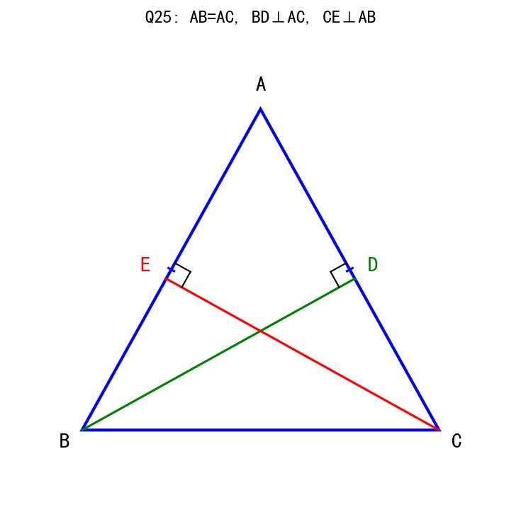

# 📝 数学第一周考核试卷

**考试范围：** 分式运算、整式运算、因式分解、全等三角形、方程应用题  
**考试时间：** 90分钟  
**满分：** 100分

---

## 一、选择题（每题3分，共30分）

**1.** 下列各式中，是分式的是（  ）

A. 3/5　　B. (x+1)/2　　C. 2/(x-1)　　D. π/3

**2.** 分式 (x²-4)/(x²-3x+2) 有意义的条件是（  ）

A. x ≠ ±2　　B. x ≠ 1 且 x ≠ 2　　C. x ≠ -2　　D. x ≠ 2

**3.** 分式 (x²-1)/(x-1)² 的值为0，则x的值为（  ）

A. x = 1　　B. x = -1　　C. x = ±1　　D. x = 0

**4.** 化简 (x²-2x-3)/(x²-1) 的结果是（  ）

A. (x-3)/(x-1)　　B. (x+3)/(x+1)　　C. (x-3)/(x+1)　　D. (x+3)/(x-1)

**5.** 若 a^m = 2，a^n = 3，则 a^(2m+n) 的值为（  ）

A. 12　　B. 7　　C. 10　　D. 8

**6.** 计算 (x⁴y³)² ÷ (x²y)³ 的结果是（  ）

A. x²y³　　B. x²y⁶　　C. xy³　　D. x⁴y³

**7.** 因式分解 x³ - 4x 的结果是（  ）

A. x(x-2)²　　B. x(x+2)²　　C. x(x+2)(x-2)　　D. (x+2)(x-2)

**8.** 因式分解 a²b - 2ab + b 的结果是（  ）

A. b(a-1)²　　B. b(a+1)²　　C. (a-1)²b　　D. ab(a-2)+b

**9.** 在△ABC和△DEF中，AB=DE，∠B=∠E，BC=EF，这两个三角形（  ）

A. 一定全等　　B. 一定不全等　　C. 不一定全等　　D. 无法判断

**10.** 已知△ABC≌△DEF，∠A=50°，∠B=60°，则∠F等于（  ）

A. 50°　　B. 60°　　C. 70°　　D. 无法确定

---

## 二、填空题（每题3分，共30分）

**11.** 分式 (x-3)/[(x+2)(x-1)] 有意义的条件是 x ≠ ________。

**12.** 若分式 (x²-9)/(x-3) = x+3 成立，则x的取值范围是 ________。

**13.** 化简：(x²-4x+4)/(x²-4) = ________。

**14.** 化简：(a³-4a)/(a²-4a+4) = ________。

**15.** 计算：(2/x - 3/y) ÷ (2y-3x)/(xy) = ________。

**16.** 计算：(a^m)³ · a^(2m) ÷ a^(4m) = ________（用a的幂表示）。

**17.** 因式分解：x⁴ - 16 = ________。

**18.** 因式分解：(x-1)² - 9 = ________。

**19.** 已知△ABC≌△DEF，AB=5，BC=7，AC=8，则△DEF的周长为 ________。

**20.** 甲单独完成一项工程需10天，乙单独完成需15天，两人合作需 ________ 天完成。

---

## 三、计算题（每题5分，共20分）

**21.** 化简：[(x²-1)/(x²+2x+1)] × [(x+1)/(x-1)]

**解：**

<br><br><br><br><br><br>

---

**22.** 化简：(a²-9)/(a²-6a+9) ÷ (a+3)/(a-3)

**解：**

<br><br><br><br><br><br>

---

**23.** 先化简，再求值：[(x+2)/(x²-2x) - (x-1)/(x²-4x+4)] ÷ (x-1)/(x²-4)，其中x=3

**解：**

<br><br><br><br><br><br><br><br>

---

**24.** 因式分解：
（1）a²(x-y) + b²(y-x)
（2）(a+b)² - 4(a+b) + 4

**解：**

<br><br><br><br><br><br>

---

## 四、解答题（每题10分，共20分）

**25.** 【全等三角形证明题】

如图，已知AB=AC，BD⊥AC于D，CE⊥AB于E。
求证：BD=CE



> **图示说明**：等腰三角形ABC，BD垂直于AC（D在AC上），CE垂直于AB（E在AB上）

**证明：**

<br><br><br><br><br><br><br><br><br><br>

---

**26.** 【方程应用题】

某商品的进价为200元，按标价的8折销售时，利润率为20%。

（1）求该商品的标价是多少元？
（2）若要使利润率达到30%，应按标价的几折销售？

**解：**

<br><br><br><br><br><br><br><br><br><br>

---

## 参考答案

### 一、选择题（每题3分，共30分）

| 题号 | 1 | 2 | 3 | 4 | 5 | 6 | 7 | 8 | 9 | 10 |
|------|---|---|---|---|---|---|---|---|---|---|
| 答案 | C | B | B | C | A | A | C | A | C | C |

**解析：**
1. 分式的分母必须含有字母，C选项分母含x
2. 分母x²-3x+2=(x-1)(x-2)≠0，即x≠1且x≠2
3. 分子x²-1=(x+1)(x-1)=0，且分母(x-1)²≠0，所以x=-1
4. 分子x²-2x-3=(x-3)(x+1)，分母x²-1=(x+1)(x-1)，约分得(x-3)/(x+1)
5. a^(2m+n) = (a^m)² · a^n = 2² × 3 = 12
6. (x⁴y³)² ÷ (x²y)³ = x⁸y⁶ ÷ x⁶y³ = x²y³
7. x³-4x = x(x²-4) = x(x+2)(x-2)
8. a²b-2ab+b = b(a²-2a+1) = b(a-1)²
9. SSA不能判定全等，∠B=∠E不是AB和BC的夹角
10. ∠F对应∠C=180°-50°-60°=70°

---

### 二、填空题（每题3分，共30分）

11. **-2和1**（分母(x+2)(x-1)≠0）
12. **x≠3**（分母不能为0）
13. **(x-2)/(x+2)**（分子(x-2)²，分母(x+2)(x-2)，约分）
14. **a(a+2)/(a-2)**（分子a(a²-4)=a(a+2)(a-2)，分母(a-2)²，约分）
15. **-1**（原式=[(2y-3x)/xy] × [xy/(2y-3x)]=-1，注意符号）
16. **a^m**（(a^m)³ · a^(2m) ÷ a^(4m) = a^(3m) · a^(2m) ÷ a^(4m) = a^(5m-4m) = a^m）
17. **(x²+4)(x+2)(x-2)**（先用平方差分解为(x²+4)(x²-4)，再分解x²-4）
18. **(x-4)(x+2)**（利用平方差，原式=(x-1+3)(x-1-3)=(x+2)(x-4)）
19. **20**（全等三角形对应边相等，周长=5+7+8=20）
20. **6**（设x天完成，(1/10 + 1/15)x = 1，解得x=6）

---

### 三、计算题（每题5分，共20分）

**21.** 化简：[(x²-1)/(x²+2x+1)] × [(x+1)/(x-1)]

**解：**
```
原式 = [(x+1)(x-1)/(x+1)²] × [(x+1)/(x-1)]
     = [(x-1)/(x+1)] × [(x+1)/(x-1)]
     = 1
```

---

**22.** 化简：(a²-9)/(a²-6a+9) ÷ (a+3)/(a-3)

**解：**
```
原式 = [(a+3)(a-3)/(a-3)²] × [(a-3)/(a+3)]
     = [(a+3)/(a-3)] × [(a-3)/(a+3)]
     = 1
```

---

**23.** 先化简，再求值：

**解：**
```
原式 = [(x+2)/(x(x-2)) - (x-1)/(x-2)²] × [(x+2)(x-2)/(x-1)]

通分后：
= [(x+2)(x-2) - x(x-1)] / [x(x-2)²] × [(x+2)(x-2)/(x-1)]
= [x²-4 - x²+x] / [x(x-2)²] × [(x+2)(x-2)/(x-1)]
= [(x-4)] / [x(x-2)²] × [(x+2)(x-2)/(x-1)]
= [(x-4)(x+2)] / [x(x-2)(x-1)]

当x=3时：
= [(3-4)(3+2)] / [3×(3-2)×(3-1)]
= [(-1)×5] / [3×1×2]
= -5/6
```

---

**24.** 因式分解：

**解：**
```
（1）a²(x-y) + b²(y-x)
   = a²(x-y) - b²(x-y)
   = (x-y)(a²-b²)
   = (x-y)(a+b)(a-b)

（2）(a+b)² - 4(a+b) + 4
   设t = a+b
   = t² - 4t + 4
   = (t-2)²
   = (a+b-2)²
```

---

### 四、解答题（每题10分，共20分）

**25.** 【全等三角形证明题】

**证明：**
```
在△ABD和△ACE中
∵ AB = AC（已知）
　 ∠A = ∠A（公共角）
　 ∠ADB = ∠AEC = 90°（BD⊥AC，CE⊥AB）
∴ ∠ABD = 90° - ∠A = ∠ACE
∴ △ABD ≌ △ACE（AAS）
∴ BD = CE（全等三角形对应边相等）
```

**评分标准：**
- 正确写出"在△ABD和△ACE中"（1分）
- 写出AB = AC及理由（2分）
- 写出∠A = ∠A（公共角）（1分）
- 写出两个直角相等（2分）
- 推导出∠ABD = ∠ACE（1分）
- 正确写出全等及判定理由（2分）
- 得出BD = CE（1分）

---

**26.** 【方程应用题】

**解：**
```
（1）设该商品的标价为x元。

根据题意，售价 = 标价 × 0.8 = 0.8x
利润 = 售价 - 进价 = 0.8x - 200
利润率 = 利润/进价 = (0.8x - 200)/200 = 20%

列方程：(0.8x - 200)/200 = 0.2

解方程：0.8x - 200 = 40
        0.8x = 240
        x = 300

答：该商品的标价是300元。

（2）设按y折销售可使利润率达到30%。

售价 = 300 × (y/10) = 30y
利润率 = (30y - 200)/200 = 30%

列方程：(30y - 200)/200 = 0.3

解方程：30y - 200 = 60
        30y = 260
        y = 26/3 ≈ 8.67

答：应按标价的8.67折（约87折）销售。
```

**评分标准：**
- 第（1）问：设未知数（1分），正确列方程（2分），正确解方程（1分），完整作答（1分）
- 第（2）问：设未知数（1分），正确列方程（2分），正确解方程（1分），完整作答（1分）

---

**试卷结束**
